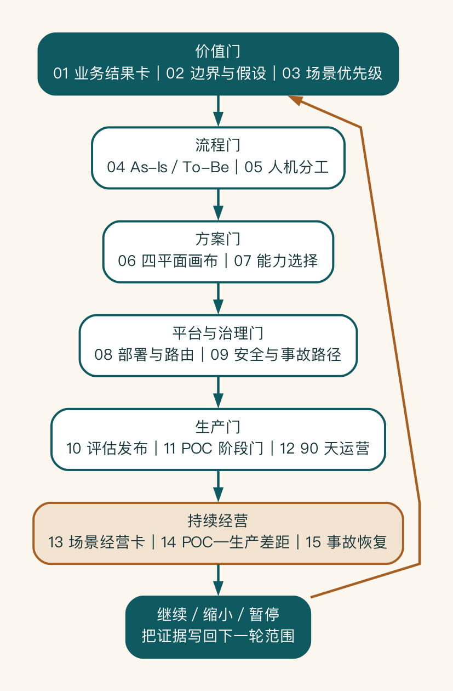

# 附录 A：企业 AI 项目工具箱

这组工具用于把书中的判断落实为项目材料。它们不要求全部填写；应根据项目阶段选择，重要结论必须附证据、责任人和重新评审条件。

工具不是十五张互不相关的表。它们沿五道决策门逐步形成证据，并在生产后进入持续经营：场景经营卡、差距台账和事故恢复记录会反过来改变下一轮的业务边界、评估集与投资决定。实际项目可以按风险裁剪字段，但不能丢失证据如何支持继续、缩小或暂停的关系。

## 工具一：业务结果卡

| 字段 | 内容 |
|---|---|
| 原始需求 | 业务方最初怎样表达 |
| 触发事件 | 什么情况下开始 |
| 目标用户 | 谁直接使用或受益 |
| 当前损耗 | 时间、错误、等待、风险或机会损失 |
| 目标动作 | 系统帮助完成什么业务动作 |
| 下一步 | 输出进入哪个流程或系统 |
| 业务指标 | 怎样判断结果改善 |
| 结果负责人 | 谁对指标和范围负责 |

## 工具二：项目边界与假设表

| 项目 | 纳入范围 | 不做范围 | 关键假设 | 验证方法 | 负责人 |
|---|---|---|---|---|---|
| 用户 |  |  |  |  |  |
| 数据 |  |  |  |  |  |
| 系统 |  |  |  |  |  |
| 动作 |  |  |  |  |  |
| 部署 |  |  |  |  |  |

## 工具三：场景优先级表

| 场景 | 业务损耗 | 流程清晰 | 数据可得 | AI 适配 | 可测量 | 风险可控 | 证据与结论 |
|---|---:|---:|---:|---:|---:|---:|---|
|  |  |  |  |  |  |  |  |

分数只用于暴露分歧。没有证据的高分应被标记为假设。

## 工具四：As-Is / To-Be 对照

| 当前步骤 | 当前损耗 | 消除/合并/前移/标准化 | AI 介入方式 | 人审 | 异常与恢复 | 新指标 |
|---|---|---|---|---|---|---|
|  |  |  |  |  |  |  |

## 工具五：人机分工矩阵

| 动作 | 影响 | 可逆性 | 错误可发现性 | 自主性 A0-A4 | 审核者 | 放权/降级条件 |
|---|---|---|---|---|---|---|
|  |  |  |  |  |  |  |

## 工具六：四平面架构画布

| 平面 | 核心组件/机制 | 负责人 | 输入输出契约 | POC 范围 | 目标状态 |
|---|---|---|---|---|---|
| 业务平面 |  |  |  |  |  |
| 解决方案平面 |  |  |  |  |  |
| 平台平面 |  |  |  |  |  |
| 控制平面 |  |  |  |  |  |

## 工具七：能力选择表

| 任务 | 确定性 | 知识依赖 | 路径开放度 | 工具影响 | 风险 | 选择 |
|---|---|---|---|---|---|---|
|  |  |  |  |  |  | 普通软件/RAG/工作流/Agent/人工 |

## 工具八：部署与路由决策表

| 任务 | 数据级别 | 质量要求 | 延迟/容量 | 候选路径 | 路由控制 | 重新评审条件 |
|---|---|---|---|---|---|---|
|  |  |  |  | 云/专属/本地/混合 |  |  |

## 工具九：安全与事故路径

| 最不能发生的事故 | 预防 | 检测 | 阻断 | 响应 | 恢复 | 负责人 |
|---|---|---|---|---|---|---|
|  |  |  |  |  |  |  |

## 工具十：评估与发布门禁

| 类型 | 样本/指标 | 期望行为 | 禁止行为 | 阈值 | 证据 | 结论 |
|---|---|---|---|---|---|---|
| 常规 |  |  |  |  |  |  |
| 边界 |  |  |  |  |  |  |
| 权限 |  |  |  |  |  |  |
| 高风险 |  |  |  |  |  |  |
| 攻击 |  |  |  |  |  |  |

## 工具十一：POC 阶段门

| 阶段 | 核心未知 | 所需证据 | 通过 | 缩小 | 暂停/终止 | 决策者 |
|---|---|---|---|---|---|---|
| 发现 |  |  |  |  |  |  |
| 原型 |  |  |  |  |  |  |
| POC |  |  |  |  |  |  |
| 试点 |  |  |  |  |  |  |
| 生产 |  |  |  |  |  |  |

## 工具十二：90 天运营表

| 周期 | 业务与采用 | 知识 | 模型/平台 | 安全与事故 | 成本 | 决定 |
|---|---|---|---|---|---|---|
| 每周 |  |  |  |  |  |  |
| 双周 |  |  |  |  |  |  |
| 每月 |  |  |  |  |  |  |
| 季度 |  |  |  |  |  |  |

## 工具十三：生产场景经营卡

| 字段 | 当前事实 | 趋势/目标 | 证据 | 负责人 | 下一决定 |
|---|---|---|---|---|---|
| 用户与任务边界 |  |  |  |  |  |
| 业务结果 |  |  |  |  |  |
| 月成功与采纳任务 |  |  |  |  |  |
| 质量与风险 SLO |  |  |  |  |  |
| 单位成功任务成本 |  |  |  |  |  |
| 人审与支持负担 |  |  |  |  |  |
| 当前主要风险 |  |  |  |  |  |
| 停止/降级条件 |  |  |  |  |  |

## 工具十四：POC—生产差距台账

| 差距 | POC 当前做法 | 生产目标 | 若不补齐的风险 | 截止门禁 | 负责人 | 临时措施与失效日 | 证据 |
|---|---|---|---|---|---|---|---|
|  |  |  |  |  |  |  |  |

差距完成的定义不是“代码已写”，而是目标机制已经在代表性环境验证，并链接测试、演练、配置或签署的运行责任。阻断项和可延期优化应分开；所有延期都要有风险接受人与失效日期。

## 工具十五：事故与恢复记录

| 字段 | 内容 |
|---|---|
| 发现时间、来源与事件等级 |  |
| 受影响场景、用户、数据和业务对象 |  |
| 当前模型、知识、策略、工作流和工具版本 |  |
| 第一条安全动作与暂停范围 |  |
| 证据保护与事件时间线 |  |
| 技术根因与组织根因 |  |
| 撤销、补偿、通知或专业判断 |  |
| 修复、回归和灰度恢复证据 |  |
| 新增评估、监控、手册与责任变化 |  |

事故恢复的标准不是服务重新返回成功码，而是问题路径得到控制、受影响对象已识别、业务补偿已决定、回归门禁通过并完成受控灰度。

所有模板的可复制版本位于配套 `tools/` 目录。
