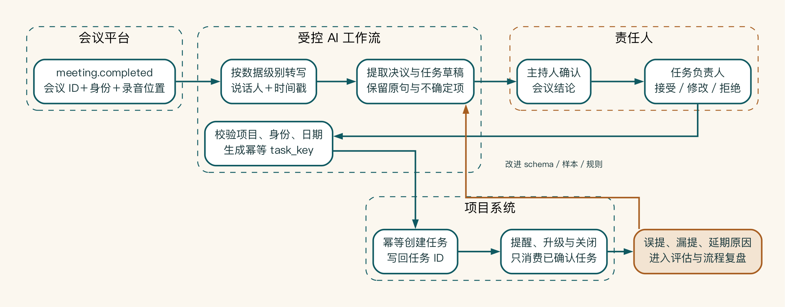
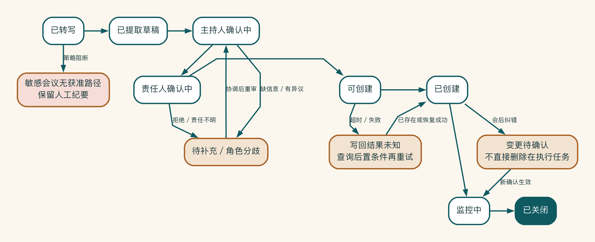

# 案例 B：会议纪要到任务执行系统

## 原始需求

老板说：“会议太多，能不能让 AI 自动生成会议纪要？”

团队很快做出第一版。纪要生成得又快又完整，项目经理却仍然要逐条复制任务、询问负责人、补截止时间。一个月后，大家拥有了更多纪要，逾期任务却没有减少。

问题不在“纪要写得够不够好”，而在会议结论没有真正进入执行系统。这个案例要追的，就是一句话怎样从会议记录走进真实任务。

## 业务结果改写

会议结束后，系统先把决议、任务、负责人、截止时间和风险整理成草稿。参会者确认后，这些内容才进入项目系统。未确认、逾期和异常任务会触发提醒或升级。项目用整理时间、任务漏记、确认率、逾期率和项目经理追踪时间验收。

## 六类结构要素与反馈回路

| 要素 | 内容 |
|---|---|
| 人 | 主持人、参会者、任务负责人、项目经理、主管、IT |
| 流程 | 会议、转写、提取、确认、创建、提醒、复盘 |
| 数据 | 录音、参会名单、项目资料、任务和历史状态 |
| 工具 | 会议、文档、项目任务、消息和审计系统 |
| 规则 | 未确认不创建；任务必须有负责人、截止时间和来源 |
| 指标 | 整理时间、漏记、确认、逾期和追踪时间 |
| 反馈 | 误提、漏提、修改、拒绝和延期原因进入复盘 |

## 现状流程

```text
会议结束 -> 人工整理纪要 -> 群里发送
-> 负责人自行记任务 -> 项目经理手工追踪
```

主要问题是纪要和任务系统断开，任务责任与确认状态不可见。

## 目标流程

```text
会议结束
-> 自动转写并生成摘要
-> 提取决议和任务草稿
-> 主持人确认会议结论
-> 任务负责人确认接受
-> 创建项目任务
-> 逾期提醒与升级
-> 周期性复盘误提、漏提和延期
```



这张图首先说明责任怎样形成。AI 产生带来源的草稿，主持人确认会议结论，任务负责人确认承诺。工作流最后校验项目、身份和日期，再创建任务。提醒服务只处理已经确认的业务对象，误提、漏提和延期原因则回流到 schema、样本和规则。

## 人机分工

- 转写和摘要：自动处理并允许纠正。
- 任务识别：AI 草拟。
- 会议结论：主持人确认。
- 负责人和截止时间：责任人确认。
- 创建任务：确认后执行，使用幂等 ID。
- 逾期升级：确定性规则。

## 关键异常

- 没有明确负责人：不创建任务，请主持人补充。
- 多人对决议有异议：保留草稿，进入人工协调。
- 任务系统失败：记录状态并从写回节点重试。
- 同一会议重复处理：使用会议 ID 和任务 ID 去重。
- 敏感会议：按数据级别禁用转写或使用批准路径。

## 最小概念验证

先选择一个项目组，处理 20 次常规内部会议。系统只创建任务草稿，不自动对外通知或修改项目优先级。试点比较人工基线、任务漏记、确认率、用户修改和系统写回错误。

## 一次任务怎样穿过系统

会议结束后，会议平台发送 `meeting.completed` 事件。事件只包含会议 ID、参会身份和录音位置，不会把全文广播给所有下游。转写服务依据会议的数据级别选择批准通道，并生成带说话人与时间戳的文本。

系统从转写中提取“候选决议”和“候选任务”，但二者都处于草稿状态。

主持人先确认决议是否准确。每个任务卡显示原句、责任人候选、截止时间、依赖和项目。如果模型只能推断“下周完成”而会议没有明确日期，卡片会标记待确认，不把推断写成事实。主持人确认后，系统分别通知任务负责人。负责人可以接受、修改日期、拒绝或要求澄清，所有变化保留来源。

只有同时满足项目存在、责任人获权、日期合法、主持人与负责人确认，工作流才生成写入命令：

```json
{
  "meeting_id": "m-2026-0715-08",
  "decision_id": "d-03",
  "task_key": "m-2026-0715-08:d-03:owner-u42",
  "project_id": "delivery-alpha",
  "owner_id": "u42",
  "due_date": "2026-07-22",
  "source_timestamp": "00:37:14",
  "approval_ids": ["host-approve-11", "owner-accept-94"]
}
```

任务系统按 `task_key` 保证幂等。接口超时时，工作流先查询是否已经存在，不盲目创建第二条任务。写入成功后再保存任务 ID 和后置条件；提醒服务只消费已确认任务，不从会议文本重新推断责任。

## 状态、异常与撤销

核心状态从转写、提取开始，依次经过主持人确认、负责人确认、准备创建、已创建、监控和关闭。工程实现可以写成：

`transcribed -> extracted -> host_review -> owner_review -> ready_to_create -> created -> monitored -> closed`

拒绝、缺少信息、写入失败和取消都是显式分支，不用一个“处理失败”概括。

如果参会者会后发现转写把否定句识别错误，主持人可以撤回尚未创建的任务。已经创建的任务进入“变更待确认”，系统不直接删除他人正在执行的工作。项目经理能看到撤回原因和受影响任务，必要时发起协调。

敏感会议默认不进入普通转写路径。用户创建会议时选择的数据标签不能作为唯一依据，会议类型、组织和项目政策也参与判断。没有获准处理通道时，系统保留人工纪要流程。可用性故障不能成为敏感录音外发的理由。



状态机让“未完成”不再只是一个模糊失败码。缺信息或角色分歧会回到协调。写回超时后，系统先核验后置条件，再决定是否重试。已经创建的任务如果需要会后纠错，会进入变更确认，不会直接删除他人正在执行的工作。敏感会议没有获准路径时，则明确退回人工流程。

## 概念验证的真实放行条件

20 次会议并不足以证明长期价值，但可以关闭一组关键未知：

| 维度 | 样本/指标 | 通过或改变决定的条件 |
|---|---|---|
| 业务 | 人工整理和追踪时间 | 总时间有明确下降，否则只保留摘要 |
| 完整 | 人工对照漏记任务 | 高影响任务不得漏记；普通漏记分类改进 |
| 责任 | 主持人与负责人确认 | 责任人确认率过低则不自动创建 |
| 可靠 | 重复事件、超时、乱序 | 不重复创建，状态可以恢复 |
| 权限 | 跨项目、离职、敏感会议 | 已知越权路径全部阻断 |
| 采用 | 第二次真实使用、拒绝原因 | 不能只统计生成了多少纪要 |

试点前先记录人工基线。项目经理每周花多少时间整理？任务从会议到系统的中位延迟是多少？漏记通常怎样被发现？又有多少任务没有明确负责人？若只比较“纪要生成从三十分钟降到一分钟”，系统可能把后续确认和纠错转移给更多参会者，总流程反而更慢。

## 一个容易被忽视的失败

试点第四周，模型识别出一句话：“王经理负责在周五前完成接口确认。”主持人点击了通过，任务负责人却拒绝接受。他指出，会上说的是“协助确认”，最终责任在另一个团队。系统没有强行创建任务，而是把角色分歧送回主持人协调。

这个事件促使团队修改任务 schema。新结构区分 Accountable、Responsible 和 Consulted，不再把所有出现的人名都映射为负责人。评估集也增加了含有“协助、配合、牵头、审批”的样本。

价值不在于模型第一次就永远正确，而在于错误能在承诺形成前被正确的人发现和修正。

## 关键取舍：从自动创建退回双重确认

第一版方案只要求主持人确认后自动建任务，看起来最省时间。流程走查发现，主持人能确认“会上说过什么”，却不能替另一位员工承诺资源与日期。团队因此把一次确认拆为两次：主持人确认会议事实，任务负责人确认承诺。确定性工作流只在两者绑定同一任务版本后写回。

这一取舍牺牲了表面的自动化率，却把“识别一句话”和“形成组织承诺”分开。试点指标也随之改变：不再只看创建速度，而同时看负责人确认率、角色争议、确认后的按期完成和项目经理追踪时间。

## 快速应用

用五道决策门回答：

1. 这个场景是否值得做，最大损耗是什么？
2. 哪个旧步骤应该被删除，而不是自动化？
3. 哪些节点用规则、模型、工作流或人审？
4. 会议数据可以走哪些处理路径？
5. 什么结果会让团队暂停试点？
