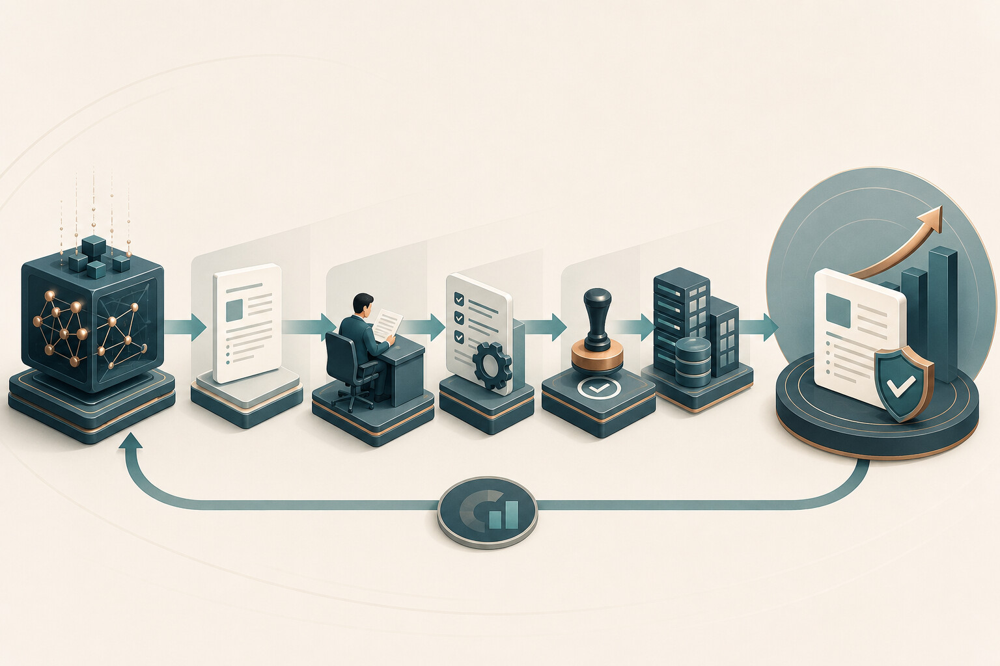
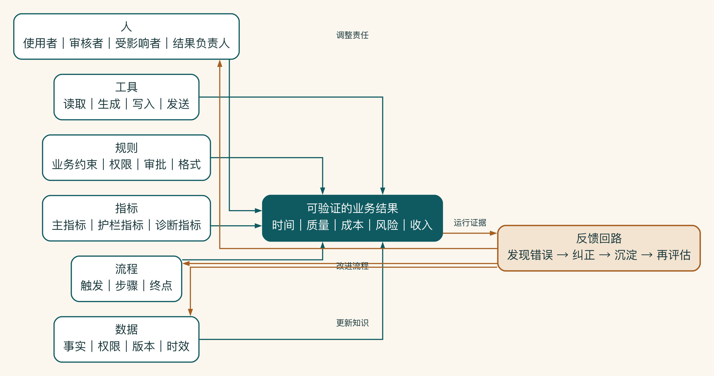
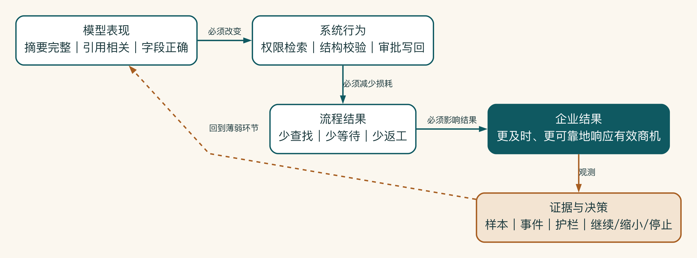

# 第 1 章 企业需要的不是 AI 工具，而是业务结果

启明科技的销售负责人第一次提出需求时，只说了一句话：“给销售做一个 AI 助手。”技术团队很快做出演示，回答也很流畅。可到了真实工作中，销售仍在翻文件、核对客户信息、等待主管确认。工具出现了，工作却没有真正改变。

所以先不谈模型和功能。更基本的问题是：谁的哪项工作会发生变化，又该用什么结果判断这项变化是否值得继续。

## 从一句常见需求开始

企业 AI 项目经常从一句工具化表达开始：

> 我们想做一个销售 AI 助手。

这句话可以启动讨论，却不能直接启动项目。它没有说明谁使用、在什么事件后使用、当前困难是什么、输出会进入哪里，也没有说明做成以后哪项业务结果会变化。

如果团队直接把它翻译成“做一个聊天入口”，很快就能拿出演示。销售输入问题，模型生成回答，屏幕上看起来已经有了产品。但当销售需要自己复制 CRM 信息、手动判断资料版本、再把输出复制回方案文档时，原来的工作链并没有改变。

企业购买的不是一个回答，而是一个结果。要看清两者的差别，先把模型能力和系统能力分开。

模型能力回答的是“它能不能完成某种认知任务”：总结、分类、提取、生成、推理、检索后回答、选择工具。

系统能力回答的是另一组问题：

- 它是否知道当前用户是谁。
- 它是否只能访问用户有权查看的资料。
- 它是否理解任务处于哪一步。
- 输出是否符合企业规则和结构。
- 高风险动作是否需要确认。
- 失败后是否能被发现、接管和复盘。
- 系统是否真的改善了业务指标。

一个模型可以生成流畅的销售方案，但如果引用了过期产品参数、泄露了其他客户信息，或者自动写入未经确认的报价，它就是一个能力强、系统弱的方案。



模型输出只是这条链路的起点。它还要经过事实核对、规则校验、权限与审批、企业系统写回和结果反馈，才可能变成可验证的业务结果。其中任何一环断开，演示中的能力都无法稳定兑现为价值。

因此，本书的第一个核心判断是：

> 模型决定系统能做什么，业务与控制设计决定系统能不能被企业使用。

## 用六类结构要素与反馈回路看见系统

可以先把项目想成一段正在发生的工作：谁在做，按什么步骤做，依据哪些事实，使用哪些工具，受什么规则约束，最后怎样判断做得更好。六类要素只是把这六个问题放到同一张桌面上。

为了避免被工具名带着走，本书用人、流程、数据、工具、规则、指标六类结构要素拆解需求，再用一条反馈回路说明运行记录怎样返回责任、流程和知识更新。它是本书定义的项目诊断框架，不是外部标准中的固定分类。

| 要素 | 要回答的问题 |
|---|---|
| 人 | 谁使用、谁审核、谁受影响、谁对结果负责 |
| 流程 | 什么触发任务，经过哪些步骤，在哪里结束 |
| 数据 | AI 依据什么事实，数据在哪里，由谁维护 |
| 工具 | AI 在哪些系统里读取、生成、发送或写回 |
| 规则 | 哪些业务、权限、审批和格式约束不能违反 |
| 指标 | 怎样证明时间、质量、成本、风险或收入发生变化 |
| 反馈回路 | 错误如何被发现、纠正、沉淀和再次评估 |



这张图强调，六类结构要素不是彼此独立的清单。它们共同决定结果能否发生，运行记录再经反馈回路返回责任、流程和知识更新。如果只有模型或工具发生变化，这套系统就没有形成反馈。

这个框架不是行业统一标准，也不是为了给方案增加七个标题。它的作用是迫使团队在进入技术选型前，看到被一句“做个 AI”遮住的系统结构。

先看人。AI 改变的是谁的工作？

至少识别四类角色：

- 使用者：直接和系统交互的人。
- 审核者：判断输出是否可用、能否执行的人。
- 受影响者：接收 AI 结果或被流程变化影响的人。
- 结果负责人：对业务指标和风险负责的人。

销售方案助手的使用者是销售，审核者可能是销售本人和主管，受影响者包括交付、客户和 CRM 管理团队，结果负责人是销售负责人。只访谈销售，不足以定义整个系统。

角色明确以后，再看流程：AI 要进入哪个具体步骤？

“帮助销售提高效率”不是流程。一个可讨论的流程至少要说明：新商机进入 CRM 后，销售何时开始准备材料，从哪里取得客户信息，谁确认事实，报价何时进入审批，方案发送后怎样更新商机状态。

AI 必须放在具体节点上。没有流程位置，AI 就只能停在流程旁边。

流程位置明确以后，还要看数据。事实、权限和时效同样重要。

企业知识不是把文件上传以后自动形成的。团队要知道资料是谁维护、哪个版本有效、谁能看、何时过期，以及检索失败时应怎样处理。

通用行业报告、内部产品资料、历史客户案例、合同和报价规则不能采用同一种数据策略。

工具决定了建议会不会变成真实动作。

AI 输出在哪里出现，决定它是否会改变工作。生成一段文字和创建一条 CRM 草稿记录是两种不同风险的动作。系统要区分读取、生成、写入、发送和删除，并为每类动作设计权限与确认。

规则清楚的事情，不要让模型替企业猜。

哪些客户属于重点客户、哪些资料不能跨部门查看、报价超过多少需要审批、方案必须包含哪些字段，这些都属于规则。没有显性规则，模型只能根据概率猜测。

没有基线，价值就无从比较。

“大家觉得方便”不能支持持续投资。系统至少要影响一项可观察结果，例如方案准备时长、资料查找时间、事实错误率、主管退回率、人工修改率或商机响应时间。

指标目标可以在基线采集前标为待测，但不能完全缺失。

错误还要回到知识、流程和系统中，不能只停在聊天记录里。

销售修改了哪些内容，主管为什么退回，哪个引用失效，哪条权限请求被阻断，这些记录决定系统能否持续改善。反馈不仅用于调提示词，也可能要求更新知识、规则、流程或责任分工。

把工具诉求改写成业务结果时，可以使用下面的句式：

```text
当【触发事件】发生后，
让【目标用户】能够在【目标时间/条件】内，
利用【获准的数据和系统】完成【业务动作】，
由【审核或责任角色】控制【关键风险】，
并用【指标】判断是否改善。
```

启明科技的原始诉求可以改写为：

> 当销售确认一个有效商机后，让销售在获准访问客户资料、产品知识和历史案例的前提下，更快完成可供主管评审的方案初稿；报价和对外承诺仍由销售与主管确认；试点通过方案准备时长、引用正确性、人工修改率和违规外部路由等指标验收。

这段话仍然没有选模型，却已经比“做一个销售 AI 助手”更接近技术方案。

企业为什么总是从工具名开始？这并不只是因为业务人员“不懂技术”。它往往来自组织内部的三种压力。

第一种压力是可见性。业务问题通常分散在许多细节里：等待资料、反复确认、跨系统复制、版本错误、审批退回。相比之下，“做一个智能助手”更容易被写进汇报材料，也更容易获得管理层注意。

第二种压力是预算语言。采购预算往往按照软件、平台、账号或基础设施申请，而不是按照“减少二十分钟等待”申请。团队为了获得资源，会主动把一个流程问题包装成工具项目。

第三种压力是技术供给。市场上出现新的模型、智能体框架或一体机后，组织会自然地问“我们能不能也用”。当供给先于问题进入会议，讨论就容易从“哪里存在损耗”滑向“新技术可以放在哪里”。

理解这些压力很重要，因为纠正工具导向不能靠一句“先谈业务价值”。项目负责人要把隐藏的问题重新变成可讨论、可预算、可验收的对象。例如，不要只否定“销售助手”，而要把它拆成方案准备时长、资料可信度、跨系统录入和审批等待四类损耗，再说明哪些损耗可以通过流程和系统共同改善。

## 建立四层结果链

一个成熟的项目至少要区分四层结果：企业结果、流程结果、系统行为和模型表现。

| 层次 | 典型问题 | 销售方案场景示例 |
|---|---|---|
| 企业结果 | 业务最终希望发生什么变化 | 有效商机得到更及时、更可靠的响应 |
| 流程结果 | 哪段工作方式必须改变 | 减少查资料、等确认和重复录入 |
| 系统行为 | 系统必须稳定完成什么 | 按权限检索、生成带引用草稿、进入审批并写回 |
| 模型表现 | 模型在具体任务上要达到什么水平 | 摘要完整、引用相关、字段提取正确 |



结果链需要逐层成立：模型指标先改变可观察的系统行为，系统行为再减少具体流程损耗，流程变化最终才可能影响企业结果。最右侧的业务结果必须回到证据与决策，帮助团队定位薄弱环节，并决定继续、缩小还是停止。

四层之间必须存在因果关系。模型摘要得分提高，不一定会让商机响应更快；如果主管仍然要重新核对全部资料，流程周期可能没有变化。反过来，模型并非每项指标都要达到接近人工专家的水平。如果系统能够准确标注不确定内容、保留引用并把关键判断交给负责人，整体业务结果仍可能改善。

项目评审时可以逐层追问：

1. 模型指标改善后，会改变哪个系统行为？
2. 系统行为改变后，会减少哪一个流程损耗？
3. 流程损耗减少后，怎样影响业务结果？
4. 如果其中一层没有变化，项目是否仍值得继续？

这组问题会识别出大量“技术上成功、业务上无效”的方案。例如，知识问答准确率从 78% 提升到 88%，但真实用户仍然回到群里询问产品经理，说明问题可能不在答案质量，而在知识覆盖、责任信任或入口位置。

不同结果之间还可能互相冲突。

企业 AI 项目很少只有一个目标。速度、质量、风险、采纳和成本常常同时变化，甚至方向相反。

启明科技如果只追求方案生成速度，系统可以在几十秒内给出完整文本。但销售核验时间可能增加，主管退回率也可能上升。相反，如果每一句都要求人工确认，错误风险下降了，流程却可能比原来更慢。

因此，项目要明确“主指标、限制条件指标和诊断指标”：

- 主指标说明项目主要改善什么，例如方案准备周期。
- 限制条件指标说明不能为了主指标牺牲什么，例如事实错误、越权访问和未经批准的外部承诺。
- 诊断指标帮助解释结果为什么变化，例如检索无结果率、人工修改类型和审批等待时间。

一个可用的验收表述是：方案准备中位数降低 30%。同时严重事实错误为零、权限放行条件全部通过、主管退回率不高于基线。这里的目标值只是项目假设，必须根据真实基线调整。

## 把讨论拉回真实工作

需求会上最有用的材料，不是功能愿望清单，而是一项刚刚完成的真实任务。启明科技让销售从最近一份方案讲起：客户信息从哪里来，哪一步等得最久，主管为什么退回，最后哪个系统记录了完成。

沿着这条时间线，团队很快发现，真正的问题不是“缺少生成按钮”，而是资料版本、事实确认和审批等待。于是原来的工具需求被改写成一项可以检查的业务承诺：方案准备时间要下降，但引用、权限和人工确认不能变差。

怎样主持这类会议、怎样填写结果合同，放在附录 I。正文只保留一个判断：如果团队不能说清输出之后发生了什么，就还没有定义业务结果。

## 客服机器人回答得很好，为什么工作量没有减少

另一家公司曾上线内部客服知识机器人。离线评估中，常见问题回答正确率明显提高，管理层认为可以减少人工咨询。三个月后，人工工单数量几乎没有变化。

复盘发现，员工遇到简单问题时使用机器人，但这些问题原本就能通过搜索解决。真正产生工单的是账号冻结、费用争议和跨系统状态不一致，机器人既无权读取完整状态，也不能发起受控流程。为了安全，它只能回答“请联系支持”。模型表现改善了，系统没有进入高成本工作。

项目最初把“回答问题”当业务结果，把回答准确率当主指标，没有追问回答以后用户能否完成任务。正确的结果链应该区分：信息问题通过获准知识直接解决。状态问题读取用户自己的记录。

动作问题进入身份验证和确定工作流。无法处理的问题携带上下文创建工单。只有减少端到端未解决请求，才算真正改善客服工作。

模型也许做得到，团队却可能用一个容易测量的模型指标，替代真正的业务终点。这种错位比模型能力不足更常见。

项目此时还没有选模型，却已经知道要改变哪段工作、怎样判断结果。先把结果说清楚，技术讨论才不会从一开始就失去方向。
