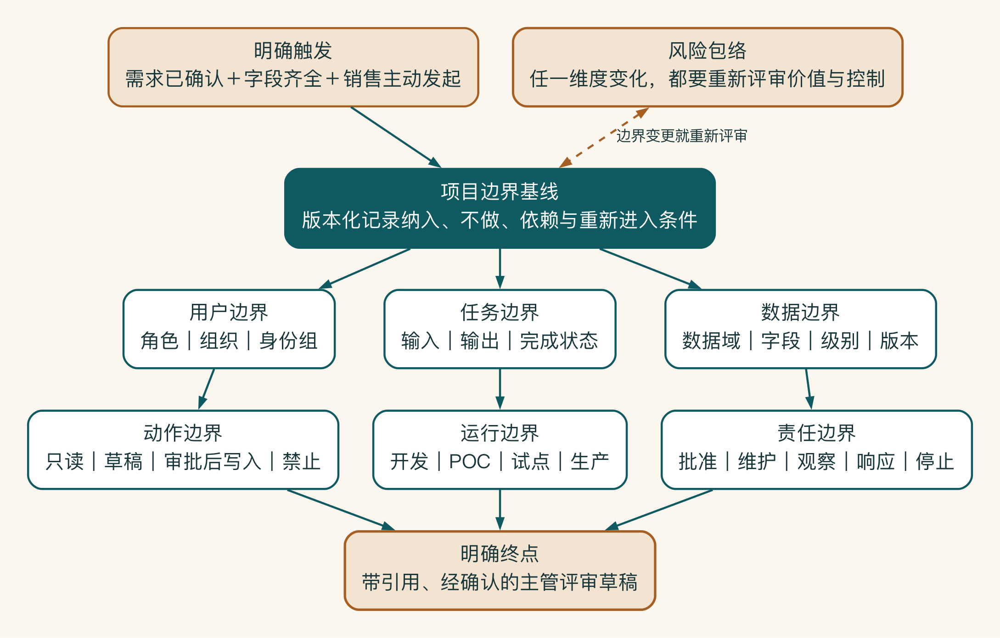
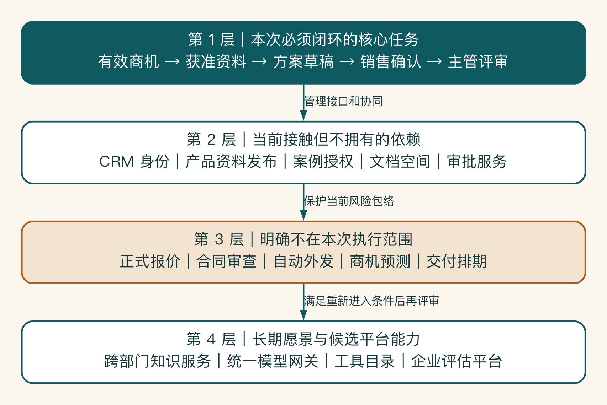

# 第 2 章 从一句模糊需求到清楚的系统边界

“销售助手”听起来只是一个小项目。开会半小时后，它却开始包含客户资料、产品知识、报价、合同、CRM 写回和跨部门审批。每个人都只加了一点需求，项目边界却在悄悄移动。

范围失控很少来自一次重大决定，更多时候是这样一点点变大的。边界不是一张系统框图。它要说清楚任务从哪里开始、在哪里结束、使用哪些数据、允许哪些动作，以及哪些事情这次明确不做。

## 边界移动怎样拖垮项目

启明科技第一次讨论销售方案助手时，范围只有“帮助销售查资料、写方案”。第二次会议，市场希望加入行业监测，交付希望加入 SOP 问答，管理层希望自动生成报价，IT 又提出以后最好成为全公司的统一 AI 入口。

每个新增想法都看起来只多一点功能，叠加以后却变成了另一个项目：用户变多、数据变多、权限变复杂、风险更高，原本六周能验证的试点失去了清楚终点。

项目边界帮助团队看清当前正在验证什么，也避免新增需求悄悄改变项目。

## 用触发和终点定义边界

一个业务系统首先要说明从哪里开始、到哪里结束。

销售方案助手的候选触发可以是：

- CRM 中新增商机。
- 销售确认客户访谈完成。
- 主管要求准备正式方案。
- 用户在聊天入口里随意提问。

四种触发会形成不同系统。为了控制试点，启明科技选择“销售在 CRM 中确认有效商机并主动发起方案准备”。换句话说系统不监控所有聊天，也不自动判断所有线索是否有效。

终点也要明确。系统是生成一段文字就结束，还是在销售确认后创建方案草稿、保存引用并更新 CRM 状态？终点决定系统集成、权限、审计和验收范围。


边界图同时表达三件事：一个明确事件把任务送入系统，一个可验收的业务结果结束本轮责任，边界内的角色、数据、动作与系统均有获准范围。边界外的内容并非“永远不做”。它们只是当前试点不承担，或者仍需另行验证和批准。

边界确定以后，还要识别五类利益相关者。项目不能只围绕最积极的使用者设计。建议至少识别：

| 角色 | 关心什么 | 在本项目中的例子 |
|---|---|---|
| 使用者 | 是否省事、输出是否能用 | 销售 |
| 业务负责人 | 是否改善业务结果 | 销售负责人 |
| 系统与数据负责人 | 接口、数据和维护责任 | CRM、飞书和知识库负责人 |
| 控制角色 | 权限、安全、合规和成本 | 安全、法务、财务、采购 |
| 下游受影响者 | 输出是否可信、责任是否清楚 | 主管、交付团队、客户 |

这些角色不必每天参加项目会，但关键假设必须由相应角色确认。项目团队不能代替安全批准数据外发，也不能代替销售负责人定义什么叫可用方案。

接着给数据和系统画边界。它不是一条抽象的框。它要具体到数据源、动作和环境。

启明科技试点纳入：

- 已指定范围的产品资料和交付 SOP。
- 已获得访问权的历史案例。
- 当前销售本人有权限查看的 CRM 商机字段。
- 公开行业资料。
- 方案草稿文档和 CRM 草稿状态写回。

试点暂不纳入：

- 全量历史合同和报价明细。
- 其他销售团队的客户沟通记录。
- 自动对外发送邮件或方案。
- 自动承诺价格、折扣和交付周期。
- 全公司通用聊天入口。

“暂不纳入”不代表永远不做，而是说明它们需要新的价值、风险和实施评审。

不做范围也是方案的一部分。很多项目把“不做什么”留到实施时再争论，结果开发团队和业务方对完成状态理解不同。

一个合格的不做范围要说明原因和重新进入条件：

| 不做项 | 当前原因 | 重新评审条件 |
|---|---|---|
| 自动生成正式报价 | 责任和规则尚未明确 | 报价规则结构化，主管审批和审计链路完成 |
| 自动向客户发送方案 | 影响外部承诺，难以撤回 | 输出质量、安全放行条件和发送前确认通过评审 |
| 导入全部历史文档 | 版本、权限和负责人不清 | 完成资料清洗、分区和下架机制 |
| 全部门一次上线 | 无真实质量和容量证据 | 小范围试点达到业务、工程和安全门槛 |

这比一句“二期再做”更有用，因为团队知道未来需要补什么证据。

边界会议还要把假设和事实分开。AI 项目早期有大量未知：销售每天准备多少份方案，本地模型质量是否足够，CRM 接口是否支持细粒度权限，用户是否愿意确认引用。

问题不在于存在假设，而在于把假设写成事实。

建议使用假设登记表：

| 假设 | 当前依据 | 验证方法 | 负责人 | 截止时间 | 不成立怎么办 |
|---|---|---|---|---|---|
| 资料查找占方案时间的 40% | 三名销售访谈 | 两周时间采样 | 销售运营 | 第 1 周 | 缩小知识检索优先级 |
| 本地模型可完成客户摘要 | 内部演示 | 30 条真实样本压测 | AI 工程 | 第 2 周 | 改为隔离云服务或人工处理 |
| CRM 支持草稿写回 | 接口文档 | 沙箱联调 | CRM 负责人 | 第 2 周 | 先输出结构化文件，由人导入 |

每个假设都要对应一个决策。如果无论结果怎样方案都不会变化，那它可能不是值得优先验证的假设。

边界不仅限制系统，也限定谁有权作决定。项目边界还包括决策边界。谁定义指标，谁批准数据，谁决定上线，谁处理事故，都必须具体。

在试点阶段，启明科技采用以下最小分工：

- 销售负责人批准业务目标、范围和验收。
- 产品与项目团队负责问题定义、流程、方案和评估组织。
- IT 负责身份、集成、环境和运行能力。
- 安全负责人批准数据、权限、日志和事故设计。
- 知识负责人负责资料版本和下架。
- 财务参与成本归属和扩大投资判断。

这里的“负责”意味着提供证据并作出决定，不是被抄送一封邮件。

## 边界要能回答几个日常问题

边界听起来抽象，落到项目里其实是几个日常问题：谁可以使用，能看到哪些资料，可以做到哪一步，结果写回哪里，费用算给谁，出了问题由谁接手。

这些问题没有答案时，范围就会跟着每次会议移动。启明科技因此把试点限制在销售方案准备，允许读取获准的客户和产品资料，只生成内部草稿；报价、合同和自动外发都暂时排除。六类边界的完整检查表放在附录 I。



## 用四层边界图建立共同语言

边界讨论最容易陷入两种极端：业务方认为技术团队总在说“不”，技术团队认为业务方不断加需求。一个有效方法是把系统画成四层同心边界，而不是用一张功能列表争论。

```text
第 1 层：本次必须跑通的核心任务
  有效商机 -> 获准资料 -> 方案草稿 -> 销售确认 -> 主管评审

第 2 层：当前接触但不拥有的依赖
  CRM 身份、产品资料发布、案例授权、文档空间、审批服务

第 3 层：明确不在本次执行范围的相邻任务
  正式报价、合同审查、自动外发、商机预测、交付排期

第 4 层：长期愿景与候选平台能力
  跨部门知识服务、统一模型网关、工具目录、企业评估平台
```



四层范围把“当前必须完成”和“未来可能复用”分开：第一层承诺端到端证据，第二层管理接口与协同，第三层保护当前风险包络，第四层只保留长期方向。相邻任务只有满足重新进入条件后，才从候选愿景变成当前范围。

第一层决定本阶段必须完成的端到端证据。第二层决定协同和接口。第三层保护试点。第四层说明设计为什么保留某些扩展点。四层不能混在同一个里程碑里。

启明科技在边界工作坊中发现，“案例授权”不是销售助手自己的功能，却是方案能否安全生成的前置依赖。“统一模型网关”可能被多个场景复用，却不必在概念验证阶段先建设完整多租户平台。通过层次划分，团队既没有忽视依赖，也没有把所有依赖变成当前建设范围。

边界图需要标注版本和日期。首次访谈得到的是 v0.1，样本和接口验证后可能变成 v0.3。每次变化写明新增事实、影响和批准人。边界本身就是需要管理的项目制品，而不是立项时的一页幻灯片。

边界最终要落实到字段和动作。“接入 CRM”在技术和业务上都过于宽泛。CRM 中可能有联系人、客户收入、合同、投诉、报价、竞争信息和内部备注。接入可以意味着搜索、读取、创建草稿、修改状态或批量导出。真正可执行的边界需要落到字段与动作矩阵。

启明科技为试点建立了下面的最小矩阵：

| 对象/字段 | 权威来源 | 读取 | 生成 | 写回 | 额外控制 |
|---|---|---:|---:|---:|---|
| 商机 ID、行业、需求摘要 | CRM | 是 | 否 | 否 | 按当前销售对象权限 |
| 客户联系人与联系方式 | CRM | 仅显示必要字段 | 否 | 否 | 不进入模型原文日志 |
| 产品事实与版本 | 产品知识库 | 是 | 只能引用和改写 | 否 | 仅生效版本 |
| 历史案例摘要 | 案例库 | 是 | 可生成相关性说明 | 否 | 客户、项目和复用标签过滤 |
| 方案正文 | 文档系统 | 是 | 是 | 创建草稿 | 销售确认后写入指定空间 |
| 报价与折扣 | 定价系统 | 仅显示批准规则 | 不生成正式值 | 否 | 超出试点动作范围 |
| CRM 方案状态 | CRM | 是 | 否 | 更新为“草稿待审” | 幂等、确认、后置条件 |

这张矩阵会直接转化为接口作用域、数据最小化、工具契约和测试用例。以后有人说“把联系人也带进提示词会更自然”，团队可以依据目的和边界决定，而不是凭感觉加字段。

字段边界还要考虑派生数据。客户名称与行业单独看可能只是内部信息，与会议内容、金额和竞争对手组合后可能成为敏感商业资料。输出也会继承输入和企业知识的级别，不能因为是模型生成就自动降级。

## 启明科技的边界基线会议

试点启动前，项目组举行了一次九十分钟边界基线会议。会议没有邀请所有相关人员，只邀请能够对边界作决定的六人：销售负责人、两名销售代表、CRM 负责人、知识负责人、安全负责人和产品/项目团队。

会议按业务对象推进，而不是按功能菜单推进。

首先确认“商机”。销售负责人最初希望系统对所有新线索自动生成方案，销售代表指出，大量线索尚未确认需求，自动生成只会增加噪声。最终触发条件被收紧为“需求已确认且关键字段齐全，由销售主动发起”。

其次确认“案例”。知识负责人说明历史方案不能直接当案例库：部分项目受保密约束，部分内容已经过时，还有一些业绩数据没有批准对外复用。因此，概念验证只纳入十二个经负责人标注的案例摘要，不导入全部历史方案。

第三确认“动作”。CRM 负责人原以为系统只读，销售负责人却希望自动更新方案状态。双方最后同意提供一个最小写回动作：销售在确认卡上查看商机、文档和字段变化后，系统创建草稿链接并把状态更新为“草稿待审”。不允许修改金额、预计签约日和客户联系人。

最后确认“运行”。开发环境使用合成数据，概念验证使用脱敏样本和沙箱 CRM，试点才接入限定真实用户与真实权限。三个环境拥有不同身份组、密钥和日志策略，不能把个人原型直接升级为试点。

会议产出一份边界基线，所有“以后可能做”的内容进入候选池，不进入当前承诺。最重要的决定，是把“自动报价和外发”明确排除。这样团队不会等到第四周才发现必须重新进行风险与责任评审。

## 一个内部助手怎样变成影子企业平台

某企业最初只为采购团队做合同摘要。由于效果不错，其他部门陆续要求接入：人力上传简历，财务分析发票，法务查看合同，销售总结客户会议。开发团队为了响应需求，继续在同一聊天入口增加文件上传和多个模型渠道。

六个月后，系统拥有全员账号、跨部门文件、共享服务密钥和无法区分用途的日志，却仍按“内部试用工具”管理。没有人能说明哪些资料允许进入外部模型，离职员工上传的文件怎样删除，某次回答来自哪个部门知识。

一次供应商审查要求暂停外部通道时，团队无法只关闭受影响场景，只能关闭整个系统。

真正的问题在于平台边界从未被正式建立，平台化本身并没有错。每次“只增加一点功能”都扩大了用户、数据和责任，却没有重新进行价值、架构和控制评审。如果当初把合同摘要作为一个场景，将身份、路由和日志等能力作为可复用候选，再为新部门分别建立数据与责任边界，就能在复用和隔离之间取得平衡。

边界漂移起初像是需求管理问题，继续扩大以后，才会变成权限、成本、运行和事故处理问题。

启明科技把自动报价、合同和对外发送留在候选池里，当前六周试点只回答一个问题：受控的资料检索与方案草拟，能不能缩短准备时间。项目终于有了可以完成、也可以停止的范围。
