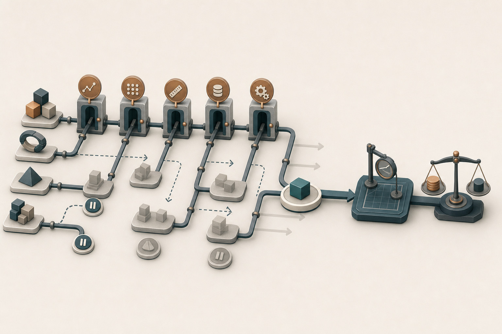
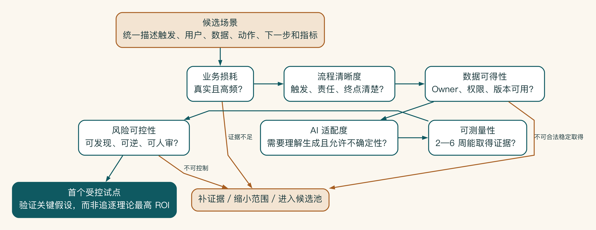
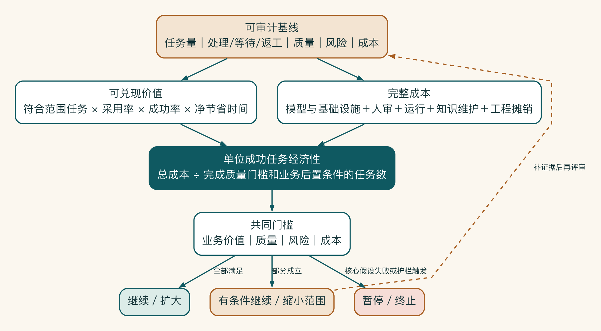

# 第 3 章 场景优先级、业务基线与投入回报判断

如果一张场景评分表算到了小数点后一位，我反而会多问一句：这些分数是测出来的，还是大家在会议室里猜出来的？企业刚开始做 AI 时，后者更常见。

场景选择不是数学竞赛。真正要决定的是，哪一个问题值得先花一小笔钱去验证，以及什么结果会让团队承认这条路走不通。基线和投入回报仍然重要，但它们首先是帮助判断的工具，不是为项目制造确定感的装饰。

## 先区分机会，再排列场景

启明科技把销售 AI 助手拆开后，得到五个候选任务：行业研究、客户摘要、内部案例检索、方案初稿和报价建议。销售最想先做方案生成，CEO 最关注报价，安全团队希望先把内部知识问答管起来。

如果用投票决定，结果只会反映谁声音大。场景选择需要同时考虑价值、可行性、风险和可测量性。

筛选之前，先建立场景组合，不要把所有想法直接排成一列。先用统一句式描述每个场景：

```text
当【触发】发生时，
帮助【用户】利用【数据】完成【业务动作】，
输出进入【下一步】，
并用【指标】验证价值。
```

统一描述后，很多伪场景会暴露出来。例如“建设企业大模型平台”不是一个业务场景，因为它没有直接用户、触发和业务动作。它可能是多个已验证场景共同需要的平台能力。

## 六个优先级维度

场景排序更像急诊分诊，不像评选最佳创意。团队既要看潜在价值，也要看现在能不能安全地处理、能否较快获得证据，以及失败以后是否容易收回。

可以按六个维度初步评分，但分数只是讨论工具，不是自动决策器。

| 维度 | 关键问题 | 高分特征 |
|---|---|---|
| 业务损耗 | 当前问题有多痛 | 高频、耗时、错误或机会损失明显 |
| 流程清晰度 | 输入输出和责任是否清楚 | 有稳定触发、步骤、规则和终点 |
| 数据可得性 | 需要的事实能否合法稳定取得 | 有负责人、权限、版本和接入方式 |
| AI 适配度 | AI 是否适合处理核心任务 | 信息密集、需要理解生成、允许一定不确定性 |
| 可测量性 | 能否在短周期内验证 | 有基线、样本和明确结果 |
| 风险可控性 | 错误是否可发现、可逆、可人审 | 影响有限，可阻断、可回滚、有责任人 |



候选场景不应只在一张总分表里竞争。每个场景都要穿过价值、流程、数据、技术、可测量性和风险等独立证据门。关键条件未成立的场景进入补证据、缩小或暂停支路，只有范围与验收方式同时清楚的场景才进入首轮试点。



六个维度更适合作为逐步淘汰假设的证据门，而不是最后算一个总分。业务损耗、数据和风险中的任一关键条件不成立，场景就应先补证据、缩小范围或回到候选池。通过全部证据门，才形成适合首轮验证的受控试点。

评分时必须写证据。例如“数据可得性 4 分”的证据可能是已经存在一个有负责人、权限清楚的产品资料库。如果只是“资料应该都在飞书”，不能给高分。

价值高，不等于适合第一个做。报价自动化可能潜在价值很高，但它涉及商业承诺、权限和责任，第一阶段不一定适合直接自动执行。相反，行业资料整理风险低，却可能难以形成明显竞争优势。

第一个试点更适合满足以下条件：

- 问题真实且高频。
- 流程边界能够在一个部门内控制。
- 数据不完美但有机会管理。
- 输出需要判断，却可以通过人审降低风险。
- 2—6 周内能够采集效果证据。
- 即使失败，也不会造成不可逆后果。

因此，首个场景应当优先用有限成本验证关键假设。理论投入回报最高，并不足以成为入选理由。

## 没有基线，就没有改进

很多 AI 试点在完成后才开始问“节省了多少时间”。这时团队只能依靠回忆，容易高估价值。

基线至少包括四类：

| 类型 | 示例 |
|---|---|
| 时间 | 方案准备中位数、资料查找时长、主管评审周期 |
| 质量 | 事实错误、引用缺失、退回原因、人工修改比例 |
| 产量 | 每周方案数量、有效商机响应数、知识问答量 |
| 风险与成本 | 数据外发方式、工具账号、人工成本、模型与基础设施成本 |

优先使用中位数、分位数和分布，不只用平均值。一次特别复杂的方案可能拉高平均时间，却不能代表大多数任务。

基线采集也要定义口径。例如“方案完成”是生成第一版、主管通过，还是发送客户？口径不一致，前后数字没有可比性。

## 先判断哪条假设最值得验证

早期的投入回报不是结论，而是一组带条件的假设。任务量可能没有访谈中说得那么大，节省的时间也不一定会转化为收入。与其给出一个看似精确的总数，不如把任务量、采用率、节省时间和完整成本分别写出来。

启明科技没有选预计收益最高的报价自动化，而是先做方案准备。原因很简单：它有足够高的频率，资料和用户容易获得，错误仍可以由销售和主管在外发前发现。试点先验证最不确定的部分，结果不成立就缩小或停止。

敏感性分析、单位经济性、风险折扣和组合管理属于进一步的投资判断，完整方法移到附录 H。普通读者先记住：先找真实基线，再判断哪项未知最值得花钱验证。



## 启明科技的场景组合评审

为了避免“谁声音大谁先做”，启明科技把最初的五个想法拆成八个可以独立验证的场景。它们包括会议纪要结构化、客户信息补全、产品知识问答、案例检索、行业研究、方案草稿、报价风险检查和 CRM 草稿写回。

项目组没有立即给每项打总分，而是先写证据和最大未知：

| 场景 | 主要价值 | 当前证据 | 最大未知 | 初步结论 |
|---|---|---|---|---|
| 会议纪要结构化 | 减少整理和遗漏 | 20 份纪要、销售确认频繁重复整理 | 不同会议格式是否稳定 | 纳入当前流程 |
| 产品知识问答 | 减少等待产品经理 | 群聊中高频重复问题 | 文档版本和负责人是否清楚 | 先管理小知识域 |
| 案例检索 | 提高方案相关性 | 销售大量复用个人旧方案 | 案例复用权限不完整 | 限定 12 个批准案例 |
| 行业研究 | 节省公开资料整理 | 工作量高但结果差异大 | 开放搜索成本与来源质量 | 只做有限研究实验 |
| 方案草稿 | 缩短编写与结构化 | 真实需求明确 | 事实核验是否抵消节省 | 主试点场景 |
| 报价风险检查 | 减少不合规折扣 | 退回记录可查 | 规则尚未完全结构化 | 只做规则提示 |
| 自动决定折扣 | 潜在价值高 | 无可接受责任设计 | 高影响且不可由模型决定 | 排除 |
| CRM 草稿写回 | 减少重复录入 | 字段和接口清楚 | 重复执行与权限 | 后半程验证 |

这张表改变了讨论方式。方案草稿仍是业务入口，但不再被当成一个孤立的生成任务；它依赖会议结构化、知识检索、规则提示和受控写回。自动折扣虽然获得管理层关注，却因责任和规则不成熟被明确排除。

团队随后将工作分为两条轨道：价值轨道验证端到端草稿周期，能力轨道只建设为该端到端任务服务的最小身份、知识、评估和工具能力。任何平台工作都要说明当前被哪两个任务使用，避免以“以后复用”为由提前扩大。

## 那个声称一年节省两千万元的自动摘要

某公司曾依据“每名员工每天节省十分钟”估算一个通用摘要工具一年可节省两千万元。这个数字把全员人数、全年工作日和人力成本相乘，看起来非常有吸引力。

上线后，只有少数知识岗位重复使用。大量摘要用于原本不会阅读的长邮件，并没有替代工作。员工仍需核验敏感内容。模型、支持和安全成本没有计入。项目没有定义成功任务，也没有记录释放时间怎样转化为业务结果。

几个百分点的估算误差并非核心问题，缺失的价值链才是。人数不等于使用量，使用量不等于成功任务，节省分钟不等于可兑现收益。更诚实的模型应从真实高频任务、采用、成功、人工审核和下一步结果开始，并保留停止条件。

启明科技没有选择理论收益最高的报价自动化，而是先验证频率更高、风险更容易控制的方案准备。这个决定并不保证成功，但能用一笔有限投入，尽早判断最重要的假设是否成立。
