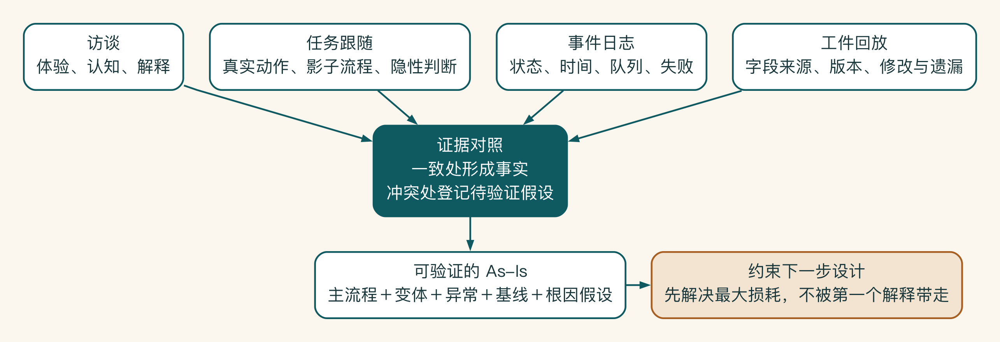
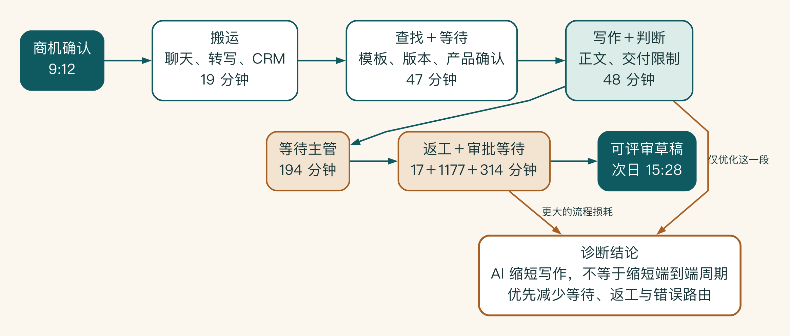

# 第 4 章 先别急着改流程，看看工作怎样发生

流程文件上写着“销售提交资料，主管审核，运营归档”。真正跟着一份方案走完两天后，团队才看到十几个聊天窗口、三个私人表格和五次重复确认。纸面流程没有撒谎，只是漏掉了大部分真实工作。

要改变这项工作，先别急着画未来的流程。跟着一项真实任务走一遍，看看人们在哪里等待、返工、绕行，又在什么时候依靠经验作判断。问题往往藏在这些细节里。

## 走进真实流程现场

启明科技的销售主管最初这样描述方案准备流程：销售查看客户需求，查找相关资料，编写方案，主管审核，然后发给客户。五个步骤听起来很清楚。

项目团队跟着两名销售实际完成一次任务后，看到的是另一条流程：

1. 在 CRM、聊天记录和个人笔记之间寻找客户背景。
2. 在群里询问谁做过相似项目。
3. 打开多个文档，判断哪一份产品参数最新。
4. 复制旧方案，删除客户名称，再补写行业内容。
5. 把方案发给产品经理确认技术事实。
6. 因为缺少报价信息，等待主管回复。
7. 主管发现引用了过期案例，退回修改。
8. 发送客户后，再手工把链接和状态补进 CRM。

制度文件描述组织希望怎样工作，现状流程诊断要记录工作实际上怎样发生。两者之间的差距，往往就是 AI 项目的机会和风险来源。

先别问“哪一步可以用 AI”。如果访谈一开始就问 AI 机会，用户会把注意力放在生成、总结和问答上。更有效的问题是：

- 最近一次完成这项任务是什么时候？
- 从哪个事件开始？第一份输入在哪里？
- 你打开了哪些系统和文件？
- 哪一步需要等别人？为什么？
- 哪些内容经常复制、核对或返工？
- 正常流程之外，最近一次失败发生在哪里？
- 任务完成后，谁还要继续处理？

让用户回忆一次具体任务，比让他描述“平时大概怎样做”更接近事实。

## 八类常见流程损耗

流程损耗很像道路拥堵。车速慢不一定是发动机不够强，也可能是路口设计、反复绕行、等待放行或事故占道。先分清堵在哪里，才知道该换工具、改规则，还是重画路线。

| 损耗 | 典型表现 | 可能的根因 |
|---|---|---|
| 等待 | 等资料、等审批、等系统返回 | 责任不清、批量处理、权限不足 |
| 搬运 | 在聊天、文档和系统之间复制 | 系统割裂、接口缺失、格式不统一 |
| 查找 | 找文件、找历史案例、找联系人 | 分类混乱、知识无负责人、入口过多 |
| 重复 | 重复录入、重复生成、重复核对 | 数据不同步、没有复用机制 |
| 判断 | 依赖少数专家确认 | 规则隐性、知识未结构化 |
| 返工 | 主管退回、事实错误、格式不合格 | 输入缺失、规则不清、反馈太晚 |
| 遗漏 | 忘记任务、字段或后续动作 | 没有强制节点、提醒和验收 |
| 责任断点 | 出错后互相等待或推诿 | 终点、负责人和升级机制不清 |

AI 可能适合处理其中一部分，但不是所有损耗都需要 AI。权限审批太慢，可能要改制度；系统字段重复，可能需要普通接口同步；资料版本混乱，首先需要知识管理。

观察影子流程。

正式系统之外的表格、个人模板、群消息和手工脚本被称为影子流程。它们不一定错误，反而常常代表员工已经为真实工作创造了补丁。

销售个人维护的“最好用案例清单”说明正式案例库难以检索。群里反复询问产品参数说明文档版本不可信。发送方案后用私人表格追踪说明 CRM 的流程或体验不满足需要。

流程图上方通常只有少数正式步骤，真正消耗时间的却可能是图面之下的等待队列、跨系统搬运、个人表格和反复核对。现状流程诊断的任务，就是把这些原本不可见的工作变成可以验证的证据。

不要急着消灭影子流程。先问它补偿了什么缺口，再决定把能力吸收到正式系统，还是保留受控的灵活性。

给流程建立基线。

流程图告诉你步骤，基线告诉你问题有多大。至少记录：

- 处理时间：真正动手工作的时间。
- 等待时间：任务停在队列或等人的时间。
- 首次通过率：不返工完成的比例。
- 异常率：缺资料、权限失败、系统错误等比例。
- 交接次数：跨角色、跨系统和跨部门的次数。
- 变异：简单任务与复杂任务差距有多大。

启明科技用两周记录 30 次方案准备任务，不追求统计学上的最终结论，只为了建立足以支持概念验证的起始口径。团队发现，真正写作只占部分时间，查资料、确认版本和等待审批才是主要损耗。

如果只优化生成速度，项目不会解决最大的业务问题。

证据基本一致以后，再画一张可以核对的现状流程。现状流程不用一开始就使用复杂符号，但至少要包含：

- 触发事件。
- 每个步骤的执行角色。
- 使用的数据与系统。
- 主要输出。
- 等待、返工和异常位置。
- 最终业务终点。

建议在流程上直接标注证据：某一步来自哪次观察、平均或中位耗时是多少、异常发生过几次、当前数据是否只是估计。

## 用三角验证避免“访谈真相”

用户访谈、系统记录和现场观察可能给出不同答案。销售说自己每天花两小时找资料，系统日志却显示大部分时间停在主管审批。制度写明所有方案应从标准模板开始，实际用户却从历史客户文档复制。

项目团队不用判断谁在撒谎，而要理解不同证据各自能说明什么：访谈反映体验和认知，日志反映系统事件，观察反映行为，业务记录反映最终结果。重要结论尽量由两类以上证据支持。若证据冲突，把冲突本身登记为待验证问题，不急于用平均数抹平。

特别要区分高频痛点和印象深刻的偶发事故。两者都可能值得处理，但优先级、控制和验收方式不同。

基线也要指定维护者。若试点期间业务口径或流程发生变化，应记录变化日期，避免把外部变化误算成 AI 效果。

四类材料回答的问题不同：访谈解释体验，任务跟随暴露真实动作，日志还原状态和等待，工件回放追溯字段与版本。它们互相印证的部分可以视为流程事实，彼此冲突的地方则留待继续验证。这样还原出的现状，才足以支持后面的流程设计。

一次访谈通常不足以看清流程，因此还要配合另外几种方法。不同方法适合发现不同类型的问题。

**任务跟随。** 观察者跟随执行者完成一项真实任务，记录时间、系统、文件、交接和临时判断。任务跟随最容易发现复制粘贴、个人模板、绕过系统和等待他人的细节。

观察时不要不断打断用户。可以先记录动作，在关键节点结束后再问“为什么这样做”“如果失败会怎么办”。频繁追问会让用户进入讲解模式，反而偏离日常行为。

**工件回放。** 选择一份已经完成的方案、审批单或客户记录，从最终结果向前追溯：每个字段来自哪里，谁修改过，哪些信息在系统里没有留下痕迹。工件回放适合处理周期较长、无法现场等待完整执行的任务。

**事件日志分析。** 从 CRM、工单、文档和审批系统提取时间戳，重建任务在各状态停留的时间。日志可以显示队列和等待，却通常无法解释为什么等待；它需要与访谈和观察结合。

**异常复盘。** 不要只抽取“正常完成”的任务。选择一次严重退回、一次权限失败、一次资料冲突和一次人工救火，追踪异常怎样被发现、谁介入、哪些信息丢失。异常往往比顺利完成的样本更能揭示系统需要什么控制。

四种方法不必在所有项目中全部使用，但关键结论至少应有两种证据互相支持。

先看画出时间，而不只是画出步骤。

许多流程图看起来只有八个节点，却可能跨越三天。问题不在步骤数量，而在每个节点的处理时间和等待时间。

可以为一次任务建立时间轴：

| 阶段 | 处理时间 | 等待时间 | 等待对象 | 是否产生返工 |
|---|---:|---:|---|---|
| 整理客户背景 | 25 分钟 | 0 | — | 否 |
| 查找案例和参数 | 45 分钟 | 30 分钟 | 产品群回复 | 是 |
| 形成初稿 | 35 分钟 | 0 | — | 否 |
| 主管确认报价 | 10 分钟 | 6 小时 | 销售主管 | 是 |
| 更新 CRM | 8 分钟 | 0 | — | 否 |

图中把一次真实任务按事件顺序拆开。写作与判断只有 48 分钟，后续等待和返工却占据绝大部分端到端周期。因此，把生成速度从几十分钟压到几分钟，并不会自动解决主管排队、资料冲突或错误审批路由。

这项任务的直接处理时间只有 123 分钟，但端到端周期远远更长。AI 即使把初稿从 35 分钟缩短到 5 分钟，也不能解决六小时审批等待。相反，如果系统能在生成前补齐审批材料、按金额自动路由到正确负责人，整体周期可能得到更大改善。

流程分析因此要同时看三种时间：触碰时间、等待时间和返工时间。只测用户面对 AI 界面的时间，会严重高估价值。

区分主流程和流程变体。

“销售方案流程”往往不是一条流程。标准产品、新行业、组合交付和大型定制项目可能有不同资料、审核和风险。试图用一张图覆盖所有情况，会得到大量模糊的“视情况而定”。

可以先按影响最大的变量分类：

- 客户是否为新客户。
- 产品是否标准化。
- 是否涉及非标准报价和合同条款。
- 是否需要跨区域或跨部门资源。
- 数据是否包含敏感客户信息。

分类后选择一个主流程和两三个高频变体。主流程用于设计首个端到端方案，变体用于测试系统是否需要分支或暂时排除。清楚的任务分类和边界才能管理复杂度。把所有路径塞进一个智能体，只会把复杂度藏起来。

## 从症状走到根因

流程损耗只是症状。同一个“等待主管”可能有完全不同的根因：

- 主管按固定时间批量处理。
- 申请材料经常缺字段。
- 金额和政策偏差没有被突出显示。
- 审批人映射不清，任务被错误转发。
- 主管担心承担责任，因此重复核验全部内容。

如果根因是材料不完整，AI 可以在提交前检查和补齐。如果根因是决策权不清，需要调整制度。如果根因是审批界面没有突出变化，可能只需普通软件改造。

诊断时可以连续追问“为什么”，但不要把所有问题都归结为个人习惯。企业流程常由激励、权限、系统约束和历史事故共同形成。一个看似低效的手工检查，可能是过去某次严重错误后建立的风险控制。删除它之前必须理解它保护什么。

影子流程也会暴露组织问题。

个人表格和群消息不仅是技术债，也可能反映正式流程缺乏信任。员工保存自己的案例清单，常常是因为不相信中央知识库里的版本，而非不知道它的存在。他们在群里请专家确认，也可能是正式审批太慢，或者错误责任最终落在个人身上。

因此，影子流程分析要记录三类信息：它提供的实际价值、它绕过的控制、以及用户为什么愿意承担绕过风险。未来系统既要吸收它的便利，也要补上它缺少的权限、版本和审计。

直接宣布“禁止个人工具”通常会把影子流程藏得更深。更有效的做法是先提供可用替代路径，再逐步关闭高风险入口，并让用户知道新系统怎样处理他们真正关心的问题。

诊断最终要形成问题陈述，而不是只留下一张漂亮流程图。现状流程诊断的最终产物应当能用一段话说明：什么角色在什么任务中遇到什么损耗，损耗由哪些证据支持，当前根因假设是什么，哪些部分值得进入下一阶段验证。

例如：

> 标准销售方案的端到端周期中，资料查找、版本确认和报价等待占主要比例。30 次任务记录显示，初稿写作并非最大损耗；12 次退回中有 7 次与资料或客户字段缺失有关。首个试点应优先验证受控检索、输入完整性检查和带上下文审批，生成能力只作为端到端流程的一部分。

这段陈述可以直接约束目标流程设计。如果下一阶段的方案只优化写作，就与诊断证据不一致。

## 一次完整任务跟随：两小时工作为什么跨了两天

项目组选择了一次标准产品方案进行任务跟随。客户不是第一次接触启明科技，需求也相对清楚，按主管描述应该是最容易的一类任务。

周二 9:12，销售在 CRM 把商机改为“需求已确认”。他没有立即开始写方案，而是先把三段会议聊天复制到个人笔记，再从会议系统下载录音转写。9:31，他打开去年给另一客户的方案作为模板，随后发现其中的产品版本已经升级。

9:45，销售在产品群问“新版是否仍支持私有部署”。十一分钟后有人回复“应该支持”，但没有附文档。销售继续查知识库，搜索结果同时出现 2024 和 2025 两个版本。他选择较新文件，却没有看到附件中的地区限制。

10:18，他开始写客户背景和需求。10:47，交付同事在群里提醒，该客户要求的上线周期可能需要额外评估。销售将周期改成“按项目确认”，但没有把这个问题记录为待办。

11:06，第一版完成。真正持续写作大约 38 分钟。从触发到初稿已有近两小时，其中包括查找、判断和等待。销售随后处理其他工作。

14:20，主管打开方案，发现报价区仍使用旧模板，要求补充折扣申请。销售 14:37 发起审批。审批人当天在外部会议中，直到第二天 10:14 才处理。主管随后又发现案例中的客户名称不能对外展示，方案第二次退回。周三 15:28，草稿才达到可评审状态。

任务时间线如下：

| 时间段 | 类型 | 分钟 | 观察到的动作 | 证据 |
|---|---|---:|---|---|
| 9:12—9:31 | 搬运 | 19 | 整理聊天、转写和 CRM 信息 | 屏幕观察 |
| 9:31—10:18 | 查找/等待 | 47 | 模板、版本、产品确认 | 文档历史、群消息 |
| 10:18—11:06 | 写作/判断 | 48 | 编写正文、处理交付限制 | 文档版本 |
| 11:06—14:20 | 等待 | 194 | 主管尚未打开 | 审阅时间戳 |
| 14:20—14:37 | 返工 | 17 | 补折扣材料 | 文档与审批 |
| 14:37—次日 10:14 | 等待 | 1177 | 折扣审批 | 审批日志 |
| 次日 10:14—15:28 | 返工/等待 | 314 | 案例授权问题 | 文档评论 |

如果只问销售“写一份方案要多久”，他回答“两小时左右”并没有错。如果管理层问“客户需求确认后多久得到可评审草稿”，答案却超过三十小时。两种口径反映不同问题，系统设计要明确改善哪一种。

任务跟随还揭示了五个流程图之外的判断：怎样选择模板、怎样判断产品回复可信、怎样处理交付不确定性、怎样决定案例能否复用、怎样选择折扣审批人。这些判断才是后续知识、规则和人机分工设计的重点。

## 审批慢，真的是因为主管不配合吗

某项目观察到采购审批平均需要两天，访谈中多人认为主管响应慢，于是计划用 AI 自动判断低金额申请并减少审批。

事件日志显示，超过一半申请被退回补材料；主管真正处理时间中位数只有七分钟。申请入口没有校验合同、预算编码和供应商状态，员工也看不到不同金额需要哪些附件。主管为了避免责任，只能逐项核对并等待补充。

正确的目标流程是把资料完整性检查前移，按规则路由审批人，在卡片中突出偏差，并只对真正低风险、规则清楚的申请考虑自动通过。若直接减少审批，系统会移除最后一道发现缺失的控制。

这次复盘提醒团队，流程诊断必须把“停留时间”拆成排队、补件、处理和责任犹豫。把组织症状归因于某个角色，不仅不准确，也会让 AI 被用于绕过而不是解决根因。

## 诊断最后要留下什么

诊断结束时，团队至少要能重建一次真实任务：它从哪里开始，经过谁和哪些系统，在哪里等待或返工，最后怎样完成。形式并不重要，重要的是后来的人能依据这些记录核对问题。

跟完一项真实任务后，启明科技发现，时间并没有主要花在写作上，而是散落在查找、等待和核对里。未来流程应该从这些损耗出发，而不是从一张空白架构图出发。
