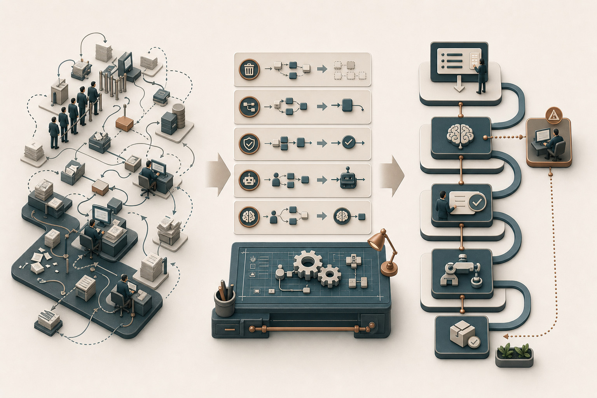
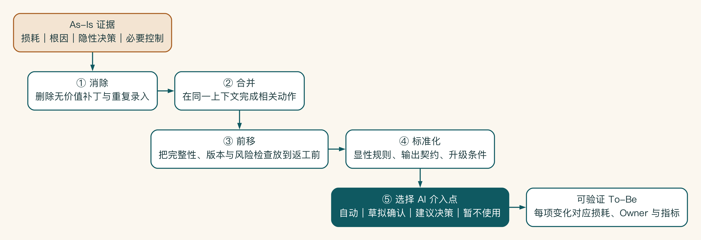
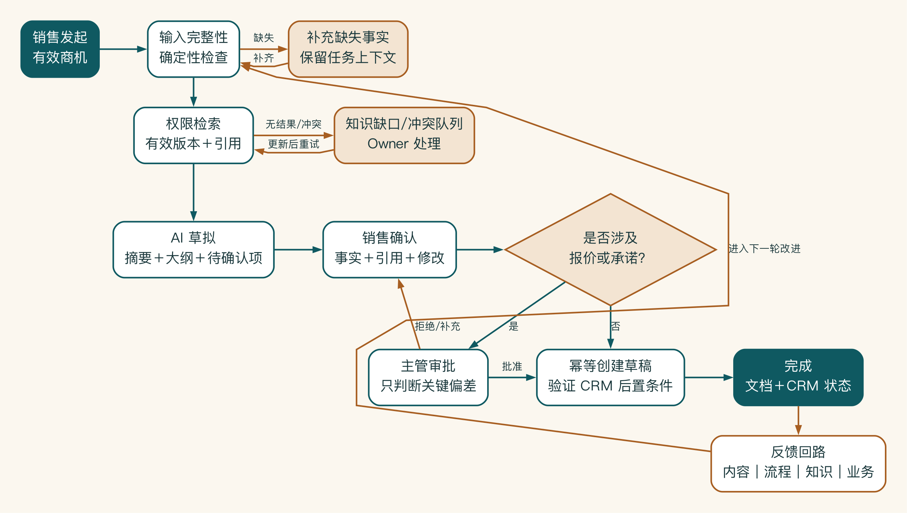

# 第 5 章 别把旧流程原样交给 AI

如果把旧流程原样交给 AI，系统通常只是更快地制造旧问题。原来要填三次的字段可能被自动复制三次，原来没人负责的异常也不会因为加了模型就自动找到主人。

AI 会放大流程原有的设计，旧问题不会因为自动化而消失。更稳妥的顺序是：先删掉无效工作，调整步骤和责任，再决定哪里用规则、哪里用 AI、哪里仍要由人判断。

## 最容易犯的错：把旧流程原样自动化

启明科技如果直接自动化现状，会得到一条复杂的 AI 流程：自动搜索多个文档、自动复制旧方案、自动催产品经理、自动询问报价、自动更新 CRM。

它可能比人工更快，却保留了资料版本混乱、责任边界不清和审批信息不足等根因。自动化一个坏流程，往往只是让错误更快发生。

目标流程设计先决定哪些工作根本不应该继续存在，之后才讨论 AI 放在哪里。

## 五步重构法

这五步有一个很朴素的顺序：先删掉没有必要做的事，再把重复工作合起来。接着把能提前发现的问题前移，把经常变化的做法变成稳定规则，最后才决定 AI 放在哪里。

第一步是消除不产生价值、只为补偿旧系统而存在的步骤。

如果方案模板已经能从 CRM 自动带入基础字段，就不应让销售反复复制客户名称、行业和联系人。如果同一内容在三个系统重复登记，应先明确事实来源，而不是让 AI 自动填三次。

第二步是合并可以在同一上下文中完成的动作，减少交接和信息损失。

客户背景汇总、资料检索和方案大纲生成可以成为一个受控工作段。但报价批准和方案写作不应因为“都和销售有关”就合并，因为它们的责任和风险不同。

第三步是把检查前移，让容易导致返工的问题更早暴露。

销售方案经常因为客户信息缺失被退回，就应该在生成前检查必填信息。知识文档没有版本或负责人，就不应在回答生成后才发现引用不可信。

第四步是把做法标准化，把隐性规则、输出结构和升级条件写清楚。

例如方案必须包含客户问题、目标、范围、证据、风险和下一步。引用必须来自批准知识源。涉及价格时系统只能插入占位符并触发主管审批。

完成前四步以后，再判断 AI 适合处理什么。常见候选包括：

- 从非结构化材料中提取字段。
- 检索并汇总多份有权限资料。
- 按结构生成草稿。
- 对内容进行分类、匹配和风险提示。
- 在有限工具集合中选择下一步。

确定性校验、权限判断、金额阈值和不可逆动作通常更适合由规则、工作流和审批控制。

重构首先处理旧流程中的重复、等待、版本冲突和返工，再决定哪些判断需要 AI、哪些控制交给规则、哪些承诺必须由人承担。目标流程应成为一条更短、责任更清楚、异常可回收、结果能进入下游系统的工作链。给原流程增加一个生成节点远远不够。

五步法具有明确顺序：先依据损耗、根因和必要控制消除、合并、前移与标准化，最后才选择 AI 介入方式。这样得到的每个 AI 节点都有业务理由，未使用 AI 的权限、规则和责任节点也不会被误删。

AI 介入后，结果通常有四种。

| 结论 | 适用情况 | 示例 |
|---|---|---|
| 自动处理 | 低风险、可验证、可恢复 | 公开资料格式化、字段提取 |
| AI 草拟，人确认 | 输出需要判断或影响后续动作 | 方案初稿、客户摘要 |
| AI 建议，人决策 | 影响较高、责任必须由人承担 | 报价风险提示、合同问题清单 |
| 暂不使用 AI | 规则未清、数据不足、风险不可控 | 自动承诺折扣、自动发送合同 |

不是每个节点都必须得出“使用 AI”。能够明确不使用，说明团队开始根据任务而不是技术热度设计系统。

回到启明科技，重构后的目标流程是：

1. 销售在 CRM 中确认有效商机并发起方案准备。
2. 系统检查客户、需求和方案类型等必要信息；缺失时要求补充。
3. 系统以销售本人身份读取获准客户字段。
4. 知识服务在权限范围内检索产品、案例和 SOP，保留引用。
5. 工作流根据任务类型选择相应模型和生成步骤。
6. AI 生成客户摘要、方案大纲和待确认事实。
7. 销售确认事实、修改内容并标记引用问题。
8. 涉及报价或承诺的部分进入主管审批。
9. 确认后创建方案草稿并写回 CRM 状态。
10. 修改、退回、引用失效和用户反馈进入评估与知识更新队列。

主路径从有效商机发起，依次经过确定性完整性检查、权限检索、AI 草拟、销售事实确认和按风险触发的主管审批。缺失输入、无结果或来源冲突、审批拒绝都进入明确分支，并保留原任务上下文。完成后的四类反馈再进入下一轮改进。

这条流程并没有追求全自动。它优化了查找和草拟，同时保留销售对客户事实、主管对商业承诺的责任。

输出还要进入下一步业务动作。判断目标流程是否成立，可以问：AI 输出之后发生什么？

如果答案是“用户可以复制去使用”，说明流程仍然断在聊天框。更完整的设计应该说明输出如何被确认、保存、审批、写回、发送或转交。

但连接下一步并不等于自动执行。高风险动作可以生成结构化草稿，由人确认后执行。关键是系统知道当前处于什么状态，而不是把责任留给用户记忆。

反馈也不只是一个点赞按钮，至少要分成四类：

- 内容反馈：事实、引用和表达哪里有问题。
- 流程反馈：哪个步骤多余、太慢或容易绕过。
- 知识反馈：资料缺失、过期或权限错误。
- 业务反馈：是否缩短周期、降低退回或提高采用。

不同反馈进入不同负责人的工作队列。用户点“差评”但没人处理，不构成反馈回路。

把流程变化落实到岗位和制度。

目标流程不只是系统蓝图，还会改变谁准备资料、谁确认、谁维护知识以及谁处理异常。如果新的流程要求产品团队维护有效资料，却没有把这项工作放入岗位责任和运营节奏，知识库很快会再次过期。

每项关键变化都要注明：旧责任人、新责任人、开始条件、培训或制度变化，以及旧流程何时停止。否则新旧流程会长期并存，用户在出问题时回到个人表格和群消息，团队又无法判断新系统是否真正被采用。

## 从设计原则开始

在画目标流程之前，团队应先写出少量不可妥协的设计原则。它们用于处理后续冲突，而不是装饰文档。

启明科技可以采用：

- 客户事实只从获准系统取得，不让模型补全缺失事实。
- 任何方案内容都能追溯到来源或明确标记为草拟判断。
- 报价与外部承诺始终由有权限的人批准。
- 用户不用在多个系统重复输入同一事实。
- 异常要进入明确队列，不能停留在聊天记录里。

当有人提出“为了体验更顺滑，缺少客户字段时先让模型猜一个”时，原则可以直接给出答案。没有原则，流程会在每次功能讨论中被局部优化，最后重新变成一组互相冲突的例外。

## 把每一项变化写成可验证假设

目标流程中的变化不是天然正确。每项变化都要说明它解决的损耗、依赖条件和验证方式。

| 变化 | 对应损耗 | 核心假设 | 验证指标 |
|---|---|---|---|
| 自动带入 CRM 客户字段 | 重复录入、事实错误 | CRM 字段完整且权限可继承 | 补录量、字段错误率 |
| 生成前检查必填信息 | 返工、审批退回 | 缺失项可以在任务开始时发现 | 首次通过率、补充等待时间 |
| 权限检索并保留引用 | 查找、版本核验 | 获准资料覆盖高频问题 | 查找时长、引用正确率、无答案率 |
| 结构化审批卡 | 等待、重复核验 | 突出偏差能缩短主管判断时间 | 审批中位数、退回原因 |

如果某项变化没有对应损耗或指标，它可能只是功能偏好。如果某项损耗没有任何目标流程变化响应，则说明设计遗漏了诊断结果。

## 用决策点设计流程

流程真正复杂的地方在于决策，步骤本身反而容易画清楚。每个关键决策点应明确：谁作决定、依据什么信息、允许哪些结果、结果怎样改变状态。

例如“资料是否足够生成方案”不能只交给模型给一个置信度。可以拆成：

1. 确定性检查必填客户字段和方案类型。
2. 检索服务判断是否取得有效版本的必要资料。
3. 模型识别仍然缺少的开放问题，并给出证据。
4. 销售选择补充信息、继续生成带缺口标记的草稿，或取消任务。

这样设计后，模型参与开放判断，但不能越过数据完整性和权限规则。决策点的输入与结果可以被记录，未来也更容易评估到底是哪一环导致失败。

## 先模拟，再实施

目标流程可以在开发前通过桌面推演验证。选取五到十个真实历史任务，让业务、产品、工程和控制角色按照新流程逐步演练：

- 如果资料缺失，谁收到请求？
- 如果两个来源冲突，系统展示什么？
- 如果主管拒绝，任务回到哪个状态？
- 如果 CRM 写回失败，用户是否会重复提交？
- 如果用户中途离开，任务怎样恢复？
- 如果发生越权请求，谁能看到并响应？

桌面推演不用模型达到最终质量。可以由项目成员人工模拟系统输出，重点验证流程、责任和信息是否完整。许多问题在这一阶段就能发现，成本远低于开发后返工。

用极端样本挑战流程。

除了常规任务，还应加入极端样本：完全没有可用资料、客户名称相似、引用来源已下架、主管长期不在线、方案同时涉及两个审批部门。一个只在正常样本上顺畅的目标流程，还不是生产流程。

设计新旧流程的切换。

新流程上线后，旧方式通常不会自动消失。用户可能继续使用个人模板，主管可能要求同时在群里发一份，CRM 仍然保留旧字段。结果是工作量不降反增。

切换设计至少包含四个阶段：

1. **影子运行**：新系统生成结果，但不改变正式流程，用于比较质量。
2. **受控并行**：部分真实任务使用新流程，明确哪些记录是权威结果。
3. **默认切换**：新流程成为默认入口，旧流程只用于例外和恢复。
4. **关闭旧路径**：确认新流程稳定后，移除重复入口和冗余制度。

每个阶段都要写进入和退出条件。长期并行看似安全，实际上会制造双重维护、数据不一致和责任模糊。

用户是否采用，首先是流程设计问题。

用户不采用新系统，原因可能是入口远离工作、需要重复填写、审核信息不足、速度不稳定，或者失败后没有人处理。把这些问题都归为“用户习惯”，只会增加培训而不改善系统。

目标流程设计要回答：

- 新任务从用户原本工作的哪里发起。
- 系统能自动取得哪些上下文，哪些必须由用户补充。
- 用户在什么时刻看到价值，而不是只承担审核成本。
- 失败时是否保留进度和上下文。
- 用户反馈后能否看到问题被处理。

如果销售要先离开 CRM、重新输入客户信息、等待生成、再把结果复制回去，即使生成质量不错，采用率也很难持续。

## 为流程定义最低可运行版本

最小可行流程要守住责任和安全底线，并保留验证核心结果所需的完整链路。随意砍掉一半步骤，只会留下新的断点。

启明科技的最低版本可以只覆盖标准方案：读取有限 CRM 字段，检索一组已批准资料，生成带引用草稿，由销售确认后创建文档。报价仍然使用原审批流程。它不具备最完整的自动化，却能验证查找和草拟是否真正减少周期。

一旦最低版本仍需要十个系统、五个部门和全量知识才能工作，说明场景边界可能还不够小。

## 启明科技的流程重构工作坊

项目组没有从一张空白流程图开始，而是把上一章的损耗、隐性决策和异常样本贴在墙上。每一张卡片必须回答：为什么存在、保护什么、是否可以删除、能否前移、由谁负责。

第一轮只做消除。销售把 CRM 客户名称复制进方案、把文档链接重新写回个人表格、在三个模板中重复更新公司介绍，这些步骤没有独立业务价值。团队决定由系统读取权威字段、创建文档后自动关联任务，模板公共内容由发布流程统一维护。

第二轮处理等待和返工。过去销售写完初稿才请求产品与交付确认，任何问题都会导致整份文档修改。新流程在生成前先检查必要字段，检索适用产品和交付约束。仍不确定的内容以“待确认项”集中展示给对应负责人。确认结果进入任务状态，不再散落在群消息里。

第三轮处理必要控制。主管审批不能简单取消，但可以只展示需要判断的差异：报价规则命中、非标准折扣、交付假设、对外承诺和来源冲突。标准内容无需主管逐段核对，审批从“重新读一遍方案”转为“判断关键偏差”。

最后才分配 AI。会议材料结构化、问题归类、相关知识召回和草稿生成使用模型。权限、必填字段、价格阈值、状态和写回使用确定系统。销售确认客户事实，主管批准商业承诺，知识负责人处理冲突和缺口。

工作坊形成一张变化账本：

| 现状流程活动 | 目标流程决定 | 机制 | 预期影响 | 需要验证 |
|---|---|---|---|---|
| 复制 CRM 字段 | 消除 | 权威字段读取 | 减少录入与错误 | 字段完整率、权限 |
| 群里问产品版本 | 前移并正式化 | 有效知识检索 + 缺口队列 | 减少等待与旧版使用 | 覆盖、响应服务目标 |
| 从旧方案复制案例 | 替换 | 授权案例库 | 降低泄密和过期风险 | 案例适用性 |
| 写完再确认交付 | 前移 | 约束检索 + 待确认项 | 降低整稿返工 | 交付判断覆盖 |
| 主管逐段核对 | 重构 | 偏差审批卡 | 缩短审批处理 | 是否漏掉关键风险 |
| 手工补 CRM | 消除 | 确认后幂等写回 | 减少重复录入 | 后置条件、恢复 |

这张账本保证目标流程中每个新功能都对应真实损耗，也让试点结束后可以判断哪项变化真正产生效果。

## 自动化以后，报销为什么反而更慢

某企业将报销单据识别、费用分类和审批建议全部加入 AI 流程。原来员工填写十个字段，新系统只需上传图片，看起来体验明显改善。

上线后，财务退回率上升。真正的原因在于旧表单曾迫使员工确认成本中心、业务目的和预算项目，OCR 准确率并非主要问题。新系统从票据猜测这些字段，员工默认接受，财务只能在末端重新核对。为了安全，又增加了一层人工复核，整个流程比原来更慢。

正确重构应该区分：票据金额、日期和商户可以自动提取。成本中心可以根据用户与项目给出候选。业务目的必须由员工确认。预算和政策由规则检查。异常才进入财务。系统应消除重复录入，不应消除责任信息。

这次复盘提醒团队，旧步骤看似麻烦，可能同时承担数据收集和责任确认。目标流程设计要保留它保护的业务目的，再寻找更轻的实现方式。

## 让新流程能够被真正做出来

目标流程画完后，业务和工程团队要一起走一遍。每一项改变都要落到具体动作：谁提供输入，系统做什么，什么情况不能继续，结果写到哪里。

目标流程不必一开始就完美，但它要比旧流程少一些绕行，也要让责任和异常更清楚。自动化应该进入这条新流程，而不是替旧流程加速。
