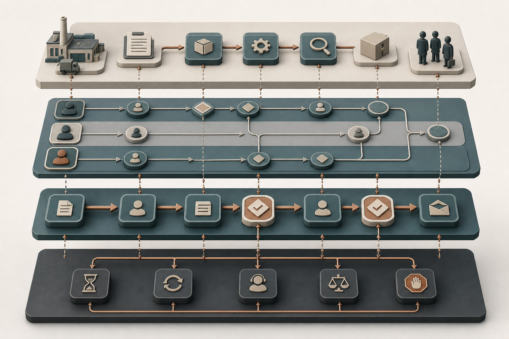
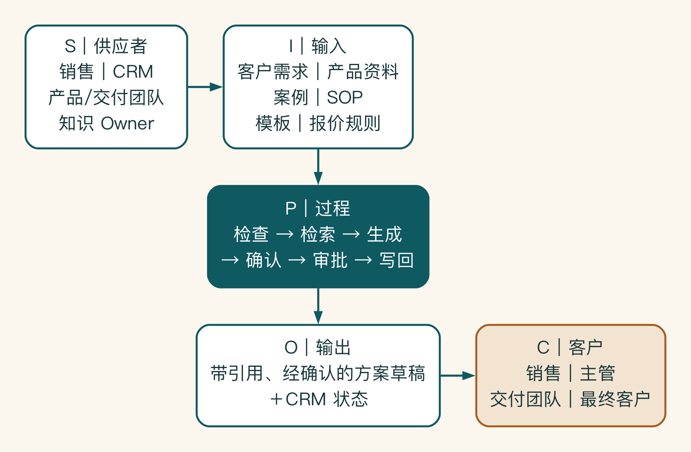
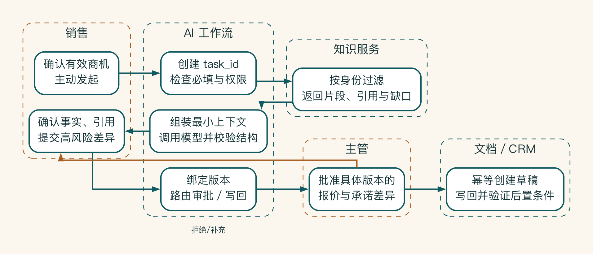
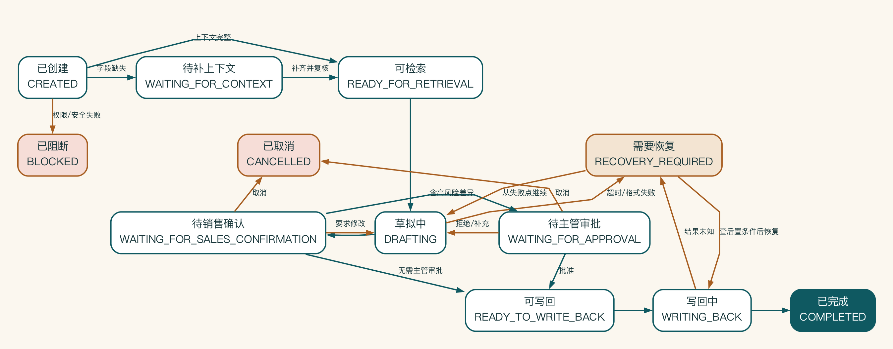

# 第 6 章 流程顺利时很简单，出错时怎么办

会议室里的流程图往往只有一条顺畅的主线。系统上线后，真正占用团队时间的却是字段缺失、审批超时、接口失败、重复提交和任务取消。工程团队并不是不懂业务，而是那张图没有告诉他们失败时该怎么办。

可靠的流程，不只知道顺利时下一步做什么，也知道失败后怎样收场。流程建模就是把业务人员讲的故事，翻译成系统能够执行的状态、事件、责任和异常处理。

## 流程建模是一项翻译工作

业务人员常用故事描述工作，工程人员要明确事件、输入、状态和分支。流程建模的作用，是让双方围绕同一个对象讨论。

图画得是否专业并不重要，流程模型要回答的是：流程在哪里开始，谁负责哪一步，什么数据进入，什么条件改变路径，失败后去哪里，什么状态算完成。



这些视图描述的是同一个业务对象，不是四套彼此独立的流程。SIPOC 固定端到端范围，泳道图说明责任怎样交接，任务链支撑系统执行。异常流和状态图则解释等待、失败、恢复与终止。它们应共享节点名称、业务 ID 和完成条件，才能从业务评审追到工程实现。

## 先用 SIPOC 框定系统

SIPOC 可以理解为先给镜头定边框。它不急着画每个按钮，而是先确认谁提供什么、过程处理什么、最后把什么结果交给谁。边框稳定以后，团队再逐步放大到责任、状态和异常。

SIPOC 分别代表供应者、输入、过程、输出和客户。对 AI 项目，一个实用顺序是先从输出和客户开始：谁需要什么结果，为什么需要；再向前追问输入和供应者。

启明科技的销售方案流程可以这样描述：

| 项目 | 内容 |
|---|---|
| Supplier | 销售、CRM、产品团队、交付团队、知识负责人 |
| Input | 客户需求、产品资料、案例、SOP、方案模板、报价规则 |
| Process | 检查信息、检索、生成、确认、审批、写回 |
| Output | 带引用且经过确认的方案草稿与 CRM 状态 |
| Customer | 销售、主管、交付团队和最终客户 |



SIPOC 把系统放回供应者、输入、过程、输出和客户的完整链条中。中间的 AI 过程只是转换机制，真正需要验收的是带引用、经确认的方案草稿和 CRM 状态，以及这些输出能否服务销售、主管、交付团队和最终客户。

如果输出写成“一个 AI 助手”，说明团队仍在用产品名替代业务结果。

## 用泳道图明确责任

泳道代表角色或系统。销售、AI 工作流、知识服务、主管和 CRM 应位于不同泳道，因为它们承担不同责任。

画图时重点检查：

- 谁发起，谁接收。
- AI 以谁的身份读取数据。
- 哪一步由确定性规则控制，哪一步使用模型。
- 谁确认事实，谁批准承诺。
- 写回由哪个系统完成。
- 任务跨泳道时传递什么信息。



泳道图把一次任务的责任交接展开。销售负责触发任务和确认事实，工作流管理状态与版本，知识服务按身份返回引用和缺口。主管只批准具体的高风险差异，文档系统和 CRM 在获得授权后执行幂等写回。箭头传递的是身份、上下文、版本和批准，而不是一句模糊的“系统自动处理”。

如果一个节点写着“系统自动处理”，仍然太模糊。要说明哪个系统、读取什么、产生什么状态、失败如何处理。

## 把业务流程转成可执行任务链

每个节点至少定义：

| 字段 | 说明 |
|---|---|
| 触发 | 事件、人工操作或前一节点成功 |
| 输入 | 数据结构、来源、权限和必填项 |
| 处理 | 规则、模型、检索或工具动作 |
| 输出 | 可验证的结构和状态 |
| 责任 | 执行者、审核者和负责人 |
| 失败 | 重试、补充、阻断、转人工或回滚 |
| 证据 | 日志、引用、审批或业务记录 |

这张任务链是业务流程和系统工作流之间的契约。流程图解决“工作怎样运行”，任务链开始回答“系统怎样执行”。

正常流程其实只是一小部分。AI 项目特别容易只画快乐路径：资料齐全、权限正常、检索准确、模型成功、用户满意、系统写回完成。真实生产环境会出现：

- 必填客户信息缺失。
- 用户无权访问某个案例。
- 检索不到可信资料。
- 多份资料互相冲突。
- 模型超时或输出格式错误。
- 生成内容触发报价或法律风险。
- 主管拒绝审批。
- CRM 写回成功，但文档创建失败。
- 用户关闭页面，流程处于半完成状态。

每个关键节点至少要讨论失败、超时、拒绝和人工接管。

## 异常流的五种基本动作

| 动作 | 适用情况 | 注意事项 |
|---|---|---|
| 重试 | 短暂网络或服务故障 | 设置次数、退避和幂等标识 |
| 补充 | 输入缺失或需要澄清 | 告诉用户缺什么，不让模型猜 |
| 降级 | 强模型、工具或知识服务不可用 | 降级结果必须仍满足最低风险要求 |
| 转人工 | 判断复杂、责任不清或风险较高 | 保留上下文和失败原因，避免重新开始 |
| 阻断/回滚 | 权限、安全、不可逆动作或部分失败 | 写清恢复状态和通知责任人 |

“发生异常后提示用户稍后再试”不算完整处理，因为系统仍可能留下半完成记录或重复执行。

审批也不是多加一个按钮。一个有效的审批页面，要让审核者快速理解：

- AI 准备做什么。
- 使用了哪些数据和引用。
- 哪些内容存在不确定或风险。
- 确认后会执行什么动作。
- 审核者可以修改、拒绝还是要求补充。

报价审批卡如果只显示“是否同意”，主管很难判断。它至少要突出客户、金额、折扣、依据、政策偏差和将要写回的位置。

审批还要设计超时和升级。主管两天不处理，任务是提醒、转交、取消还是继续停留？这属于业务规则，不能交给模型自由决定。

事情做到一半失败，还要考虑怎样补偿。假设系统已经创建方案文档，但 CRM 写回失败。直接重跑整个流程可能重复创建文档。此时需要：

- 为业务任务生成唯一 ID。
- 记录每个节点状态。
- 写操作支持幂等或重复检测。
- 明确已完成步骤是否需要撤销。
- 允许人工从失败节点继续。

这些看似工程化的问题，实际决定业务是否敢让系统执行动作。

## 为方案任务建立完整状态机

启明科技最初的原型只有三个状态：处理中、成功、失败。这足以显示一个模型请求，却无法支撑跨小时、跨角色的业务流程。用户不知道任务是在等知识、等自己确认还是等主管，运维也无法判断失败后从哪里恢复。

项目组改为业务可理解的状态：

```text
CREATED
  -> WAITING_FOR_CONTEXT
  -> READY_FOR_RETRIEVAL
  -> DRAFTING
  -> WAITING_FOR_SALES_CONFIRMATION
  -> WAITING_FOR_APPROVAL
  -> READY_TO_WRITE_BACK
  -> WRITING_BACK
  -> COMPLETED

任意可恢复状态 -> RECOVERY_REQUIRED
任意未完成状态 -> CANCELLED
安全或权限失败 -> BLOCKED
```



状态机让长任务在跨小时、跨角色和跨系统时不丢失业务语义。正常状态规定允许的命令，缺字段进入待补上下文，审批拒绝回到草拟，超时或结果未知进入恢复，权限与安全失败进入阻断。取消和恢复都不能绕过原有不变量。

状态不是进度文案。每个状态规定允许的命令、超时、负责人和下一步。例如 `WAITING_FOR_APPROVAL` 只允许批准、拒绝、要求补充、取消和超时升级。

它不能直接接收 CRM 写回命令。`BLOCKED` 需要保存策略原因，只有有权限的控制角色解除条件后才能重新开始。

状态表可以直接用于实现：

| 当前状态 | 允许事件 | 下一状态 | 负责人 | 超时动作 |
|---|---|---|---|---|
| CREATED | ContextChecked | READY_FOR_RETRIEVAL / WAITING_FOR_CONTEXT | 销售 | 24 小时提醒 |
| DRAFTING | DraftProduced / DraftFailed | WAITING_FOR_SALES_CONFIRMATION / RECOVERY_REQUIRED | 工作流 | 10 分钟降级或转人工 |
| WAITING_FOR_SALES_CONFIRMATION | SalesConfirmed / ChangesRequested | WAITING_FOR_APPROVAL / DRAFTING | 销售 | 2 个工作日取消 |
| WAITING_FOR_APPROVAL | Approved / Rejected / MoreInfoRequested | READY_TO_WRITE_BACK / DRAFTING | 主管 | 4 小时提醒，1 天升级 |
| WRITING_BACK | WriteBackVerified / WriteBackUnknown | COMPLETED / RECOVERY_REQUIRED | 集成服务 | 先查后置条件，不盲重试 |

所有状态变化都要校验前置版本。若销售在主管审批期间修改了方案，高风险内容的批准不能继续绑定旧版本。系统应使原审批失效，重新生成差异并请求批准。

## 一条任务怎样跨系统运行

下面用文字展开一次正常任务，帮助业务和工程确认每个责任交接。它还没有细化到 API 文档：

```text
销售 -> CRM 入口：发起方案任务
CRM 入口 -> 工作流：创建 task_id，携带用户身份和商机 ID
工作流 -> CRM：读取获准字段并验证必填项
工作流 -> 知识服务：按身份、方案类型和版本检索
知识服务 -> 工作流：返回获准片段、引用和缺口
工作流 -> 模型网关：提交最小上下文和输出契约
模型网关 -> 工作流：返回结构化草稿、版本和使用量
工作流 -> 销售：展示事实、引用、推断和待确认项
销售 -> 工作流：确认并提交高风险差异
工作流 -> 主管：发送审批卡
主管 -> 工作流：批准具体版本
工作流 -> 文档/CRM：幂等创建草稿并验证后置条件
工作流 -> 销售：返回完成结果和可撤回范围
```

这条时序暴露几个不能省略的细节：身份要贯穿 CRM 与检索。知识返回缺口而不只是文本。模型输出绑定版本。主管批准的是具体差异。写回完成需要重新读取结果。任何一步只写“智能体处理”，都会隐藏契约。

异常时序也要画。例如模型生成成功后销售取消任务，工作流不得继续发送审批。CRM 请求超时但实际已创建草稿时，恢复服务先按幂等键查询，不重新创建。权限在任务中途被撤销时，未写回任务应重新验证授权。

## 流程图要经得起一次故障

流程模型画完以后，不妨故意让它失败一次：资料缺失、接口超时、审批人离职，或者写回结果不确定。团队顺着任务状态往下问，很快就能看出哪里只有一句“人工处理”，却没有具体接手人。

启明科技的第一次演练发现，前端显示取消后，队列里的模型任务仍在运行。这个问题在桌面上只需改状态和规则；等到真实客户数据写回以后再发现，代价会高得多。审批卡和故障演练脚本放在附录 I。

## 一次重试为什么制造了三张订单

一家企业让智能体根据邮件创建采购订单。工具调用在十秒后超时，智能体判断失败并重试两次。外部 ERP 实际都已成功，只是响应没有及时返回，最终产生三张订单。

团队最初把问题归为“模型没有判断好是否重试”，实际根因是工具没有业务幂等键，工作流没有区分结果未知与明确失败，也没有在重试前查询后置条件。即使换成更强模型，同样网络条件仍可能重复执行。

修复方案是为采购意图建立稳定键，集成层保存尝试和外部对象，超时进入 `OUTCOME_UNKNOWN`，恢复服务先查询 ERP。只有确认未创建且错误可重试时才再次调用。智能体只能提出恢复建议，无权绕过状态机直接重放写操作。

这次复盘提醒团队，企业 AI 的可靠性常来自传统分布式系统纪律。模型推理并不能替代事务、状态、幂等和对账。

演练结束时，团队补上的不是更多正常步骤，而是 `OUTCOME_UNKNOWN` 状态、幂等键和恢复责任人。下一次接口超时，系统不用猜结果，也不会靠盲目重试把一张订单变成三张。
