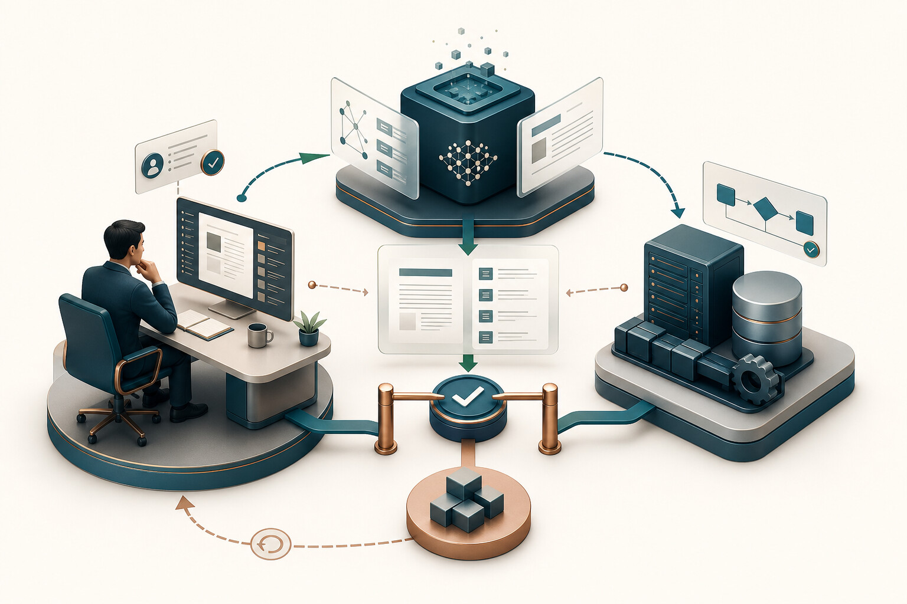
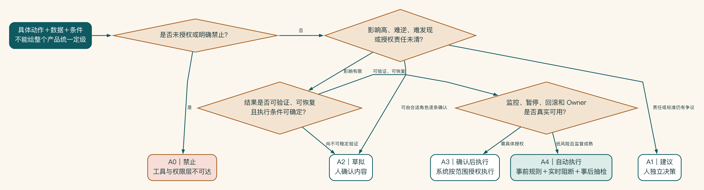
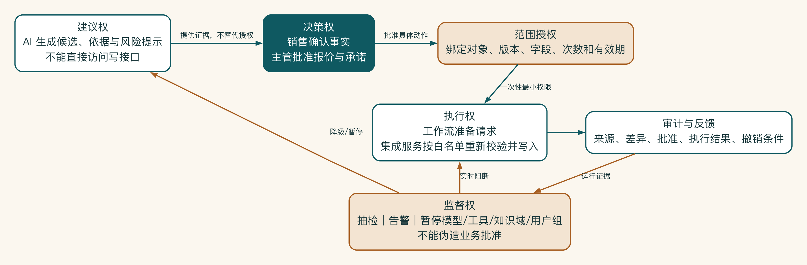

# 第 7 章 人、AI 与系统如何分工

先别讨论 AI 到底有多聪明。拿“把报价写进客户系统”这个动作来说，真正麻烦的问题是：写错后能不能撤回，谁会发现，谁有权批准，损失会不会在几分钟内扩大。

人和 AI 怎样分工，最后都要落到这种具体动作上。生成一段内部草稿和向客户承诺价格，不能因为都由同一个助手完成，就被划成同一种自动化。

## 先把“全自动”拆成具体动作

业务负责人常说，希望 AI 尽量自动，减少人工操作。但自动生成公开资料摘要、自动创建 CRM 草稿和自动向客户承诺报价，属于完全不同的风险等级。

人机分工不能只按“模型是否足够聪明”决定。还要考虑影响、可逆性、可验证性、责任和异常发生后能否及时发现。



AI 适合生成候选、识别模式和解释信息，人负责承担业务判断与授权，确定性系统负责执行权限、规则、状态和写回。清晰的批准门与可逆路径，才把三者连接成可控的工作系统。

## 本书定义的五级动作自主性

可以把自主性理解为给一名新同事逐步授权。最开始他只能观察和准备材料；证据稳定以后，可以提出建议、生成草稿，甚至执行低风险动作。权限随时可以收回，而且高风险决定未必需要升级到自动执行。

| 等级 | AI 的角色 | 例子 |
|---|---|---|
| A0 禁止 | 不允许读取、判断或执行 | 未授权合同、密钥、禁止外发数据 |
| A1 建议 | 提供信息或风险提示，人独立决策 | 报价风险、合同问题清单 |
| A2 草拟 | 生成可编辑草稿，人确认内容 | 客户摘要、销售方案、邮件草稿 |
| A3 确认后执行 | AI 准备动作，人确认后系统执行 | 创建 CRM 草稿、发送内部通知 |
| A4 自动执行 | 在明确边界内自动完成并接受监控 | 低风险分类、格式转换、公开资料汇总 |

这套 A0—A4 分级是本书用于逐项分配动作权限的设计工具，不是外部标准，也不是企业成熟度排行。A1 不比 A4 落后；一个高风险场景长期保持 A1，可能正是正确设计。若组织已有风险或控制分级，应建立映射并以组织制度为准。

## 用四个问题判断自主性

先问一个直白的问题：这个动作如果出错，影响有多大？

输出只影响个人草稿，还是会影响客户、收入、员工权益、法律义务或生产系统？影响越大，越要明确授权和责任。

第二个问题是动作能不能撤销。生成草稿容易撤回，向客户发送邮件、修改订单和删除数据更难恢复。不可逆动作不能只依靠模型置信度。

第三个问题是错误是否容易被发现。格式错误很明显，引用了错误客户的相似案例却可能长期不被发现。难发现的错误需要更强证据、抽检或人工确认。

最后还要看出了问题能不能找到真正负责的人。谁有权批准，谁承担业务结果，谁处理申诉或事故？没有责任人时，不能用“系统自动”掩盖责任真空。



自主性从具体动作、数据和条件开始判断。未授权动作直接进入 A0。影响高、难以撤回或责任未清的动作停留在建议或草拟。只有结果可验证、可恢复，且监控、暂停、回滚和负责人真实可用时，才可能进入确认后执行或低风险自动执行。

## 人审有不同类型

有些审核只是在确认事实，例如销售核对客户名称、需求、产品参数和案例引用。

另一些审核是在作出业务授权，例如主管批准折扣、承诺、资源和范围。批准折扣、承诺、资源和范围，本身就是承担业务责任；检查文笔只是很小一部分。

高影响任务还要由安全、法务或合规角色单独检查数据、合同、隐私或监管问题。

系统无法继续时，人要能接管。当系统无法取得资料、多个来源冲突、模型持续失败或工具调用异常时，由合适角色接手。

如果所有输出都由同一个人无差别点击“确认”，人审会变成形式。审核内容必须匹配审核者的知识和权限。

确认页面决定了审核人究竟能检查什么。

一个有效的确认卡应让用户在几十秒内回答：

- 系统根据什么得出结论。
- 哪些内容是事实，哪些是推断。
- 哪些字段将被写入或发送。
- 是否触发风险规则。
- 可以修改、拒绝或要求补充什么。

隐藏引用、变化和风险，只展示一大段生成文本，会让人审成本过高。用户最终可能直接通过，或绕开系统。

再看启明科技怎样分工。

| 任务 | 自主性 | 控制 |
|---|---|---|
| 公开行业资料归类 | A4 | 来源记录、成本和质量抽检 |
| 客户背景摘要 | A2 | 继承 CRM 权限，销售确认事实 |
| 内部案例推荐 | A2 | 权限检索、引用、销售选择 |
| 方案初稿 | A2 | 销售编辑，主管按需评审 |
| 创建 CRM 方案草稿记录 | A3 | 展示写回字段，销售确认，支持回滚 |
| 报价和折扣建议 | A1 | 仅提示规则和风险，主管决策 |
| 对外发送正式方案 | 试点期 A0 | 待质量、安全和发送控制通过后重新评审 |

这张表比一句“安排人工审核”更可执行，因为它说明人在哪个动作上承担什么责任。

放权只能一步一步来。

系统可以从 A2 演进到 A3 或 A4，但必须针对具体动作，而不是对整个智能体一次性放权。重新评审至少需要：

- 足够的真实样本和观察窗口。
- 关键错误类型已被识别和控制。
- 自动执行的业务收益明显高于新增风险。
- 监控能够及时发现异常。
- 有暂停、回滚和责任人。
- 业务和控制角色共同批准。

即使自动化，仍应保留抽检和事故反馈。

用户还要拒绝、撤回和申诉。

人审设计常关注“批准”，却忽略拒绝和纠正。用户应能说明拒绝原因、修改关键事实、撤回尚未执行的动作，并在系统作出影响较大的建议时请求人工复核。

拒绝原因要进入正确的改进路径：事实错误交给知识或数据负责人。业务判断分歧交给规则负责人，界面信息不足交给产品，越权和异常行为交给安全。不能把所有拒绝都自动当作模型负样本，否则系统可能学习到未经确认的个人偏好。

对员工、客户或供应商产生影响的场景，还应说明如何查询决定依据、如何提出异议、谁有权改正。可申诉性本身就是责任设计的一部分。

自动化还要有临时例外机制。系统异常或政策变化时，授权角色可以将某个动作从 A4 降到 A2/A1，而不用等待完整版本发布。例外的范围、期限和恢复条件必须被记录。

## 自主性属于动作，不属于产品

“这是一个 A3 级智能体”并不是准确描述。同一个产品内部可能同时存在 A0 到 A4：它可以自动整理公开资料，却只能草拟客户摘要，不得读取未授权合同，也不得自动发送正式方案。

自主性必须绑定到具体动作、数据和条件。例如“创建 CRM 草稿”只有在用户已确认字段、目标系统可用、幂等检查通过时才是 A3。当权限服务不可用时，它应自动降为 A1 或阻断，而不是继续执行。

因此，自主性矩阵至少要增加三列：生效前置条件、降级条件和重新评审日期。没有这些条件，等级只是一张静态分类表。

区分模型不确定性和业务风险。

模型置信度低，不一定代表业务风险高；模型置信度高，也不代表可以自动执行。

公开文章分类即使模型不太确定，错误也容易纠正，业务影响有限。相反，系统可能非常确定地识别了一个折扣数字，但是否允许使用这个折扣仍然属于业务授权。

自主性决策需要同时考虑：

| 维度 | 要回答的问题 |
|---|---|
| 认知不确定性 | 模型是否容易在这类输入上犯错 |
| 业务影响 | 错误会影响谁、造成什么损失 |
| 可发现性 | 错误能否在执行前或短时间内被发现 |
| 可逆性 | 执行后能否完整撤回或补偿 |
| 授权要求 | 是否只有特定角色有权作决定 |
| 监督能力 | 组织是否真的有人、有时间完成复核 |

不能用一个模型分数替代这六项判断。真正的控制是根据风险选择草拟、确认、阻断、抽检和自动执行的组合。

## 人审会形成新的容量瓶颈

设计人工审核时，团队常假设“总会有人确认”。如果系统每天生成 500 项建议，每项需要两分钟审核，就会新增近 17 小时工作量。审核者很快出现确认疲劳，开始机械点击。

人审设计要做容量计算：

```text
每日审核负荷 = 任务量 × 需要审核比例 × 单次审核中位时间
```

还要考虑峰值、复杂任务和拒绝后的沟通成本。若审核负荷不可承受，应重新减少系统输出、提高前置规则质量、按风险分层抽检，或缩小场景，而不是把责任推给审核者。

人工审核应该把注意力留给机器无法可靠判断的部分。确认卡应突出变化、例外和风险，而不是要求人重读完整内容。系统可以自动校验格式、权限、必填字段和确定性规则，让人关注客户事实、商业判断和不确定引用。这样人审才是控制，而不是昂贵的人工回放。

## 决策权和执行权要分开

“人参与”不等于责任清楚。一个人可以审核事实，却无权批准折扣；可以批准业务动作，却不应拥有系统管理员权限。

人机分工至少区分：

- 建议权：提出选项和依据。
- 决策权：选择是否采取业务动作。
- 执行权：在系统中完成写入、发送或变更。
- 监督权：查看记录、抽检和暂停能力。

AI 通常可以拥有有限建议权。工作流可以在授权后拥有执行能力。业务负责人拥有决策权。安全或运行角色拥有监督和暂停能力。把这些权力集中在一个智能体服务账号上，会削弱最小权限和责任追踪。



权力分离把人机责任落实成技术路径：AI 只能提供候选和证据，有权限的人批准具体对象和版本。系统获得范围有限的一次性执行授权，集成服务再次校验白名单后写入。监督角色依据审计证据实施抽检、降级或暂停，却不能伪造业务批准。

## 放权要一点点发生

系统不必从“全人工”突然跳到“全自动”。先让 AI 生成草稿，再允许它完成低风险、可撤销的动作；只有长期运行结果稳定，才考虑减少人工检查。

启明科技先开放内部方案草稿。销售可以修改或拒绝，主管能看到引用和变化，系统只有在确认后才写入客户系统。后来即使增加自动写回，外发和报价仍然留在人手里。

放权也要能收回来。知识版本异常时，系统可以只关闭受影响的生成和写回，而不是让整个应用停摆。自主性分级、确认卡和升级演练移到附录 I，供实际项目使用。

## 医生签了字，为什么监督仍然失效

某医疗辅助系统要求医生在 AI 建议后点击确认，因此团队认为风险已经由专业人员控制。真实使用中，系统每天生成大量结构化建议，界面只显示最终结论，没有突出所依据数据、变化和不确定项。医生为了完成队列，通常快速点击通过。

一次错误建议源于上游数据映射，模型输出非常流畅，医生也没有理由怀疑。事故复盘不能简单归责“医生没有认真看”：系统没有提供可审查证据，任务量超过容量，界面默认接受，组织却把签字解释为完整复核。

有效监督至少需要审核者具备正确专业范围、足够时间、相关证据、拒绝和修改能力，以及不因拒绝受到不合理惩罚。人审是一套社会技术控制，不是页面上的一个按钮。

启明科技先把方案草拟定在 A2，把确认后的 CRM 写回定在 A3，报价与外发则继续留在人手里。以后是否放权，要看具体动作的运行证据；一旦知识或权限异常，这些权限也能分别收回。
