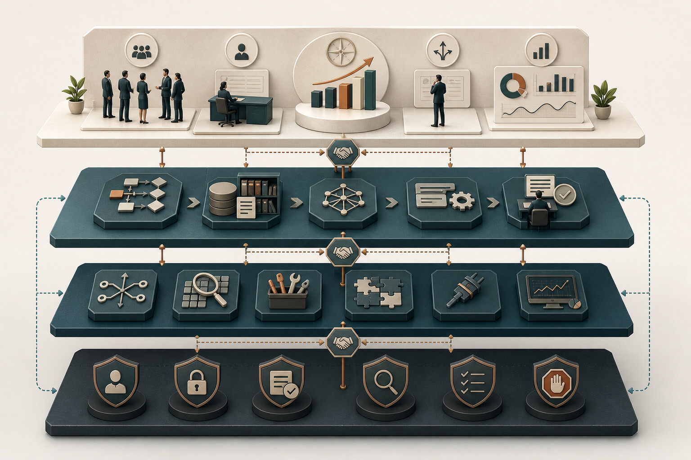
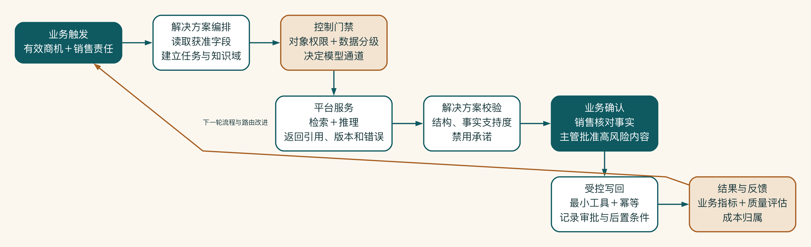

# 第 8 章 把业务、技术和风险放到同一张图上

销售负责人想知道方案能不能缩短准备时间，安全负责人关心客户资料会不会泄露，运维团队只想知道系统出错时该找谁。三个人看的是同一个系统，却在问三类不同的问题。

一张有用的架构图，要让这些人能够围绕同一件事说话。本书把系统分成业务、解决方案、平台和控制四个视角，分别看结果、任务、运行能力与责任，再把它们重新连起来。

## 从组件清单走向责任架构

启明科技完成目标流程后，技术团队画出第一版架构：用户、聊天入口、智能体、向量数据库、大模型、CRM。每个流行组件都在图上，但业务负责人仍然不知道方案如何改善工作，安全团队看不到权限在哪里执行，运维团队也不知道谁负责模型、知识和失败任务。

一张图包含很多组件，不代表它表达了完整架构。

架构的作用是划分责任、暴露取舍，并帮助不同角色回答自己的问题。企业 AI 同时包含业务工作、AI 解决方案、运行平台和控制机制，只用一条“用户请求模型”的调用链很难说明全部内容。

## 用四个视角看同一套系统

可以把四个平面想成看同一栋办公楼的四种视角。业务平面说明这栋楼为什么存在，解决方案平面描述人在里面怎样工作。平台平面提供水电和电梯，控制平面则负责放行条件、消防和巡检。它们不是四栋楼。

本书使用四平面模型组织企业 AI 架构。它是为了让跨职能团队同时看见业务、方案、运行能力与控制责任而定义的参考视图，不对应某个厂商产品分层，也不等同于外部架构或管理标准。

四个平面分别回答四类必须同时处理的架构问题：业务平面定义结果，解决方案平面组织任务。平台平面提供运行能力，控制平面把身份、评估、安全、成本和审计贯穿其中。

从业务视角看，先问系统为什么存在。

业务平面描述：

- 用户和利益相关者。
- 业务目标、触发与终点。
- 现状流程 / 目标流程。
- 人机分工、规则和审批。
- 业务指标与反馈。

它不负责说明模型怎样部署，而是定义系统必须兑现的结果和约束。没有业务平面，技术团队只能用功能数量代替价值。

从解决方案视角看，任务怎样完成。

解决方案平面包括：

- 用户入口和应用体验。
- 知识与上下文组装。
- 确定性工作流。
- 有限自主的智能体。
- 工具和企业系统集成。
- 人工确认、异常和业务状态。

它把业务流程翻译为系统行为。这里先关注任务怎样拆解、数据怎样进入、输出怎样验证、动作怎样执行。使用什么框架排在这些问题之后。

从平台视角看，能力在哪里运行。

平台平面提供共享运行能力：

- 模型网关和模型目录。
- 云端、本地或专属模型服务。
- 推理计算、存储、网络和密钥基础设施。
- 检索、向量、文件和数据服务。
- 部署、扩缩容、备份和恢复。

企业不一定一开始就建设完整平台。一个场景可以使用托管服务；当多个场景反复需要相同身份、模型、知识和评估能力时，再判断是否沉淀共享平台。

从控制视角看，系统怎样保持可用与可信。

控制平面横跨前三个平面：

- 身份、权限和数据分级。
- 模型路由、配额和成本归属。
- 安全策略、审计和合规证据。
- 评估、追踪、监控和变更回归。
- 人审、事故响应、暂停和回滚。
- 负责人、服务目标和运营节奏。

控制平面由运行时真实执行的规则和组织责任组成，不能等到上线前再补一份文档。

## 四平面之间要有契约

平面不是四个孤立盒子。它们之间需要可验证的输入输出。

| 上游 | 下游 | 关键契约 |
|---|---|---|
| 业务 -> 解决方案 | 业务动作如何成为系统任务 | 触发、输入、输出、规则、人审、终点 |
| 解决方案 -> 平台 | 任务需要什么运行能力 | 模型能力、上下文、延迟、并发、工具、数据级别 |
| 控制 -> 各平面 | 什么条件允许继续 | 权限、风险放行条件、质量、成本、日志和停止条件 |
| 平台 -> 业务 | 技术表现如何影响结果 | 可用性、响应时间、单位成本和失败体验 |

例如业务要求“销售只能访问自己的客户”，解决方案要把用户身份传入检索和 CRM 工具。平台要支持身份或令牌传递，控制平面要记录访问与阻断证据。把“权限控制”写在图角落里，不构成契约。

契约还必须写出失败语义。解决方案请求模型生成方案时，平台可能返回超时、配额不足、模型不可用或内容策略阻断。业务流程不能把这些情况都显示成“系统出错”。它要知道哪些请求可以重试，哪些可以切换模型，哪些只能保存草稿并转人工。只有成功路径的接口说明，不是完整契约。

可以为关键跨平面调用建立一张“六字段契约卡”：

| 字段 | 要回答的问题 |
|---|---|
| 输入 | 需要什么业务对象、身份、状态和数据级别 |
| 输出 | 返回内容、结构、引用和业务状态是什么 |
| 质量 | 什么结果可以被下游采用，什么结果必须阻断 |
| 服务水平 | 延迟、吞吐、可用窗口和成本上限是多少 |
| 失败 | 超时、拒绝、降级、重试和人工接管怎样发生 |
| 证据 | 哪些日志、评估、审批和任务轨迹能证明契约被执行 |

这样，平台团队不会只承诺“有一个模型接口”，业务团队也不能只提出“效果要好”。双方要把可交付条件落到同一张卡上。

这四个视角是决策边界，不是组织边界。

四平面不要求企业成立四个部门。一个小团队可以同时负责解决方案和平面运行，一个已有 IAM 团队可以提供控制能力，一项业务规则也可能由业务负责人和工程团队共同维护。重要的是每项责任只出现一个最终负责者，并且接口可以被验证。

最容易模糊的是以下三类责任：

- 知识质量由内容负责人负责，知识服务负责版本、索引和可用性；模型团队不能替代内容批准。
- 模型输出质量由解决方案负责人负责端到端结果，平台团队负责模型服务水平；不能把业务结果全部归因给基础模型。
- 人工审批由业务负责人定义批准标准，系统负责展示证据、记录决定和执行阻断；不能用“有人审核”代替审核设计。

为每个平面列出责任分工表只是开始。更有用的是给关键对象指定负责人：客户事实和知识条目归谁，提示词与工作流版本归谁。模型路由、工具权限、评估集和事故处置又分别归谁。对象有归属，变更才有入口。

## 用一次请求检查架构是否完整

静态架构图容易显得完整。检查它最有效的方法，是选择一个高价值任务，按时间顺序走一遍。

以“为已确认商机生成方案草稿”为例：

1. 业务平面确认触发条件：商机状态有效、关键字段齐全，销售对客户事实负责。
2. 解决方案平面读取获准 CRM 字段，建立任务 ID，选择产品与案例知识域。
3. 控制平面检查用户是否拥有商机权限，并依据数据级别限制可用模型渠道。
4. 平台平面提供检索和推理能力，返回引用、使用量、延迟和错误状态。
5. 解决方案平面验证结构、事实支持度和禁用承诺，形成带来源的草稿。
6. 业务平面由销售确认事实、主管批准高风险内容。
7. 解决方案通过最小写回工具保存草稿，控制平面记录审批、工具结果和最终状态。
8. 结果进入业务指标、质量评估和成本归属，成为下一轮路由和流程改进的依据。

这张图把四个平面还原为一条按时间展开的业务请求。控制放行条件会在平台服务被选择之前决定数据和模型通道，最后的审计只是留下记录。业务确认是高风险内容进入写回前的正式责任节点，不能被当作模型质量不足时的笼统兜底。只有最终结果重新进入指标、评估和路由改进，架构才形成完整的运行反馈。

如果其中任何一步只能用“平台会处理”“智能体会判断”解释，架构仍有未分配的责任。这个逐请求检查也适合安全评审和故障演练，因为它能指出控制是在请求前、执行中还是执行后生效。

把这四个视角放回启明科技。

**业务视角。** 销售在确认有效商机后发起方案准备；目标是缩短资料查找和草拟时间，同时保持事实、引用和商业承诺可控。销售确认客户事实，主管批准报价，知识负责人维护资料。

**解决方案视角。** CRM 侧边栏和协作入口发起任务。工作流检查必填信息、读取获准字段、检索知识、选择生成路径、请求人审并写回。开放行业研究允许有限智能体选择来源，报价只提供规则提示。

**平台视角。** 模型网关连接批准的云模型和本地推理服务。知识服务管理产品、案例和 SOP。集成层连接 CRM 和文档系统。运行环境提供队列、状态、存储和监控。

**控制视角。** 用户身份和 CRM 权限贯穿调用。数据级别决定模型渠道。所有高风险动作进入审批。任务轨迹串联检索、模型、工具和写回。成本按部门和场景归属。变更需要评估和回归。

## 最小架构与目标架构

架构图容易诱导团队一次性建设最终状态。更实用的做法是同时画两张：

- 最小试点架构：验证价值和关键风险所需的最少组件。
- 目标架构：当试点通过并扩大时需要的能力。

启明科技的概念验证可以只接一个 CRM 沙箱、一个批准知识库、一个云模型和一个本地模型候选，使用简单网关策略和人工审批。不用第一天就支持全公司多租户和自动扩缩容。

但试点不能通过临时共享账号、绕过权限和缺失日志来换取速度。最小不等于没有底线。

最小架构还要保留可替换性。试点可以只接一个模型，但调用应通过清楚的模型适配接口。可以手工维护一个小知识域，但文档仍要带负责人、版本和权限元数据。可以人工处理失败任务，但任务状态和原因要记录。这样，试点验证的是业务假设，而不是验证一组无法演进的临时代码。

目标架构则不能被理解为采购清单。它应描述随着规模、风险和复用增加，责任怎样变化：谁运营共享网关，谁批准新模型，谁管理跨部门知识，谁承担夜间事故响应。组件能够采购，运行责任不能采购后自动产生。

## 图最后要落到真实责任

画架构图时，最容易遗漏的不是组件，而是责任。一次请求经过身份、知识、模型、审批和写回，每一步都要有人能解释，也要有人能在失败时接手。

启明科技用一项真实任务反向检查四个视角：业务结果在哪里出现，流程由谁推进，平台提供什么能力，限制条件在哪个系统执行。工作坊步骤和底线检查表放在附录 I。

## 架构怎样随第二个场景演进

销售试点之后，交付团队希望使用受控知识问答。两个场景都需要身份、权限检索、模型路由、引用和评估，但知识负责人、质量标准、入口和业务结果不同。

团队没有复制整套销售应用，也没有把两个场景合并为“统一助手”。它将用户身份传递、模型网关、检索接口、任务轨迹和评估运行沉淀为共享能力。产品知识、交付 SOP、提示模板、工作流和业务指标留在各自领域。

这次演进验证了平台边界：共享的是稳定、重复、与领域内容相对解耦的能力。保留的是业务语义、知识责任和结果判断。平台化因此由两个真实场景拉动，而不是在第一个场景之前凭想象建设。

## 当控制机制只存在于汇报材料

某企业架构图上有统一网关、权限中心、审计平台和安全限制条件。实际原型为了赶进度，在应用代码中保存供应商密钥，使用共享账号访问文档，完整提示词写入普通日志。安全评审时，团队指向图上的控制组件，认为生产前再接入即可。

原型随后被二十多名员工持续使用，数据和依赖逐渐成为真实业务的一部分。要切换统一身份时，团队无法确定历史索引的文档权限。接入网关后，提示词与工具参数格式不兼容。清理日志又缺少数据映射。所谓“以后接管理”变成一次高成本重构。

最小试点可以减少规模和自动化，不能放弃会改变数据责任的底线。共享账号、不可追踪数据和无版本结果，只会验证一套无法安全迁移的临时系统。

评审启明科技的方案时，团队不再对着组件清单点头，而是沿着一项真实商机逐步追问：谁发起，谁允许，谁执行，失败后谁接手。四个视角因此变成了同一项任务的四种证据。
