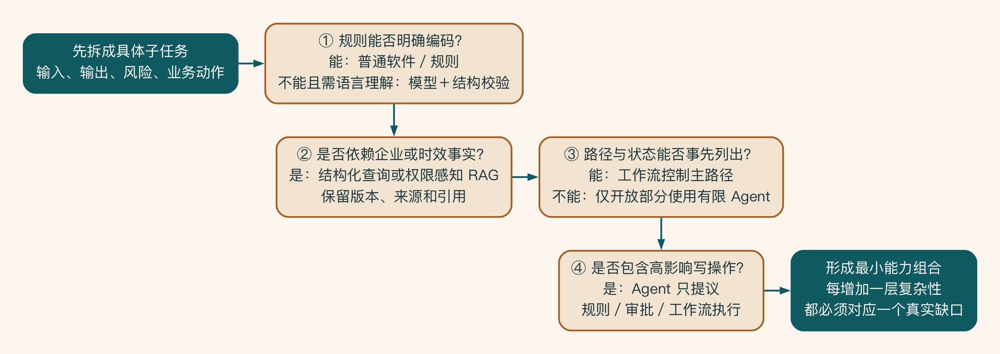
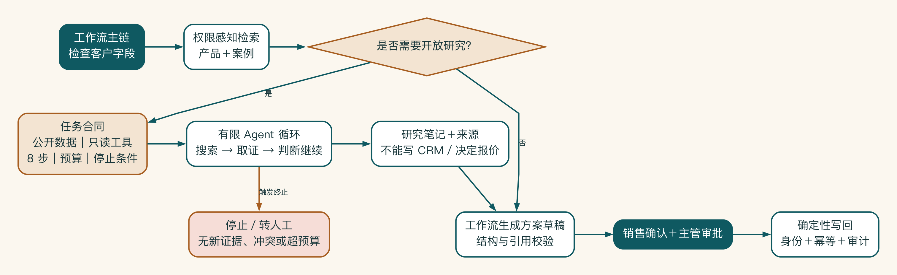

# 第 9 章 普通软件、知识检索、工作流和智能体怎么选

选技术时，我更愿意先做一道减法题：这一步能不能不用 AI？如果普通规则已经足够，就让规则来做；如果步骤可以事先写清，就交给工作流。只有语言理解、企业知识或开放探索真的出现缺口时，模型和智能体才有上场的理由。

这样做看起来不够炫，却能让系统更便宜，也更容易解释。技术名词应该是分析任务以后得到的答案，而不是会议开始前就写好的结论。

## “做一个智能体”通常太早

当任务包含检索、生成和系统调用时，团队很容易把整个系统称为智能体。这个词能表达智能，却会掩盖一个重要问题：任务中的哪些步骤必须确定，哪些步骤才真正需要自主判断？

企业 AI 的可靠性往往来自组合：普通软件处理确定规则，检索增强生成提供获准知识，工作流控制顺序和状态。模型处理非结构化内容，智能体只在路径开放且风险允许的局部选择下一步。

## 五种基本能力

这五种能力更像工具箱，而不是五个互相竞争的产品。校验金额用规则，查企业资料用检索增强生成，固定步骤用工作流，只有下一步无法提前写死时才考虑智能体。锤子很好用，但不必把每颗螺丝都当成钉子。

先看最简单的一类：普通软件和明确规则。

适合明确、可编码、需要稳定一致的任务：字段校验、权限判断、金额阈值、状态流转、格式转换和重复检测。

如果规则能清楚写出，就不应仅为了“智能”交给模型判断。

语言理解和内容生成，才轮到生成模型。

适合总结、提取、分类、改写、生成和处理模糊语言。它的输出具有概率性，需要结构校验、评估和适当人审。

答案依赖企业资料时，可以先检索获准资料，再让模型据此回答。

检索增强生成用检索到的外部知识为生成提供上下文。适合答案依赖企业资料、需要引用或知识持续更新的任务。它不自动解决资料质量、权限、冲突和过期问题。[^ch9-rag]

[^ch9-rag]:检索增强生成的经典任务定义参见 Lewis 等, “Retrieval-Augmented Generation for Knowledge-Intensive NLP Tasks,” 2020：https://arxiv.org/abs/2005.11401 。企业权限、时效和引用控制是本书在该模式上的系统扩展。

步骤和顺序明确时，工作流通常更合适。

工作流适合步骤、分支、审批、异常和状态相对明确的流程。模型可以是其中一个节点，但流程控制不依赖模型自由发挥。

只有路径无法预先写死时，才需要智能体。

智能体适合目标明确但路径不能预先完全固定，需要根据中间结果选择工具、继续研究或调整计划的任务。自主性越高，对权限、预算、终止、可观测性和评估要求越高。


能力选择要落到具体子任务。确定规则优先交给普通软件；需要获准知识时引入检索增强生成；顺序和状态清楚时使用工作流。只有路径确实开放的局部，才要有限智能体。高影响动作无论由哪种能力提出，都要回到权限、审批与确定性执行边界。

## 用五个维度做选择

| 维度 | 低端倾向 | 高端倾向 |
|---|---|---|
| 任务确定性 | 规则/普通软件 | 模型或智能体|
| 企业知识依赖 | 模型通用能力 |检索增强生成/上下文工程 |
| 路径开放度 | 固定工作流 | 有限或高自主智能体|
| 工具调用影响 | 只读、可逆 | 严格工作流、人审和权限 |
| 风险与责任 | 可自动 | 建议、草拟、确认或禁止 |

这五个维度不会自动生成答案，但能帮助团队解释为什么选择某种组合。

选择前先把“大任务”拆成可以独立判断的动作。比如“审核合同”至少包含读取合同、识别条款、查找标准条款、比较差异、计算金额阈值、判断审批级别、生成修改建议和提交审批。前四项可能需要模型与检索，金额阈值必须由规则计算，审批级别由工作流决定，提交动作还要确定性权限和人审。

如果不拆任务，团队往往会因为其中一小部分需要语言理解，就把整个合同审核交给智能体。随后又不得不用大量提示词去约束金额、权限和流程状态。正确的拆分能把概率性能力包围在确定性边界之内。

## 确定性内核与概率性边缘

一个稳健的企业 AI 系统通常有“确定性内核”：身份、权限、金额、状态、审批、写回和审计由普通软件或工作流控制。模型位于“概率性边缘”，承担理解、检索辅助、内容生成、解释和开放研究。

这并不意味着模型只能给建议。低风险且可逆的分类、摘要或内部草稿可以自动完成。关键是动作的影响不能随着模型置信表达而被悄悄放大。模型说“我很确定”，不会自动获得更高权限。

设计时可以对每个动作问四个问题：

1. 错误结果会不会进入客户、资金、权限或法定义务？
2. 动作是否可逆，撤销成本多高？
3. 正确条件能否被代码、数据或审批明确验证？
4. 失败能否在影响扩散前被观察和阻断？

影响越高、越难逆转、越容易用确定规则验证，就越应由工作流包住，而不是交给智能体自主执行。

## 几种常见组合模式

第一种组合是规则加模型。

先用规则检查输入，再让模型提取或生成，最后用结构校验确认输出。适合客户访谈摘要、工单分类和文档结构化。

第二种组合是知识检索、生成和引用。

用户身份进入检索，返回获准片段，模型基于片段回答并保留引用。适合 SOP、产品知识和内部政策问答。

第三种组合是在工作流中局部使用 AI。

流程步骤固定，模型处理其中的非结构化节点，审批和写回由工作流控制。适合销售方案、客服工单和会议任务分发。

第四种组合是给智能体限定工具和预算。

智能体可以选择搜索、检索、分析或调用只读工具，但工具范围、最大步骤、时间、费用和终止条件预先定义。适合开放研究和多来源问题调查。

第五种组合是智能体提出建议，由工作流执行。

智能体生成计划或建议动作，确定性工作流验证权限和参数，经人确认后执行。适合需要一定自主规划、又包含高影响系统动作的场景。

混合方案还要说清控制权。

“工作流里有智能体”和“智能体调用工作流”看起来相似，控制权却不同。

前者由工作流决定何时进入智能体、允许它完成什么子任务以及何时退出，适合主路径清楚、局部研究开放的场景。后者由智能体决定调用哪个流程，适合目标开放但下游动作已经被封装为安全、可审计事务的场景。企业早期通常应优先前者，因为状态、预算和异常更容易管理。

还有一种常用模式是“双阶段生成”：模型先产生结构化计划，规则验证计划是否包含禁止工具、缺失字段或超预算步骤。验证通过后，再由工作流逐项执行。计划可以灵活，执行仍然确定。不要让同一次不可见推理同时决定计划、参数和高风险动作。

同一项任务也可以采用不同的能力边界。仍以合同审核为例：

| 子任务 | 推荐能力 | 不推荐做法 | 关键控制 |
|---|---|---|---|
| 识别条款类型 | 模型 + 结构校验 | 为每种措辞手写海量规则 | 允许未知类别 |
| 查标准条款 | 权限感知检索增强生成| 把所有历史合同塞进上下文 | 生效版本与引用 |
| 比较文本差异 | 普通算法 + 模型解释 | 只让模型凭记忆总结差异 | 保留原文定位 |
| 判断金额阈值 | 规则 | 让模型计算并决定审批级别 | 版本化规则 |
| 生成修改建议 | 检索增强生成 + 模型 | 无来源生成法律结论 | 标明建议与依据 |
| 发起审批 | 工作流 |智能体自主选择批准人并提交 | 身份、状态和幂等 |

这张表说明，能力选择要为每个子任务分配最合适的机制，不能只给整个产品贴一个标签。

启明科技最终这样拆分能力。

| 任务 | 选择 | 理由 |
|---|---|---|
| 检查必填客户信息 | 普通规则 | 字段和条件明确 |
| 汇总客户访谈 | 模型 + 结构输出 | 非结构化输入，输出字段固定 |
| 产品与案例检索 | 权限感知检索增强生成| 依赖企业知识和引用 |
| 方案生成 | 工作流 + 检索 + 模型 + 人审 | 路径稳定，内容需判断 |
| 行业研究 | 有限智能体| 来源和研究路径较开放，但只读 |
| 报价检查 | 规则 + AI 风险提示 | 金额规则确定，解释可由 AI 辅助 |
| CRM 写回 | 工作流 + 确认 | 高影响动作，需要状态和审计 |

系统仍然可以在产品层面叫“销售方案助手”，但内部架构不应被一个智能体框覆盖。

## 什么时候才轮到智能体

只有当下一步无法预先写死，系统才真正需要智能体。例如行业研究可能要根据新发现继续搜索，而金额判断和审批顺序并不用这种自由。

即使使用智能体，也要先限定可用工具、数据范围、时间、费用和停止条件。高影响动作由智能体提出，仍由明确规则、权限和人工确认来执行。

智能体约束、终止条件和逐级放权方法放在附录 H。正文的选择原则保持简单：能用规则就不用模型，能用固定流程就不增加自主路径。

## 从任务形态推导能力组合

团队可以使用一条顺序判断，而不是先在几个流行架构中投票：

```text
规则能否明确编码？
  能 -> 普通软件/规则
  不能 -> 是否主要处理非结构化理解或生成？
          是 -> 模型 + 结构校验
          否 -> 重新定义任务

结果是否依赖企业或时效知识？
  是 -> 加入权限感知检索或结构化数据查询

路径和状态是否可以事先列出？
  是 -> 工作流控制
  否 -> 只有开放部分考虑有限智能体

是否包含高影响工具动作？
  是 ->智能体只提议，规则/审批/工作流执行
```



决策顺序本身就是一种复杂性控制：先判断普通软件是否足够，再判断是否需要企业知识、开放路径和高影响动作。检索增强生成、工作流与智能体可以组合使用。只有上一层能力无法补上真实缺口时，才增加新的系统机制。

高影响写操作无论前面使用了多少模型能力，最终仍回到规则、审批和工作流执行。

这条顺序不是绝对技术法则，而是要求每次增加概率性和自主性时给出理由。普通软件无法解决语言理解，所以加入模型。通用模型缺少企业事实，所以加入检索增强生成。固定流程无法预先确定研究路径，所以在只读范围加入智能体。每层复杂性都对应一个真实缺口。

如果团队无法说明上一层为什么不够，就不应直接选择更复杂架构。复杂性会带来更多状态、延迟、成本、测试和事故组合，不能只看演示时的灵活感。

同一个销售任务还可以有三种不同实现。

启明科技用 20 个历史商机比较三种方案。

**方案 A：单次提示词生成。** 将客户简介和部分资料一次性放入模型，直接生成方案。开发最快，但资料选择由用户完成，引用不稳定，无法处理中途缺失和写回。

**方案 B：确定工作流。** 先检查字段，再按方案类型检索知识，生成摘要、大纲和正文，销售确认后审批并写回。步骤可观察、失败可恢复，适合主流程。

**方案 C：自主智能体。** 给智能体 CRM 读取、企业搜索、网页搜索、文档和写回工具，让它自行计划。演示覆盖灵活，但工具调用次数和输出差异很大；某些任务重复搜索，某些任务跳过交付限制，状态恢复困难。

比较结果不是“工作流永远好于智能体”，而是主任务路径稳定，开放性主要存在于行业研究：

| 维度 | 单次生成 | 确定工作流 | 自主智能体|
|---|---|---|---|
| 开发速度 | 快 | 中 | 初版快，管理慢 |
| 资料权限 | 依赖上游 | 可逐步执行 | 每个工具和步骤都要控制 |
| 可复现性 | 中 | 高 | 低到中 |
| 异常恢复 | 弱 | 强 | 需要额外轨迹和状态设计 |
| 开放研究 | 弱 | 有限 | 强 |
| 成本与延迟 | 较稳定 | 可预算 | 波动较大 |
| 写操作安全 | 不适合 | 可通过审批与幂等 | 必须被工作流包围 |

最终方案由工作流控制主链，只在“公开行业研究”节点允许有限智能体使用网页搜索和公开资料工具。智能体返回来源和研究笔记，不能直接改 CRM，也不能决定报价。



这张图给出了“工作流里有智能体”的准确边界：工作流先完成客户字段和权限检索，再按任务需要签发只读研究合同。智能体只在合同内搜索和取证，触发无新证据、来源冲突或超预算条件时立即停止。

研究产物回到确定性主链后，仍须经过结构、引用、业务确认和幂等写回，开放性不会扩散到报价决定或 CRM 权限。

## 自主智能体为什么在内部搜索中不断兜圈

某企业为员工提供通用研究智能体，可访问内部搜索、网盘和网页。用户要求总结一个项目失败原因，智能体先搜索项目名，得到多个同名结果。随后反复改写查询，在网盘和搜索之间循环十余次，最终引用了另一个部门的相似项目。

系统没有项目 ID、用户权限和知识域约束，也没有“连续无新证据停止”规则。由于最终报告语言完整，用户一开始没有发现引用错误。高额成本只是表面问题，更严重的是开放搜索掩盖了业务对象和权限缺失。

正确设计应先由确定系统取得用户有权访问的项目对象和资料集合，再让模型在集合内提取和总结。如果需要开放研究，单独建立只读任务合同。智能体不能用更多搜索步骤补偿缺少的业务标识。

复杂能力应该一层一层增加。上一层方法解决不了真实问题时，才引入下一层；如果普通软件已经够用，少一个智能体通常是好消息。
