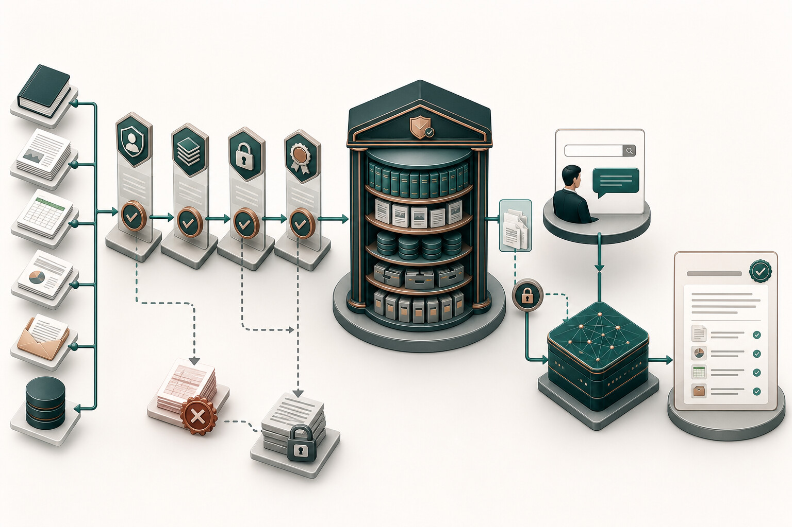

# 第 10 章 为什么文件越多，答案反而越不可靠

启明科技把一百份文件放进知识库后，系统确实能搜到很多内容。问题是，旧价格表、未批准案例和过期政策也一起被搜了出来。文件数量增加了，可信知识反而更难找到。

知识库的问题通常不是资料太少，而是系统分不清哪份资料此刻值得相信。知识工程不是把文件上传完就结束。资料要有来源、权限、版本、有效期和负责人；系统还要知道这次任务究竟需要哪一小部分上下文。

## 文件上传以后，真正的工作才开始

启明科技把一批产品资料和历史方案导入测试知识库后，第一轮问答表现很好。第二轮，销售问到某个产品参数，系统引用了两年前的旧版本；另一名销售又检索到了不属于自己团队的客户案例。

技术上，检索和生成都成功了。业务上，系统已经失败。

企业知识工程要让模型在正确时间看到正确、获准、可追溯的事实。看到更多资料并不是目标。

## 一份文件怎样变成可以信任的知识

把知识库想成一家需要长期营业的资料室，会更容易理解这一章。文件进门前要有人验收，上架时要有分类和权限，版本过期要及时撤下，读者还要知道手里的材料来自哪里。上传只是入库的第一步。

一份资料进入 AI 系统前后，要经过完整生命周期：

```text
发现 -> 准入 -> 清洗 -> 组织 -> 授权 -> 索引
-> 检索 -> 引用 -> 反馈 -> 更新/下架
```

每个阶段都需要责任人和证据。

资料进入知识库前，先做发现与准入。团队要先盘点资料类型，不要直接导入整个网盘。每类资料要回答：

- 它解决什么用户问题。
- 谁是内容负责人。
- 是否有有效版本。
- 是否允许进入当前场景。
- 是否包含个人信息、客户秘密或受限制内容。
- 是否有可执行的更新和下架机制。

没有负责人的资料，不适合作为高可信生产知识源。

通过准入后，再清洗和组织资料。这里的清洗不只是删除空格，还包括：

- 去除重复和过期版本。
- 保留标题、章节和表格结构。
- 识别日期、产品、地区、客户和适用范围。
- 将图片、扫描件和附件转为可检索内容，并保留来源。
- 区分事实、示例、观点和已经失效的历史记录。

组织方式应服务检索和权限，而不是只复制原文件夹结构。

资料经过准入和清洗以后，才轮到切分和元数据。文本切分需要在语义完整和检索精度之间权衡。切得太大，返回无关内容并增加上下文成本；切得太小，事实失去上下文。

比固定字符数更重要的是元数据：

- 文档与片段 ID。
- 标题、章节和来源链接。
- 负责人、版本、发布日期和复核日期。
- 业务领域、产品、地区和适用对象。
- 数据级别、部门、项目和访问标签。
- 生效、过期和下架状态。

元数据决定检索能否过滤、引用和管理。

切分单位应服从业务语义。产品手册可以按“功能—限制—参数”切分，制度文件可以按“适用范围—规则—例外—生效日期”切分，案例可以按“客户背景—问题—方案—结果”切分。

统一按 500 字截断虽然实现简单，却可能把适用条件和结论分开，让模型只看到“可以”而看不到前面的“仅在某版本、某地区可以”。

表格、图片和附件尤其需要单独处理。把价格表直接转成连续文本，行列关系可能丢失；把架构图只做 OCR，连接关系无法恢复。对高价值结构化事实，优先保留为字段或表格查询；对必须检索的图表，增加标题、说明、来源页码和人工复核。知识工程不是把所有内容都压成向量。

## 把知识看成一条供应链

生产知识和软件依赖很相似：来源可能变化，版本可能冲突，错误会沿下游传播。因此要建立从来源到回答的供应链证据：

```text
来源系统 -> 内容批准 -> 版本发布 -> 解析与索引
-> 权限过滤 -> 检索与组装 -> 回答与引用 -> 反馈与下架
```



这条供应链既要让有效知识顺利到达用户，也要在错误版本、越权内容和证据不足时停止传播。最终回答要能反向追踪到来源、版本、权限判断和处理过程。

每个环节都要能回答“谁、在何时、基于哪个版本做了什么”。当用户指出产品参数错误时，团队才能判断是源文档错误、旧版本未下架、解析丢失、检索选错，还是生成没有忠实使用来源。如果只有最终聊天记录，所有问题都会被模糊地归为“模型幻觉”。

成熟的知识发布可以借鉴软件发布：先在预生产索引验证解析、权限和典型问题，再切换生产别名。旧索引保留短期回滚。更新失败不影响当前有效版本。重大资料变化触发相关评估集。这样，知识更新就不再是不可追踪的后台重建。

## 搜索结果也要遵守权限

用户登录应用，不代表知识检索已经安全。权限需要贯穿：

1. 文档准入时保留访问标签。
2. 请求时传入用户、部门、角色和项目权限。
3. 检索前或检索后执行授权过滤，防止跨租户和跨项目返回。
4. 模型只接收获准片段。
5. 回答保留文档 ID 和授权上下文。
6. 权限变化后，索引和缓存及时同步。

原则是：

> AI 的可见范围不得大于当前用户在原系统中的可见范围。

使用一个共享超级账号导入和检索，虽然实施快，却会破坏原有权限边界。

权限过滤还要与切分方式一致。一份文档的不同章节如果拥有不同权限，就不能在文档级统一授权后把所有片段混用。项目案例如果包含公开摘要和受限客户细节，最好拆成不同对象并分别标记。缓存同样需要权限作用域，不能把 A 用户的检索结果直接复用给 B 用户。

检索后的过滤通常不足以替代检索前过滤。先从全量库召回再删除无权片段，既可能在日志或重排服务中暴露内容，也可能导致授权结果被删除后没有足够候选。更稳妥的方式是在召回时就缩小可见集合，并在返回模型前再次验证。两道检查分别防止召回泄露和传递错误。

权限测试不能只验证“授权用户能搜到”，还要验证“未授权用户搜不到”。应包含跨部门、跨项目、权限刚撤销、缓存仍存在、文档从公开改为受限等负向样本。对于多租户系统，租户隔离失败应是零容忍放行条件，而不是平均准确率的一部分。

## 搜到内容以后，还要判断能不能用

一个完整检索链要处理：

- 用户问题是否需要改写或补充。
- 应检索哪个知识域。
- 权限和业务条件怎样过滤。
- 关键词、向量或混合检索怎样组合。
- 是否需要重排。
- 多个来源冲突时怎样处理。
- 没有可靠来源时是否拒答或转人工。
- 引用是否能回到原文位置。

对于产品参数、制度和报价规则等事实型内容，无可靠引用时不应生成确定答案。

检索链的每一步都可能需要不同策略。关键词检索擅长产品编号、法规条款和专有名词。向量检索擅长语义近似。元数据过滤负责权限、地区、版本和时间。重排模型在候选中重新判断与问题的关系。混合检索要根据问题类型和业务约束组合证据，不能把几个分数随意相加。

问题改写也要谨慎。如果用户问“这个版本还能卖吗”，系统要把对话中的产品、地区和日期补入查询，但不能把模型猜测的产品写成事实。改写结果最好保留原问题、补充字段及其来源，使后续任务轨迹能解释为什么检索了某个知识域。

评估时，要把检索和回答分层来看。

最终回答失败时，团队要知道故障位于哪一层。可以把评估拆成四层：

1. 语料层：正确来源是否存在、有效、获准并被成功索引。
2. 召回层：给定问题，正确片段是否进入候选，越权片段是否被阻断。
3. 组装层：重排、去重和上下文选择是否保留了关键条件。
4. 生成层：答案是否忠于上下文、引用是否真正支持结论、无证据时是否拒答。

只看端到端得分，很难定位改善动作。召回不足应调整语料、元数据或查询。上下文已经正确却引用错，应改善生成约束和引用验证。源资料本身冲突，则必须回到内容负责人，不能靠调提示词解决。

评估样本不能只覆盖容易命中的问题。还要包括同名产品、新旧版本冲突、多条件适用、答案跨多个来源、没有答案和无权访问。来源中包含诱导模型忽略规则的恶意文本，也要成为测试样本。每条样本都应写出期望来源、禁止来源、期望行为和业务风险。

## 别把所有资料一次塞给模型

一次任务真正需要的资料通常很少。系统要先判断用户是谁、任务走到哪一步，再取出适用版本和必要片段。给得太多，旧资料和无关内容反而会干扰回答。

这类工作常被称为上下文工程。名字并不重要，核心是控制模型此刻能看到什么，以及为什么能看到。切分实验、上下文预算、知识发布和回滚方法放在附录 H。

## 启明科技的知识盘点：一百份文件里只有三十二份可以直接进入试点

销售团队最初提供了 126 份“常用资料”。项目组没有立即索引，而是逐份完成准入盘点。结果如下：

| 处理结论 | 数量 | 主要原因 |
|---|---:|---|
| 直接准入 | 32 | 负责人、版本、权限和适用范围清楚 |
| 清洗后准入 | 41 | 重复、格式或元数据缺失，可由负责人修复 |
| 仅保留内部参考 | 18 | 内容有价值，但不允许用于客户方案 |
| 待专业确认 | 12 | 合同、报价或客户复用边界不清 |
| 下架/不准入 | 23 | 过期、无负责人、来源不明或含未授权客户内容 |

如果直接导入全部文件，检索覆盖看起来会更高，但模型同时获得多个版本和受限内容。准入过程减少了语料数量，却提高了可相信范围。

项目组为每份知识对象建立最小记录：

```json
{
  "document_id": "product-x-installation-v3",
  "knowledge_domain": "product",
  "owner": "product-platform-team",
  "status": "effective",
  "version": "3.0",
  "effective_from": "2026-04-01",
  "review_due": "2026-10-01",
  "applies_to": {"region": ["CN"], "edition": ["enterprise"]},
  "classification": "internal",
  "access_tags": ["sales", "delivery"],
  "allowed_uses": ["internal_answer", "proposal_draft"],
  "forbidden_uses": ["public_marketing_claim"],
  "source_uri": "doc-system://...",
  "supersedes": "product-x-installation-v2"
}
```

验收知识库时，团队不再问“已经导入多少份文件”，而是抽取真实任务，检查系统能否找到当前有效、用户有权查看的资料。找不到时，它还要明确拒答或提出缺口，而不是拿旧版本凑出一个完整答案。
