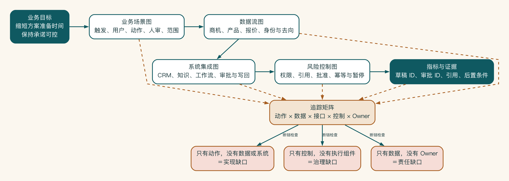
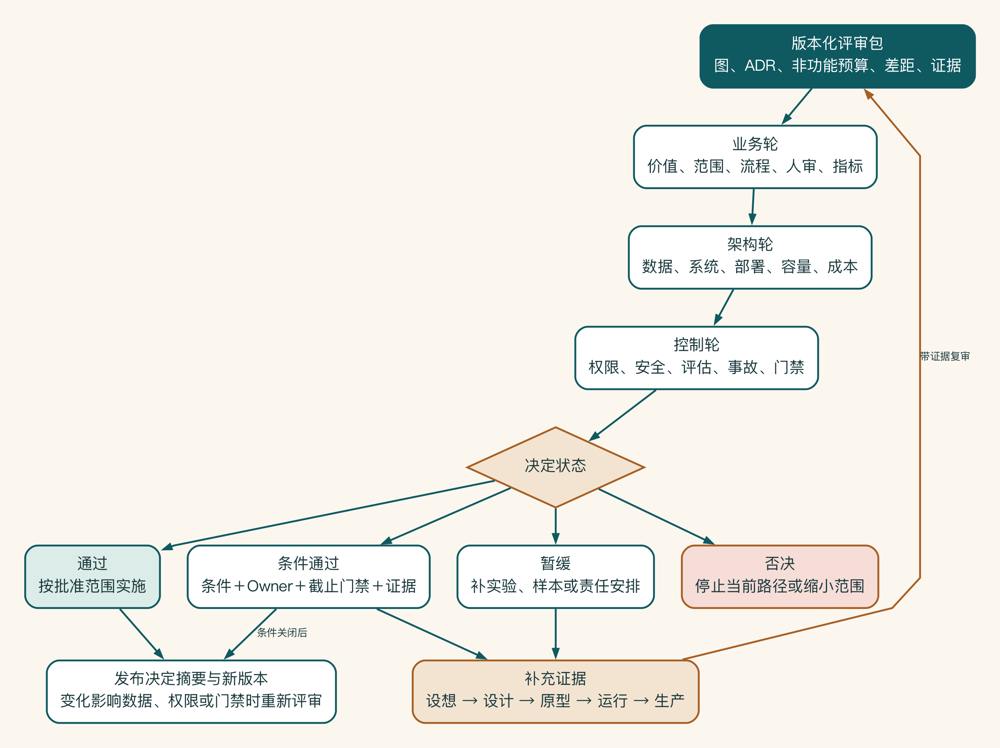

# 第 12 章 让方案可以被共同评审

方案会上最尴尬的时刻，通常不是有人反对，而是每个人都点头，散会后却带走了不同理解。业务以为项目已经承诺效果，安全以为高风险动作还没开放，工程团队则以为接口方案已经获批。

架构材料的作用不是把图画漂亮，而是让这些分歧在开工前出现。会议结束时，团队要知道哪些决定已经作出，依据是什么，还有哪些问题没人能回答。

## 一张图无法服务所有读者

一张城市地图也无法同时替代地铁图、道路图和消防疏散图。它们描述的是同一座城市，却服务不同决定。架构材料也是如此：关键不是图越多越好，而是每张图回答一个清楚问题，并且彼此能够对上。

老板关心价值和范围，业务关心工作方式，IT 关心系统边界与责任，安全关心数据和控制，财务关心成本与扩大条件。如果试图用一张塞满组件的图回答所有问题，通常谁都看不懂。

架构表达要帮助参与者围绕同一个方案作出决定，无需证明作者懂得多。


业务场景、数据流、系统集成与风险控制分别服务不同问题，却必须使用相同角色、业务对象、系统节点和编号。中央的证据与决策关系把四张图连起来：任何数据路径都能追到业务用途、责任角色和控制，任何关键主张也能追到样本、指标或待验证假设。

第一张图画业务场景，用来回答：谁在什么情境下使用系统，目标是什么，输出进入哪里。

至少包含：

- 触发事件和主要用户。
- 当前痛点和目标结果。
- 关键业务动作和人审点。
- 上下游角色与系统。
- 试点范围和指标。

不要在这张图里塞入模型名称和 GPU 型号。它服务的是范围和价值评审。

第二张图画数据怎样流动，用来回答：哪些数据从哪里来，经过什么处理，到哪里去。

关键标注包括：

- 数据对象及敏感级别。
- 来源系统和负责人。
- 用户身份和权限如何传递。
- 是否脱敏、最小化、缓存或记录日志。
- 哪些数据进入云端、本地模型和知识服务。
- 输出、引用和写回去向。
- 数据保留、删除和审计位置。

箭头要说明传递的对象，不能只写“调用”。

第三张图画系统怎样连接，用来回答：应用、工作流、知识、工具、网关、模型和企业系统怎样协作。

至少说明：

- 同步、异步或人工交接。
- API、MCP、事件或 RPA 等接口方式。
- 认证和服务身份。
- 状态、队列和幂等位置。
- 超时、重试、降级和恢复。
- 概念验证与生产组件的差异。

这张图服务工程、平台和运维评审。

第四张图画风险在哪里被限制，用来回答：风险在哪里被预防、发现、阻断和恢复。

可以按过程标注：

- 输入：恶意内容、越权请求、敏感数据。
- 检索：权限过滤、来源、污染和过期。
- 模型：路由、提示注入、输出限制和成本。
- 工具：最小权限、参数校验、人审和幂等。
- 输出：引用、事实确认、对外发送和日志。
- 运行：评估、监控、告警、暂停和事故响应。

管理不是一个放在右下角的盾牌图标。控制必须落在具体路径上。

## 四张图必须相互映射

在启明科技的主案例中，业务图上的“主管批准报价”，应在数据图出现报价数据，在集成图出现审批和写回，在风险图出现未批准不得执行。任何只出现在一张图上的关键动作，都可能是方案缺口。

评审前可以做一次追踪：

```text
业务目标 -> 流程节点 -> 数据 -> 系统组件 -> 控制 -> 指标
```

如果链路断开，方案仍不完整。

可以把映射固化成追踪矩阵，而不是依赖评审者在四张图之间寻找：

| 业务动作 | 数据对象 | 系统/接口 | 控制 | 成功证据 | 负责人 |
|---|---|---|---|---|---|
| 生成方案草稿 | 商机、产品、案例 | CRM、知识服务、模型网关 | 权限过滤、引用校验 | 草稿 ID、引用、评估结果 | 方案产品负责人 |
| 批准报价 | 报价项、折扣 | 审批流、定价服务 | 阈值规则、主管批准 | 审批 ID、规则版本 | 销售运营 |
| 写回 CRM | 状态、文档链接 | 集成服务、CRM API | 幂等、字段白名单 | 任务 ID、后置条件 | CRM 负责人 |

矩阵能暴露“有动作但没有证据”“有控制但没有执行组件”“有数据但没有负责人”等缺口。设计变化时，也可以快速识别受影响的图、测试和责任人。



四张图是同一业务动作的不同投影，彼此必须能够对应。追踪矩阵以动作作为主键，把业务范围、数据对象、系统接口、风险控制、成功证据和负责人串在一起。

任何一段断链都会暴露明确缺口。评审人因此可以从“批准报价”一路追到数据去向、审批接口、阻断规则和最终审批 ID，而不必凭图形外观猜测方案是否完整。

## 方案会的目的，是作出决定

一次有效的方案会，不是让所有专业角色轮流提意见，而是把意见变成决定。有人认为本地部署更安全，材料就要说明它减少了哪类风险，又增加了哪些运行负担；有人担心系统不稳定，就要给出真实负载和恢复结果。

会议还要把“已经测过”“根据现有信息推断”和“未来希望达到”分开。启明科技因此没有把概念验证中的顺利样本写成生产承诺，也没有把尚未确定的接口和权限藏在附注里。

不同角色的检查问题、架构决策记录和一页摘要模板放在附录 I。正文只保留会议必须产生的三样东西：明确决定、决定依据和仍待回答的问题。



## 启明科技的完整评审包

启明科技第一次准备架构评审时，项目组交出了一份四十二页的演示文稿。页面不少，但核心内容只有三类：产品功能截图、模型回答示例和一张组件图。信息安全团队无法判断客户数据会不会离开允许的区域。

CRM 团队不知道写回接口要承担多大流量。销售运营也没有看到主管何时批准报价。会议进行了九十分钟，大家提出了很多意见，却没有形成任何可以执行的决定。

项目组随后把材料重组为一个有明确阅读顺序的评审包：

| 编号 | 材料 | 回答的问题 | 主要审阅者 | 预期决定 |
|---|---|---|---|---|
| 01 | 决策摘要 | 为什么做、这次决定什么 | 业务负责人、投资负责人 | 是否进入受控试点 |
| 02 | 业务场景与边界 | 谁在何时使用，哪些不做 | 销售运营、产品负责人 | 范围与指标是否成立 |
| 03 | 目标流程 | 人、AI 和系统如何分工 | 一线代表、流程负责人 | 工作方式是否可接受 |
| 04 | 数据流与分级 | 数据从哪里来、到哪里去 | 数据、安全、法务 | 数据路径是否允许 |
| 05 | 系统集成与状态 | 如何调用、写回和恢复 | 企业架构、系统负责人 | 接口责任是否可承担 |
| 06 | 风险控制与威胁场景 | 风险在哪里被阻断 | 安全、内控、业务风险 | 控制是否足够 |
| 07 | 非功能需求与容量 | 在多大规模、什么条件下工作 | 平台、运维、财务 | 性能与成本预算是否可行 |
| 08 | 评估与上线放行条件 | 怎样证明质量、何时暂停 | 评测负责人、业务负责人 | 验收条件是否完整 |
| 09 | 架构决策记录与差距清单 | 做了哪些取舍、还欠什么 | 全体评审人 | 条件通过项是否有负责人 |
| 10 | 运行与事故方案 | 上线后谁看、坏了怎么办 | 运维、服务台、产品负责人 | 运营责任是否落实 |

这套目录的重要性不在于页数，而在于每份材料都对应一个决策。项目组还在首页声明：此次评审只批准“在三个销售团队中生成方案草稿并由主管确认”，不批准自动发送客户邮件，也不批准自动修改折扣。这样，评审人不会把对未来愿景的认同误认为对生产权限的授权。

评审包采用同一个版本标识，例如 `solution-review-0.8.3`。图、架构决策记录、测试结果和差距清单都引用这一标识。若会后修改了数据去向或写权限，不能只替换一张图，而要形成 `0.8.4`，列出变化、影响和需要重新签署的决定。

版本一致性看似行政工作，实质上是在防止“安全批准的是 A，开发实现的是 B”。

最后看这场方案会怎样真正作出决定。

第二次评审前，主持人提前三天把材料发给对应审阅者。会议邀请中只列出五个需要作出的决定：数据能否送往指定云模型，是否批准 CRM 只读访问，何时开放草稿写回，试点容量是否可以接受，以及哪些差距会阻断上线。与决定无关的措辞修改在线完成。

会上，安全负责人提出：“你们说客户名称已经脱敏，但日志中是否仍保留原始商机标题？”项目组没有回答“我们会注意”，而是打开数据字段矩阵，确认日志设计仍包含标题。

会议决定将日志改为商机 ID 和脱敏摘要，并补充一条验证任务。该项被记录为条件通过，负责人是可观测平台负责人，截止时间是接入真实数据前，证据是日志抽样与自动扫描结果。

CRM 负责人又提出，接口超时不等于写入失败。团队展示了幂等键和后置条件查询的测试证据，因此这一点直接通过。财务负责人对成本上限有疑问，项目组承认当前评估集没有覆盖长文档商机，于是成本结论保持“原型证据”，先增加长上下文样本，不把平均值当成生产预算。

会议结束时，记录中只有四种状态：通过、条件通过、暂缓、否决。没有“大家基本同意”“后续再看”这样的模糊语言。二十四小时内发布决定摘要；一周后只复审条件项，不重新讲解整套方案。一次有效评审最终要留下带证据、条件和责任人的决定，掌声无法代替它。

## 一张漂亮架构图通过以后发生了什么

另一家公司曾用一张标准化程度很高的架构图获得项目批准。图上有模型网关、向量数据库、安全过滤和审计模块，但没有标出用户身份如何传递，也没有说明 AI 生成的工单由谁批准。

开发阶段为了赶时间，共享服务账号被授予全部工单队列权限。审计模块只记录了应用名称，没有记录最终用户和批准事件。

试点扩大后，一名客服人员能够通过助手检索其他区域的内部处理记录。系统没有发生传统意义上的入侵，每个组件也都“按设计工作”，问题在于设计从未把字段权限和委托身份变成评审对象。团队暂停服务后才补画数据流和信任边界，重新开发身份链路，延期六周。

这个失败说明，图的专业外观不能替代可追踪的决定。评审时看到“权限控制”四个字，必须继续问：依据谁的身份、控制到哪个对象和字段、在哪个执行点强制实施、如何构造负向测试、日志能否证明没有绕过。每一个抽象名词都要落到机制和证据。

启明科技的方案会结束时，参会者仍然有分歧，但分歧已经写成待验证问题。已经通过的决定有证据和负责人，尚未回答的接口、权限与容量问题也有下一次确认时间。
