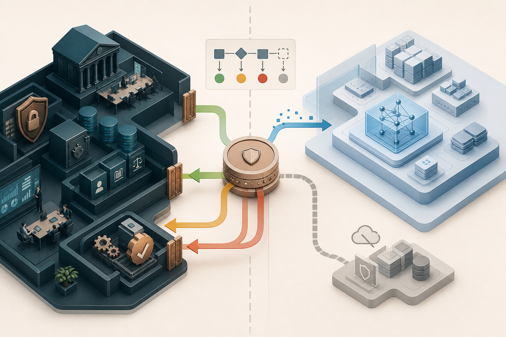
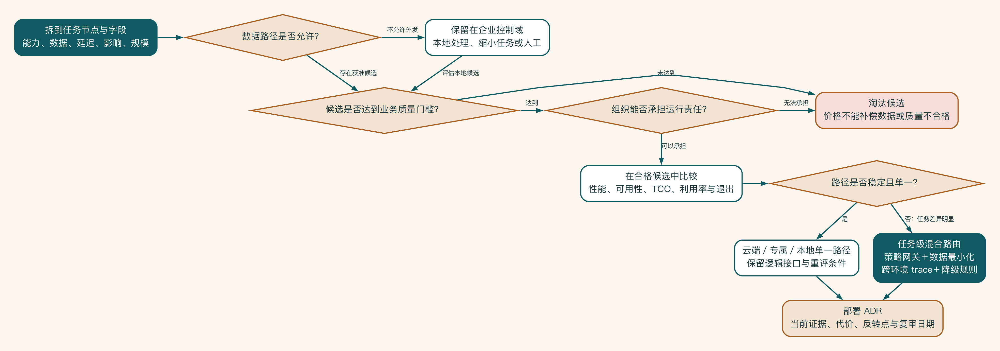

# 第 13 章 云端、本地还是混合

业务团队希望尽快使用效果更好的云模型，安全团队倾向把所有东西留在内网，采购又关心三年成本。三方都没有错，只是各自拿着一个局部答案讨论整条技术路线。

云端、本地或混合，并不是三种要先表态支持的立场。先看具体任务会接触哪些字段、有多少人使用、质量要求多高，再比较风险、成本和团队能否长期维护，答案才会逐渐清楚。

## 先看任务和数据，再谈部署

“敏感，所以必须全部本地”“云模型效果好，所以尽量上云”都是过早结论。企业 AI 系统包含多个任务，每个任务的数据、质量、延迟和风险不同。部署决策应落到任务和数据路径，而不是给整个项目贴一个标签。

启明科技的行业研究、客户摘要、内部案例检索、方案生成、报价检查和 CRM 写回，不用经过同一种模型通道。

先把部署概念说清楚。

常被混用的模式包括：

- 公有云 API：通过供应商公共服务调用模型。
- 企业或专属云服务：在合同、区域、网络和数据控制上提供企业能力。
- 私有云或专属环境：运行于企业批准的隔离云环境。
- 企业自有本地推理：模型服务运行在企业控制的计算环境。
- 桌面本地工具：单机体验或小规模开发，不等同于生产服务。
- 混合架构：同一业务流程按任务和数据采用多种获准路径。

“私有化”若不说明网络、硬件、身份、运维和责任，无法作为架构结论。



在混合架构中，策略网关根据任务、数据级别和批准条件决定路径，用户不能随意选择模型。必要字段最小化后才能进入获准云端，结果返回本地仍要经过校验、审批与审计。不满足条件时则保留在企业控制域内或转入降级路径。

## 部署选择先做排除法

与其一开始比较所有云端、本地和混合方案，不如先排除不能接受的路径。某些数据不能离开指定环境，某些任务又需要本地模型达不到的质量；这两个事实已经把选择缩小了。

启明科技最终保留两条路径：敏感资料在本地处理，公开研究使用获准云服务。身份和任务标签决定路由，故障时只能退到同等级或更严格的路径，不能为了恢复速度放宽数据范围。

部署维度、混合模式和决策记录放在附录 H。正文先抓住一点：部署是任务、数据、质量和运行能力共同决定的，不是对某种技术立场的表态。



## 从工作负载组合出发

企业通常不是选择一个模型，而是在管理一组工作负载。可以将任务按以下特征分群：

- 短交互任务：输入小、延迟敏感、量大，例如分类和字段提取。
- 长上下文任务：需要大量资料，内存和上下文成本高，例如合同分析。
- 长生成任务：输出大、可异步，例如方案初稿和报告。
- 开放研究任务：步骤不固定，成本和时延波动大。
- 高敏任务：数据路径优先于模型能力。
- 高影响动作：模型只产生建议，执行留在受控工作流。

同一套本地资源如果同时承载短交互和长生成，长任务可能挤占显存和队列，使所有用户体验恶化。同一云端模型如果同时处理公开研究和敏感摘要，又可能把原本不同的数据控制混在一起。先理解组合，才能设计隔离、优先级和路由。

## 把数据路径画到字段级

选择部署方式，很像安排一件敏感包裹的运输路线。不能只说“走外部物流”或“全程自送”，而要看包裹里究竟有什么、在哪个节点拆封、谁能看见、途中留下哪些记录，以及出现问题时怎样召回。

“本地检索、云端生成”仍然太粗。真正需要决定的是：用户问题中的哪些字段出网，检索片段是否包含客户名。模型输出回到哪里，供应商是否记录元数据，错误上报是否携带原文，人工支持能否查看请求。

可以对每条外部路径建立数据清单：

| 数据对象 | 原始级别 | 最小化方式 | 允许去向 | 保留/日志 | 批准依据 |
|---|---|---|---|---|---|
| 客户访谈 | 敏感 | 删除身份与联系方式 | 批准隔离服务或本地 | 仅 ID 与分类 | 场景数据评审 |
| 产品说明 | 内部 | 选择相关公开字段 | 批准云模型 | 文档 ID | 内容负责人 |
| 商机金额 | 敏感 | 仅传金额区间或不传 | 本地规则 | 规则结果 | 销售运营 |

字段级处理可以改变部署选择。原始客户资料不得外发，不代表所有衍生任务都必须本地。反过来，去掉姓名也不一定完成匿名化，结合公司、行业和项目细节仍可能重新识别。

## 别只比较调用价格和 GPU 采购价

云端候选至少计算：调用量、输入输出用量、缓存、峰值、网络、企业条款和支持。

本地候选至少计算：服务器与 GPU、CPU/内存/存储、机房、电力、折旧、利用率、模型适配、平台工程、监控、升级、备份、值班和停机成本。

两者都要加上知识、集成、安全、评估和用户运营成本，因为这些工作不会因部署方式消失。

更有意义的指标是“每个成功业务任务成本”：总成本除以达到质量、权限和业务终点的任务数。失败率高、人工修改多的便宜模型，可能并不便宜。

总成本应至少做三种情景：低调用量、预计调用量和峰值调用量。云端在低利用率时通常减少固定成本，本地在高且稳定的利用率下可能摊薄硬件成本。但如果请求只集中在工作日两小时，本地平均利用率仍可能很低。不要用峰值吞吐乘整月时间制造虚假规模。

可以采用下面的简化口径：

```text
单位成功任务成本
=（模型/硬件 + 平台 + 运维 + 安全 + 知识 + 集成 + 人审 + 失败返工）
  / 达到业务质量并完成终点的任务数
```

敏感性分析比单一数字更重要。分别改变采用率、平均上下文、成功率、人工修改时间、GPU 利用率和供应商价格，观察结论何时反转。部署架构决策记录应记录这些反转点，例如“当稳定月成功任务超过某阈值且本地质量差距收窄到门槛内时，重新评审”。

混合架构也会增加运行复杂度。

混合不是两种部署优点的简单相加。它会新增路由、两套容量、不同模型行为、跨环境任务轨迹、数据最小化和更多故障组合。团队要明确谁运营每条路径，哪条是主路径，哪条仅用于灾备，配置怎样同步，事故时谁能关闭跨环境流量。

如果一个低价值任务同时维护云、本地和备用三条路径，运行成本可能超过业务收益。混合应服务明确的控制或连续性需求，而不是成为不愿做取舍的折中口号。

## 启明科技的双路径验证实验

启明科技最初的争论很典型。安全团队认为客户资料敏感，主张全部本地。销售团队试用过能力较强的云模型，担心本地模型写不出可用方案。基础设施团队则根据预计三年调用量提出采购四台 GPU 服务器。三方都在讨论方案，但没有使用同一批任务，也没有比较相同的业务终点。

项目组把争论改造成一个为期三周的双路径实验。样本不是网上题库，而是从历史商机中分层抽取的 120 个任务：40 个短摘要、30 个产品匹配、30 个方案章节生成和 20 个复杂异议分析。

样本覆盖不同地区、行业、材料长度与信息缺失程度，并由数据负责人完成去标识化。两条路径获得相同的允许信息和相同的结构化输出要求。

实验事先写明通过规则：

- 客户摘要的关键字段准确率不低于 97%，不得出现跨客户信息。
- 产品匹配必须给出可追踪依据，严重不匹配为零容忍。
- 方案初稿的销售采纳率不低于 75%，平均人工修改不超过十二分钟。
- 交互任务 P95 不超过十二秒；长生成任务 P95 不超过四十五秒。
- 任何路径都必须通过权限负向测试、日志最小化检查和删除验证。
- 单个成功方案任务的可变成本不得超过预算，但成本不凌驾于数据和质量门槛。

结果并没有产生一个“总冠军”。本地候选在摘要和产品匹配上达到要求，速度稳定，且原始客户材料不离开企业环境。在长方案和复杂异议上，销售采纳率比云端候选低十四个百分点，修改时间多九分钟。

云端候选可以处理去标识化后的公开行业研究和方案措辞，但不能获得原始客户访谈与未批准案例。

最终架构是一种有证据支持的任务级组合，并非双方立场的简单妥协：本地服务完成敏感信息抽取和内部检索，输出受控的事实卡片。批准的云端模型只接收事实卡片、公开资料和必要的产品片段，生成方案草稿。

报价、批准和 CRM 写回始终留在本地工作流。两条模型路径都经过同一个网关，网关按任务、数据标签和用户权限执行路由。

这个结论附带两个重新评审条件：若本地候选在连续两个版本中把方案采纳率差距缩小到三个百分点以内，就重新比较长生成路径。若外部服务的条款、处理区域或保留机制发生变化，立即暂停对应任务并启动数据路径复审。部署决定由证据维持，也应能被新证据推翻。

## 为三年后的规模提前买满硬件以后

某企业根据业务部门提交的“潜在用户数”，推算每名员工每天使用二十次 AI，于项目开始时采购了足以支持峰值的本地设备。六个月后，真正进入稳定流程的只有两个摘要场景，活跃用户不到预计的 15%。

设备大部分时间空闲，但团队为了证明采购合理，又把并不适合本地候选的长文任务迁入集群，结果质量下降、人工修改增加。

更严重的是，预算大多用于硬件，知识维护、评估和平台工程没有足够人员。模型能运行，却无法可靠获取最新制度，升级后也没有回归测试。项目最终并非败在本地技术，而是把一个尚未验证的采用率假设变成了不可逆资本支出。

合理的做法是按证据扩大容量：先用小规模、租赁、现有资源或受控云服务验证任务质量和采用。应用通过模型网关与逻辑接口解耦。当稳定负载、质量差距、组织能力和三年总成本同时跨过事先约定的阈值，再分阶段采购。

本地部署可以是正确答案，但它必须回答已经存在的工作负载，而不是承担寻找场景的责任。

部署方式没有天然高下。能解释数据去了哪里、质量损失多少、故障时怎样退回，才是一项可以长期承担的选择。
