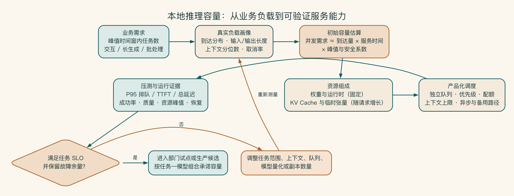

# 第 14 章 本地推理不是下载模型

一台工作站上的本地模型回答得又快又好，演示现场掌声不断。第二天十个人同时使用，首个回答要等几十秒，长文档直接挤爆显存。模型没有变，使用方式变了。

能在一台机器上运行，只证明模型可以启动，还没有证明它能成为一项服务。下载模型只是开始。本地推理要成为企业服务，还要处理容量、并发、调度、发布、监控和故障恢复。

## 从单机回答走向部门服务

本地模型演示往往从下载模型、打开聊天界面开始。单人输入一段文字，几秒或几十秒后得到回答，团队便认为“私有化已经跑通”。

生产推理服务面对的是多用户、不同长度输入、峰值并发、服务升级、模型切换和故障恢复。桌面体验验证的是模型可以运行，不能证明服务可用。

本地推理大致会经历三种形态。

| 形态 | 目的 | 典型要求 |
|---|---|---|
| 单机体验 | 探索模型和数据 | 本地运行、人工测试、可随时重启 |
| 部门概念验证服务 | 验证真实任务与负载 | API、鉴权、指标、并发、样本评估 |
| 生产推理服务 | 稳定提供企业能力 | HA、容量、队列、监控、升级、回滚、支持责任 |

不要用生产要求阻止早期实验，也不要用实验结果替代生产证据。


本地部署从固定模型与运行时版本开始，经量化验证、资源装载、队列调度和服务接口承载真实负载，再由监控、容量余量、降级与发布回滚保证持续运行。任何单点速度数字都只能解释这条链中的一个局部，不能替代端到端服务证据。

## 模型变小以后，能力会损失多少

模型选择要固定具体版本、权重、量化、运行时和上下文配置。同一模型的不同量化可能在显存、速度和质量上明显不同。

量化降低资源占用，但不能默认“几乎无损”。企业要在自己的摘要、检索问答、结构输出和高风险样本上测试。某个量化版本在通用问答表现正常，不代表它能稳定处理产品编号和合同条款。

上下文越长，资源需求越高。

显存不只用来存模型权重。模型在处理上下文时还会占用一块临时记忆，工程上通常称为 KV Cache；并发请求越多，这部分占用也越大。上下文越长、并发越高，资源消耗越大。

因此容量问题不能只问“这个模型需要多少显存”，还要问：

- 平均和 P95 输入长度是多少。
- 输出长度是多少。
- 同时有多少活跃请求。
- 请求是否能够排队。
- 是否使用缓存、前缀复用或批处理。
- 多模型是否共享同一资源。

容量估算不能只使用模型文件大小。可以先把资源占用分成固定部分和随请求增长的部分。模型权重与运行时属于固定占用；KV Cache 会随着上下文、生成长度、并发和模型结构增长。批处理与临时张量还会带来额外峰值。不同运行时的内存管理方式不同，最终结论必须以测量为准。

长上下文并非免费质量。把几十份文档全部放入窗口，可能降低模型对关键证据的关注，也会拖慢首字响应，并减少可承载并发。优先用检索、结构化查询、分阶段总结和上下文预算减少无关输入，再决定是否扩大硬件。

## 先算清楚同时会有多少人用

单人演示和部门服务的差别，像家庭厨房与午餐高峰的餐厅。会做一道菜不等于能同时服务几十桌。团队要知道客人什么时候到、每桌占用多久、厨房能并行处理多少，以及设备故障后还能不能继续营业。

压测前可以先用业务数据估算：

```text
到达量 = 峰值时间窗内任务数 / 时间窗
服务时间 = 排队后实际占用推理资源的平均时长
并发需求 ≈ 到达量 × 服务时间 × 峰值与安全系数
```

这不是采购公式，但能暴露关键假设。若销售团队每天只生成 100 份方案，却集中在晨会后半小时，平均日调用量会严重低估峰值。若一次长文占用资源三分钟，少量并发也会形成长队列。

容量模型要区分允许排队的批任务和需要立即反馈的交互任务。可以给交互请求保留池，把长任务放入异步队列，或者在同一服务中设置优先级与最大上下文。没有调度策略，最先到达的超长请求可能阻塞大量短任务。



这张图把容量规划从“模型能否装入显存”展开成一条记录链。团队先观察真实任务的到达方式和上下文分布，再估算并发、拆解资源并设计调度。最后用质量、延迟、成功率和故障余量共同验收。任何一环发生变化，都应回到负载画像重新校准，而不是直接追加硬件。

## 一个人用得快，不等于十个人也快

交互任务关注首字响应时间和总响应时间。批处理关注单位时间完成量。长文生成可能接受更高延迟，但会占用更久资源。

测试至少记录：

- 首字响应时间：用户多久看到第一个 token。
- 生成速度：稳定输出速度。
- 端到端延迟：P50 表示一半请求能达到的水平，P95 和 P99 用来观察等待最久的少数请求。
- 吞吐和并发。
- 错误、超时和排队。
- GPU/CPU/内存峰值。
- 单次成功任务成本。

只报告每秒生成量，不足以判断用户体验和业务容量。

还要区分排队时间、预处理时间、首字响应时间和生成时间。用户觉得“模型慢”，可能实际卡在文档解析、检索、模型加载或队列。分段任务轨迹能决定是增加副本、优化上下文、预热模型，还是改变交互设计。

吞吐优化也可能伤害延迟。连续批处理提高 GPU 利用率，但高峰时小请求可能等待凑批。提高最大并发会让每个请求生成变慢。过度保留 KV Cache 会减少新请求容量。调优必须围绕业务服务目标，而不是追求单一基准最高值。

## 本地模型要经受真实拥堵

一个人在工程师电脑上提问，和几十名员工在早高峰同时使用，是两种完全不同的工作负载。平均速度看起来不错，排队最久的那批用户仍可能已经放弃。

因此，本地概念验证不能只跑单条样本。它要使用真实长度的输入、真实并发和真实失败条件，观察用户等待、任务完成和资源占用。模型变小后节省了多少资源，也要和业务质量损失一起看。

压测方法、容量计算、服务化和调度细节移到附录 H。普通读者只需记住：榜单成绩属于模型，能否在拥堵时完成任务才属于服务。

## 启明科技的本地概念验证

试点只验证客户摘要和内部知识问答，不把方案长文生成全部放入本地。团队准备：

- 30 条客户摘要样本。
- 30 条带权限和引用的知识问答。
- 10 条长上下文和冲突资料。
- 10 条权限、提示注入和高风险样本。
- 单用户、5 并发和 20 并发三组负载。

通过标准同时包含质量、引用、权限、延迟、错误和恢复。若本地候选质量不足，团队可以缩小任务范围，而不是为了证明采购正确而降低业务标准。

高可用也不只是“再买一台服务器”。企业在谈高可用，也就是 HA 时，至少要回答：

- 故障怎样被发现。
- 流量怎样切换。
- 模型和配置是否一致。
- 在途请求怎样处理。
- 上游是否支持重试且不会重复业务动作。
- 容量是否足以在单实例故障时承载核心负载。
- 恢复目标和允许数据丢失是什么。

对非关键试点，可以接受人工恢复；但要明确服务窗口和影响，不能口头承诺企业级可用性。

恢复演练应真正停止一个实例、破坏一次配置或模拟存储不可用，再观察探针、告警、流量切换和在途请求。只检查两台机器都在线，无法证明故障切换。

需要备份的往往不是模型权重本身——权重可以从可信制品库重新获取——而是路由配置、服务清单、评估基线、访问策略、部署清单和运行数据。备份完成不等于可恢复，必须在隔离环境恢复并校验版本与权限。

如果备用容量只够承担核心任务，故障模式下要自动暂停低优先级长生成，而不是让所有请求一起变慢。降级顺序应在事故前由业务确定。

## 那台演示完美的工作站后来怎样了

某团队在高配工作站上做出了响应流畅的内部问答演示。采购批准后，同一配置被部署为部门服务。真实用户上传的文档远长于演示样本，午间并发达到十五，显存很快耗尽。

服务自动重启后所有排队任务丢失，用户再次提交，形成更大突发流量。由于日志只记录 GPU 利用率，团队最初误以为设备算力不足，又申请增加硬件。

事后分析发现，真正问题包括没有上下文上限、短长任务共用队列、重启没有任务状态、取消请求仍继续生成，以及检索返回大量重复片段。通过检索去重、队列隔离、任务持久化和限流，原硬件已经能够支撑目标部门。

这次复盘提醒团队，本地推理的工程瓶颈常常在服务和工作负载管理，不在模型能否加载。

本地模型在一个人的电脑上跑得快，只是起点。真实用户同时到来时，它仍能稳定完成任务，才算成为了一项服务。
