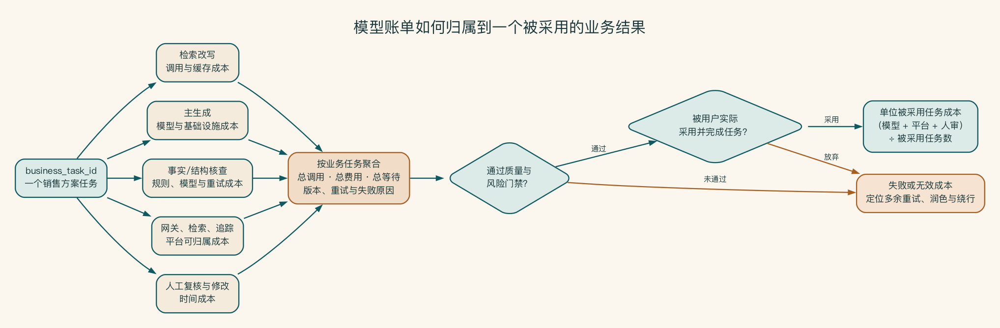

# 第 15 章 模型越来越多以后，谁来管入口

第一个应用直接调用模型接口时，一切都很简单。到了第十个应用，团队已经说不清谁在使用哪个模型、密钥放在哪里、费用属于哪个部门，也不知道某个供应商故障时哪些业务会受影响。

当模型调用从一个应用扩展到许多应用，统一管理就从便利功能变成了运行条件。模型网关的价值不只是转发请求。它把身份、路由、配额、成本、审计和降级放到一个可以真实执行的入口。

## 直连在一个应用里很方便，在十个应用里会失控

第一个 AI 原型直接保存供应商密钥、调用固定模型，通常最快。第二个团队复制代码，换一个账号。几个月后，企业拥有多个密钥、多个账单、多个日志口径和写死在应用里的模型名称。

当安全需要阻断某个渠道、财务需要解释成本、技术团队要换模型时，必须逐个修改应用。模型网关的价值，就是把这组变化从业务应用中抽离出来，形成统一控制入口。

## 一个统一入口到底要管哪些事

模型网关既像总机，也像检查站。它先认出谁在调用、准备去哪里，再根据数据和任务决定能否放行、走哪条通道、花多少预算，并把过程记录下来。只负责转接号码的代理，还算不上控制入口。

一次请求进入网关后，第一步是确认身份和使用环境：谁在调用，来自哪个部门、应用和环境。生产、测试和个人实验不能混用同一套配额与策略。网关随后把业务使用的逻辑模型映射到获准的供应商或本地渠道，业务应用不再写死具体模型名称。供应商密钥和本地服务凭据也由受控系统统一保存、轮换和撤销。

身份和候选范围确认以后，网关才按任务、数据级别、质量、成本、延迟、地区和可用性选择路径。调用量要能够归到用户、部门、应用和场景，每次选择还要留下模型、版本、用量、错误和策略命中记录，同时避免无必要地保存请求原文。

故障与退出路径也应提前写清。模型超时、预算耗尽或供应商退出时，系统可以切换到获准候选、转人工或停止。它不能为了维持可用性，悄悄绕过数据和安全要求。

这七类对象还要区分控制面和数据面。控制面负责模型目录、策略、凭据引用、配额和批准；数据面承载实际推理流量。普通应用管理员可以查看用量，不一定有权修改高敏路由。策略发布者可以改变允许渠道，但不应直接读取请求原文。分离权限能降低网关管理员成为“万能账号”的风险。

配置变化要版本化并支持审批。新增供应商、放宽数据级别、改变默认模型和关闭日志都属于高影响变更，不能与调整展示名称使用同一权限。每次调用记录策略版本，事故后才能解释当时为何选择了某条路径。


统一地址只是网关的表面。真正的控制入口必须先验证调用者和业务语境，再按数据、质量、预算、可用性和批准范围求值，最后选择、降级或拒绝具体渠道。所有应用共享同一条追踪、成本与审计记录链，绕过网关的直连则被当作管理缺口。

## 一次请求该去哪个模型

一个可解释的路由顺序通常是：

1. 先检查任务和数据是否允许进入该渠道。
2. 检查用户、应用和场景是否获准。
3. 在允许候选中满足最低质量和功能要求。
4. 再比较延迟、可用性和成本。
5. 记录选择原因和策略版本。

成本最低但不满足数据或质量要求的模型，不是候选模型。

路由输入应尽量来自可信系统，而不是完全由用户或模型自报。数据级别来自业务对象和字段标签，任务类型来自工作流节点，用户权限来自身份系统。模型可以建议“这个任务需要强模型”，但升级仍需策略验证。否则用户只要在提示中写“这是公开低敏任务”，就可能绕过控制。

动态路由需要防止不可解释波动。同一任务今天走 A、明天走 B，会让问题难以复现。除故障切换外，可以在任务创建时固定路由决定，让后续重试和相关步骤使用同一逻辑版本。真正切换时记录原因和用户可见影响。

多条策略同时生效时，要先确定优先级。

策略会冲突：成本策略希望降级，质量策略希望升级，数据策略禁止外部，连续性策略希望切备用。如果没有优先级和冲突规则，执行结果可能取决于代码顺序。

一种常见优先级是：法律与数据禁止 > 身份与授权 > 高风险动作限制 > 最低质量 > 可用性 > 成本与体验。前一层不满足时，后一层不能覆盖。最终顺序必须由企业根据责任确认，并写入可测试的策略表。

策略测试应像代码测试一样包含输入、期望通道、期望阻断和原因。例如高敏数据即使主通道故障，也不得转到外部。测试环境即使预算充足，也不得访问生产专用模型。公开任务在强模型超预算时可以降级，但必须保持结构输出能力。

## 统一入口先解决三件事

模型入口首先要知道请求来自谁，以及这项任务允许走哪些路径。其次，它要说明为什么选中某个模型，而不是在故障时把所有请求随意转发。最后，它要把费用和结果连起来，避免只看调用次数。

启明科技用逻辑模型名隔离业务应用和具体供应商。切换供应商时，团队仍然会重新检查质量、格式和风险；网关减少了重复改代码的工作，却没有免除验证。

策略版本、成本归属、网关可靠性和迁移演练放在附录 H。



## 降级必须保持风险底线

模型 A 故障时切换模型 B，看起来合理，但需要确认：

- 模型 B 是否也被批准处理当前数据。
- 是否支持同样的结构、工具和上下文长度。
- 质量是否满足最低标准。
- 切换是否会跨地区或跨供应商。
- 用户是否需要知道结果来自降级路径。

不能为了可用性，把高敏请求静默切到未批准外部通道。安全条件不满足时，正确降级可能是转人工或停止。

## 启明科技的网关方案

销售方案应用只调用逻辑模型：公开研究、敏感摘要、内部问答和方案生成。网关再按策略连接批准的云模型和本地服务。

销售、交付、市场和测试环境拥有不同分组。高敏数据命中外部渠道时直接阻断。模型升级必须携带数据级别和理由。每次调用关联 CRM 商机任务 ID。供应商模型替换不要求修改业务应用。

网关要作出这些判断，每次请求就得携带可执行的业务语境。传统反向代理看到的主要是 URL、令牌和网络地址，无法判断“这段文本是否允许进入这个模型”。模型网关需要一个稳定的请求信封，把业务系统已经知道的任务、数据和责任传给策略引擎。启明科技采用的简化结构如下：

```json
{
  "request_id": "req_01J...",
  "business_task_id": "opp_8742_proposal_v3",
  "actor": {
    "user_id": "u_184",
    "department": "sales-east",
    "delegation_id": "del_992"
  },
  "application": {
    "app_id": "sales-proposal",
    "environment": "production",
    "scenario_id": "proposal_draft"
  },
  "task": {
    "type": "long_generation",
    "logical_model": "proposal-writer",
    "impact_level": "A2",
    "max_latency_ms": 45000,
    "max_cost_cny": 2.5
  },
  "data": {
    "classification": "sensitive",
    "allowed_processing_zones": ["enterprise-local", "approved-isolated-cloud"],
    "contains_personal_data": false,
    "retention_profile": "no-content-log"
  },
  "controls": {
    "requires_citations": true,
    "requires_structured_output": true,
    "human_review_before_external_use": true
  },
  "payload_ref": "secure://task-store/req_01J..."
}
```

信封不意味着相信应用自报的一切。网关验证用户令牌与 `user_id` 是否一致，从场景目录读取 `impact_level` 和允许区域，从数据目录或上游签名标签确认分级。

应用不能通过修改 JSON 把高敏数据声明为公开。对无法验证的关键属性，策略应拒绝或进入保守路径。

实际内容可以通过受控引用传递，而不是在每一层日志中复制。`payload_ref` 指向短期任务存储，网关数据面按权限读取，日志只保留摘要、哈希和策略结果。这样既保留可追踪性，也减少网关数据库成为全量敏感内容副本。

信封还统一了调用与业务结果。模型可能被调用三次：生成提纲、完成正文、修复结构。它们都关联同一个 `business_task_id`。当销售接受或放弃草稿时，结果回传到成本与质量系统，平台才能计算每个可采纳方案的真实模型成本。

## 地址统一了，控制为什么仍然失效

某企业建设了模型网关，所有团队都改用同一个 URL。由于赶进度，网关只转发请求和统一计费，没有强制用户身份、数据分级或逻辑模型。应用仍在请求中传具体供应商名称，共享密钥也没有按环境隔离。

一次供应商故障后，运维人员将默认地址切到另一家公共服务。公开问答很快恢复，但两个包含敏感内部材料的应用也随之切换。因为日志只记录“默认模型”，团队事后无法准确判断哪些请求受影响。网关表面上减少了 endpoint，实际扩大了错误配置的爆炸半径。

真正的整改不是再增加一个代理层，而是补齐可信身份、任务与数据标签、候选过滤、策略优先级、版本审批、调用追踪和禁止绕过。只有当网关能够解释“为什么这次请求被允许走这条路径”，它才是控制入口。

统一入口的意义不是把地址变成一个，而是让企业终于说得清：谁在调用、为什么走这条路径、花了多少钱，故障时会退到哪里。
