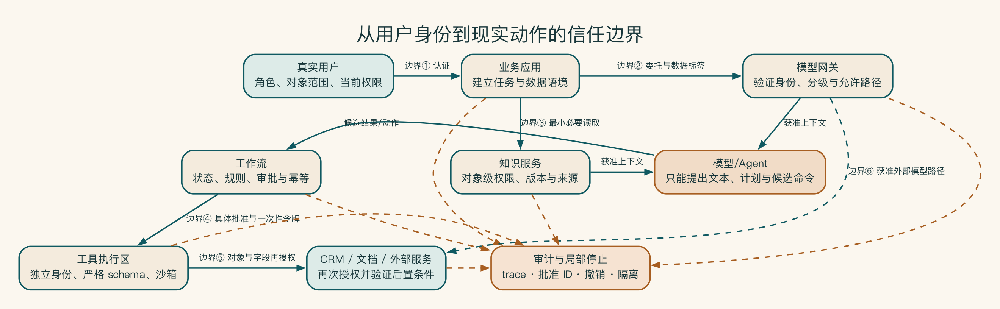
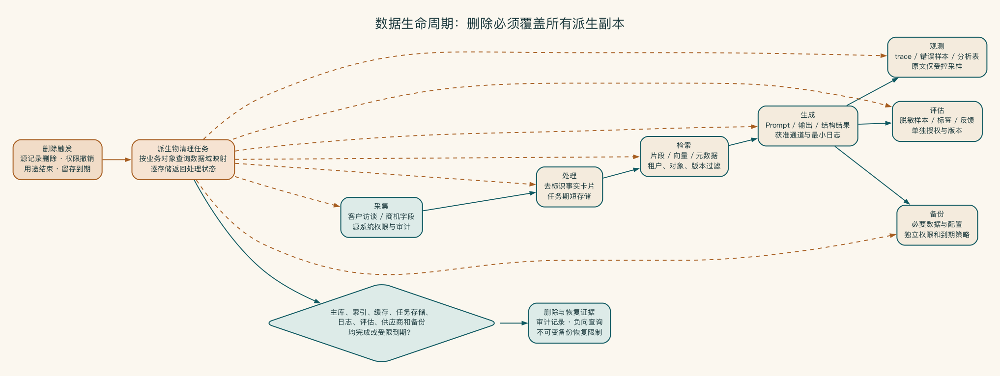

# 第 16 章 模型在内网，就真的安全吗

把模型搬进内网，确实能减少一类数据外发问题，但安全工作并没有因此结束。一个共用的管理员账号、一次越权检索，或者一条被诱导执行的工具指令，都可能在防火墙里面造成事故。

普通读者不必记住所有安全术语。先抓住三个问题就够了：谁能看见什么，谁能做什么，出问题时谁能立刻停下来。后面的身份、权限、日志和测试，都是这三个问题的具体答案。

启明科技最初只讨论“模型是否在内网”。真正画出数据和工具路径后，团队才发现，共用服务账号和跨部门案例检索比部署位置更值得先处理。

## 安全来自完整控制链

把服务器放进内网，类似把贵重物品搬进办公楼。楼门上锁并不代表已经安全：不同房间仍要有放行条件，访客权限要到期，重要操作要有人确认，发生异常时还要能封锁局部区域并留下记录。

模型运行在企业机房，只能说明推理位置。用户是否越权、知识是否污染、智能体是否拥有过大权限、日志是否保存敏感原文、镜像和模型来源是否可信，这些问题不会因为服务器在内网自动消失。

安全设计要让重要风险能够被预防、发现、阻断、响应和复盘。任何方案都无法承诺零风险。

## 先弄清哪些数据能去哪里

一个可操作的起点可以是：公开、内部、敏感和高敏。真实企业应使用自己的数据制度和行业要求。

分级对象不只包括用户输入，还包括：

- 检索片段和嵌入。
- 模型输出和中间推理结果。
- 提示词、系统指令和工具参数。
- 日志、任务轨迹、评估集和反馈样本。
- 缓存、备份和错误转储。

同一请求中不同字段可以采用不同级别和处理方式。系统要按最小必要原则选择进入每个组件的数据。

分级必须连接允许动作。对每个级别明确能否进入外部模型、能否用于评估、能否保存原文日志、能否跨区域访问、保留多久、谁能审批例外。只有“公开/敏感”标签而没有执行规则，无法改变系统行为。

数据还会在生命周期中变形。公开模板与敏感客户事实组合后，输出可能成为敏感。匿名样本与其他字段结合后可能重新识别。嵌入和缓存虽然不易直接阅读，仍可能泄露来源特征。分级要覆盖衍生物，而不是只看初始文件。

## 每过一道边界，都要重新确认

威胁常发生在责任交界处：浏览器到应用、应用到网关、检索服务到向量库、智能体到工具、企业到云供应商、生产到支持人员。架构图应标出每次跨边界时的身份验证、授权、加密、输入验证、日志和失败方式。

同一内网并不等于同一信任区。员工终端、研发测试、生产服务、客户数据区和第三方远程支持应有不同边界。智能体运行环境如果同时拥有互联网访问、客户数据和写系统权限，就形成高风险组合。可以通过网络隔离、只读工具、短期凭据和审批拆开这些能力。

## AI 到底在借谁的权限做事

企业 AI 系统可能同时拥有用户身份、应用身份、工作流身份和工具服务身份。要说清楚：

- 谁发起请求。
- 系统以谁的权限读取。
- 是否允许委托，委托范围和期限是什么。
- 哪个动作需要提升权限或额外批准。
- 下游怎样验证身份和对象权限。
- 权限变更和用户离职后怎样撤销。

原则仍然是：AI 不能替用户访问其本来无权访问的数据，也不能因为拥有服务账号而扩大用户权限。

授权要检查动作与对象，而不只是角色。销售角色可以更新 CRM，不代表可以更新任意客户或任意字段。知识管理员可以发布资料，不代表可以批准法律政策。模型输出的对象 ID 和参数都必须在服务端重新授权，不能信任前端或提示词中的声明。

委托权限应包含委托人、代理服务、允许动作、对象范围、目的、期限和批准。高风险任务使用一次性或短期令牌，任务结束立即失效。长期静态服务密钥最容易因为复用、复制和日志泄露扩大影响面。

紧急管理员权限也要管理。生产事故中可能需要查看受限任务轨迹或手工修复状态，应采用临时授权、双人批准或至少事后强制审计，并让访问自动到期。安全机制不能假设管理员永远不会犯错。

图中的每一条边都是一次责任切换：应用不能替用户扩大权限，模型网关不能相信未经验证的数据标签。模型或智能体只能提出候选动作，工具和目标系统必须再次校验对象、字段、批准与后置条件。审计与局部停止贯穿各边界，使一次组件失误不会直接变成不可追责的现实动作。

## 风险不能只写在安全文档里

常见风险包括：

- 提示注入：外部内容试图改变系统目标或诱导工具调用。
- 敏感信息泄露：模型、检索、输出或日志暴露资料。
- 不当输出处理：模型输出未经校验进入页面、代码、数据库或命令。
- 过度代理：智能体获得超出任务所需的工具和自主性。
- 知识和模型污染：恶意或错误内容进入数据、索引、反馈或供应链。
- 不受控资源消耗：超长上下文、循环调用和恶意请求造成费用或服务问题。

控制不能只写“增加 Guardrail”。需要具体说明输入怎样隔离、权限在哪里检查、工具如何白名单、输出如何验证、预算如何限制、失败怎样阻断。

提示注入尤其需要纵深防御，因为没有一个分类器能识别所有恶意文本。OWASP 对 LLM 与智能体应用的风险清单可用于扩充威胁样本，但不能替代具体系统的威胁模型。[^ch16-owasp]

[^ch16-owasp]: OWASP GenAI Security Project, *Top 10 for LLM Applications 2025*：https://genai.owasp.org/llm-top-10/ ；*Top 10 for Agentic Applications*：https://genai.owasp.org/2025/12/09/owasp-top-10-for-agentic-applications-the-benchmark-for-agentic-security-in-the-age-of-autonomous-ai/ 。

纵深防御至少包括：

1. 限制系统可接触的数据和工具，先缩小最坏影响。
2. 将外部内容明确标记为不可信数据，不能覆盖系统规则。
3. 工具在服务端校验身份、对象、参数和业务状态。
4. 高影响动作展示具体变更并确认。
5. 监控异常工具序列、批量读取、权限失败和循环调用。
6. 用攻击样本持续回归，而不是上线前只测一次。

纵深防御的意义不在于堆叠更多检测器，而在于让一次控制失效不会直接变成业务事故。身份、对象权限、策略、沙箱、人工批准、审计和局部停止分别限制不同阶段的影响半径，并且都由模型之外的系统执行。

输出处理同样要按去向设计。展示到网页的内容需要转义，写入数据库要做结构与长度校验，生成代码要在隔离环境检查，传入 Shell、SQL 或模板引擎的内容不能直接拼接。模型输出永远是外部输入，即使它来自企业自有模型。

安全不能依赖模型自我约束。

提示词可以告诉模型不要泄露、不要越权、不要执行危险动作，但它只能作为行为引导。真正的控制要由模型无法绕过的系统执行：知识服务过滤权限，网关阻断数据路径，工具层验证授权，工作流要求审批，运行时限制网络和资源。

一个实用检验是：假设模型完全忽略系统提示，最坏能做什么？如果答案是“读取全库、调用任意工具并发送到互联网”，系统边界显然不够。若最坏只是生成一份未发布草稿并触发告警，风险更可管理。

## 安全最终落在三个问题上

先问谁能看。用户身份要跟着请求进入知识和工具，不能到了模型后面就变成一个共用账号。再问谁能做。读取、生成、写入和外发需要不同权限，高影响动作还要确认。

最后问怎样停。发现越权检索时，团队要能关闭受影响知识域、找出相关任务，并在修复后小范围恢复。只有“以后查日志”还不够。

供应链、威胁建模、数据生命周期和安全测试属于专业实施内容，放在附录 H。正文保留普通读者判断系统是否安全所需的主线。

## 日志既是证据，也是敏感数据

日志应帮助回答谁在何时访问了什么、调用哪个模型和工具、是否经过批准、结果写到哪里。但完整提示词、回答、系统指令和检索片段可能包含客户秘密或安全策略。

建议默认记录：ID、分类、模型、用量、延迟、策略命中、文档 ID、工具名称和审批 ID。需要采集原文时，明确目的、访问、加密、留存、删除和审计。

可观测性不能制造第二个无人管理的敏感数据库。

日志留存要按用途分层。运行指标可能只需聚合保存，审计事件按制度保留，调试原文仅在获得批准的短窗口采样。删除业务数据时，还要判断日志、备份和评估集中是否存在副本。所谓“不保存提示词”也要核查代理、错误追踪和供应商侧日志，而不是只看应用代码。

日志读取本身应进入审计。支持人员为诊断某一任务查看原文，需要理由和范围；批量导出任务轨迹应受更高权限控制。对敏感字段进行格式保留脱敏或哈希时，要验证是否仍能满足排障和关联，避免既泄露原文又无法使用。

## 桌面推演：一次隐蔽的跨团队泄露

演练场景是：销售人员报告方案草稿出现了另一个客户的项目细节，但服务没有报错。事故指挥者先暂停内部案例检索域和方案自动生成，保留公开研究与人工模板。随后冻结相关知识版本、网关策略和日志清理任务，避免证据丢失。

团队通过业务任务 ID 定位用户、知识版本、检索文档 ID、模型渠道和输出去向。查询发现，前一周的索引优化移除了一个过滤字段，缓存键仍包含旧权限摘要，因此少量跨团队片段可以被召回。

安全团队根据同一版本和时间窗查找所有可能受影响请求。业务负责人判断哪些草稿被外发，CRM 负责人阻止尚未发送的后续动作。

恢复不是简单重新打开系统。团队先修复过滤字段，清空受影响缓存，重建索引，在隔离环境运行跨租户回归和生产合成测试。再只开放一个团队，观察检索与拒绝指标。确认无异常后逐步恢复。受影响人员通知、合同义务或监管处理由适当专业角色根据事实决定，本书不替代该判断。

复盘发现三个组织根因：索引变更被当作纯性能优化，没有触发权限评审。评估集只测答案质量，没有权限负向样本。看板统计检索命中率，却没有跨分区拒绝与异常访问。修复因此包括变更分类、放行条件测试、监控和负责人责任，而不仅是补一个过滤条件。

桌面推演验证了暂停开关、证据、影响范围和恢复放行条件。若团队只能说“发生问题我们会查日志”，但不知道谁能关、哪些日志、如何找受影响对象和怎样安全恢复，事故响应尚未设计完成。

## 内网中的共享超级账号怎样造成越权

某公司将模型和向量库全部部署在内网，因此评审中把数据外发风险标记为已解决。为了简化集成，知识服务和智能体共用一个具有全库读取与业务系统写入权限的服务账号。应用层根据用户部门过滤搜索结果，但工具接口接受模型返回的对象 ID，没有再次授权。

一次间接提示注入诱导智能体请求“相关项目的完整附件”。模型给出另一区域的文档 ID，工具以共享账号成功读取。事故没有穿越防火墙，也没有利用软件漏洞；系统只是忠实执行了过宽权限。由于日志只记录服务账号，团队无法立即识别最终用户与受影响对象。

整改包括贯穿用户委托身份、对象级服务端授权、读写身份分离、工具白名单、短期凭据、跨团队负向测试和详细审计。这次复盘提醒团队，部署位置只是一个边界。身份、权限和动作控制才决定内网中的系统能做什么。

回到启明科技，模型是否在内网只决定了一部分数据路径。共享账号被拆开、对象权限在服务端重新校验、工具动作可以单独暂停以后，安全才进入每一次真实请求。
