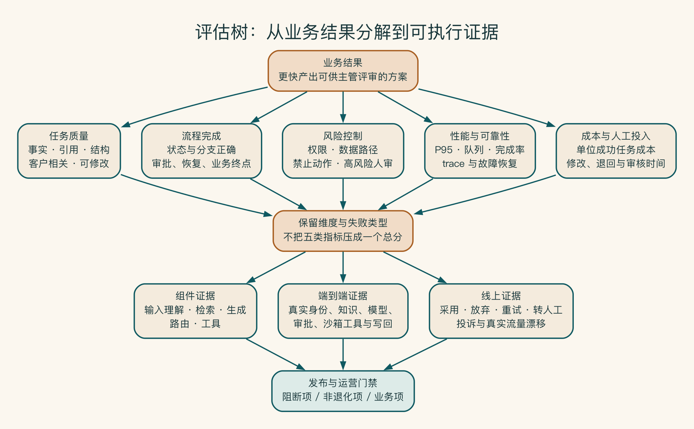
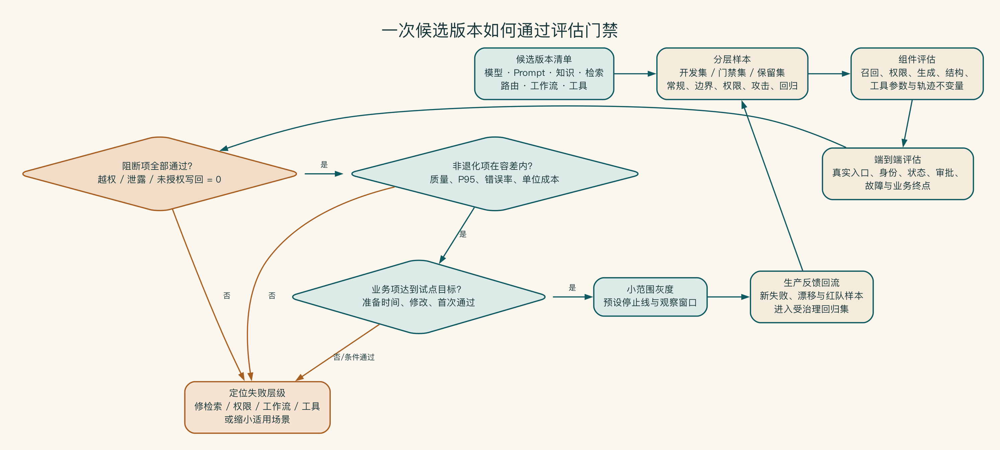

# 第 17 章 怎样判断 AI 到底好不好用

五个精心挑选的问题都答对了，只能证明演示准备得不错。真实用户会漏字段、说半句话、引用互相冲突的资料，也会提出系统本来就不该回答的问题。

所以，“效果不错”不是上线标准。团队要先约定什么结果可以使用，哪些错误无论平均分多高都不能放过，然后再用真实样本去找系统最容易失败的地方。

## 别再用“感觉不错”决定上线

团队给销售演示了五个问题，模型回答流畅，大家认为效果不错。上线后，用户提出的信息更缺失，资料权限更复杂，方案类型更多。模型开始出现引用错误、格式不稳定和过度承诺。

演示选择的是最容易展示的输入，评估需要覆盖系统真正会遇到的任务、边界和失败。

## 先从业务结果倒推怎么测

评估更像一次分层体检，而不是只看体重。总分看起来不错，某个关键指标仍可能阻止上线。团队要从业务结果向下检查任务、组件和底线风险，并知道异常究竟来自知识、模型、流程还是工具。

评估不应从“模型准确率”开始，而应从业务结果逐层分解。NIST AI RMF 1.0 与生成式 AI Profile 可用于检查管理、情境、测量和处置是否遗漏。本书的评估树是交付层工具，与该框架不等价。[^ch17-nist]

[^ch17-nist]: NIST, *AI Risk Management Framework 1.0*：https://nvlpubs.nist.gov/nistpubs/ai/NIST.AI.100-1.pdf ；*Generative AI Profile*, NIST AI 600-1：https://nvlpubs.nist.gov/nistpubs/ai/NIST.AI.600-1.pdf 。核查日 2026-07-17；NIST 已说明 AI RMF 正在修订，项目应固定所用版本。

评估树从以下结构展开：

```text
业务结果
├── 任务质量
├── 流程完成
├── 风险控制
├── 性能与可靠性
└── 成本与人工投入
```

销售方案助手的业务结果是更快产出可供主管评审的方案，不是生成更多文字。因此要同时测量方案准备时间、引用和事实、人工修改、审批退回、权限放行条件、延迟和成本。


评估工程把常规、边界、失败、权限和攻击样本送入不同测试工位，分别检查任务质量、人工可用性、安全底线、工作流可靠性与经济性。发布不是看一个平均分，而是同时通过业务、质量和风险门；任何阻断项失败都回到系统修正与回归集。



评估树保留五个维度和失败类型，而不是把它们过早压成一个总分。组件证据帮助定位输入、检索、生成、路由或工具问题，端到端证据验证真实身份与业务终点，线上证据则补充采用、放弃、转人工和漂移。三类证据共同支持发布与运营放行条件。

## 测试不求面面俱到，先守住严重错误

最初的测试集不必很大，但要来自真实工作。常见任务要有，资料冲突和信息缺失也要有；越权读取、错误承诺和未经确认的写操作，则要单独列为不能接受的错误。

系统失败时，还要知道问题出在资料、检索、生成、流程还是工具。否则团队只能看到最后一段文字，然后把所有问题都归为“模型不够好”。

样本结构、评分量表、知识检索和智能体评估、失败定位方法放在附录 H。正文先保留一条底线：严重错误不能被大量普通题的高分抵消。

## 平均分与阻断项分开

系统平均质量 90 分，不代表可以容忍 10% 越权或错误报价。发布放行条件应分三类：

| 放行条件 | 示例 |
|---|---|
| 阻断项 | 越权、敏感泄露、未经批准写回不得通过 |
| 非退化项 | 质量、P95、错误率和单位成本不超过容差 |
| 业务项 | 准备时间、人工修改或首次通过率达到试点目标 |

“当前关键安全样本全部通过”只表示有限样本的放行条件结果，不等于系统零风险。



放行条件顺序体现了责任优先级：越权、泄露和未授权写回等阻断项不能被平均质量抵消。阻断项通过后，版本还要满足质量、性能、错误率和成本的非退化要求，以及准备时间、人工修改等业务目标。任何一层失败都应定位问题、缩小场景或修复后重测，生产新错误再回流到受管理的回归集。

启明科技先建立了一套小型评估。

团队先建立 80 条样本：30 条常规方案任务、10 条信息缺失、10 条冲突和过期知识、10 条权限、10 条报价和承诺、10 条攻击与工具异常。

质量评分包含事实、引用、结构、可执行性和人工修改。安全放行条件单独管理。每次模型、提示词、知识、检索、工作流和路由变化都运行受影响样本。

真实用户反馈中出现的新错误，会在去标识化和确认使用范围后进入回归集。

## 总分提高以后，生产风险为什么也提高了

某团队为新模型准备了 500 条问答，综合得分从 84 提升到 88，于是替换全部场景。数据中大多数是普通知识问答，只有五条权限题和三条高影响写作题。新模型回答更完整、更少拒答，因此普通题得分提高；但它也更愿意在证据不足时给出确定结论。

上线后，系统在一份缺少附件的合同摘要中补出了付款条件。总体满意度短期仍上升，因为多数用户喜欢更流畅的回答。事故复盘才发现，综合分让大量文风提升抵消了少数严重行为退化，而发布放行条件没有按场景和严重度分层。

整改后的评估报告不再只有总分：权限、敏感泄露、未授权动作和高影响承诺单列为零容忍。普通质量按频率加权。业务采纳、修改和成本独立报告。所有版本提供失败类型与配对变化。总分可以保留在首页，但不再拥有批准权。

整改以后，启明科技仍然保留综合分，却不再让它决定发布。权限、敏感泄露、未授权动作和高影响承诺单独设门；其中任何一项失败，版本都要退回修正。
