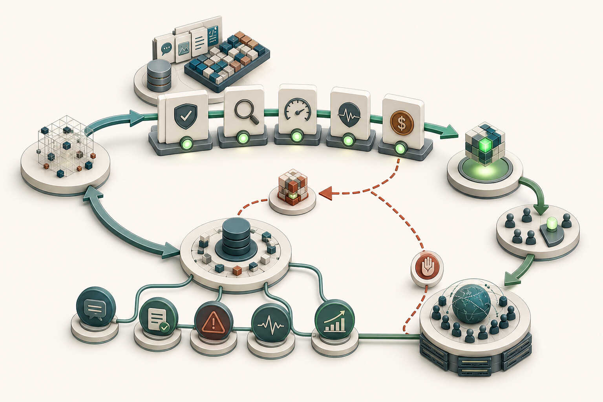
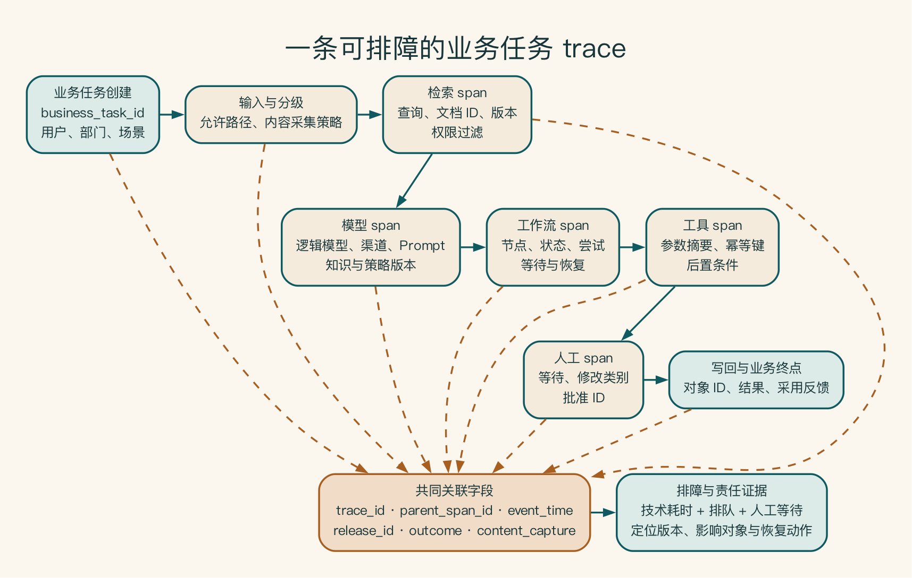
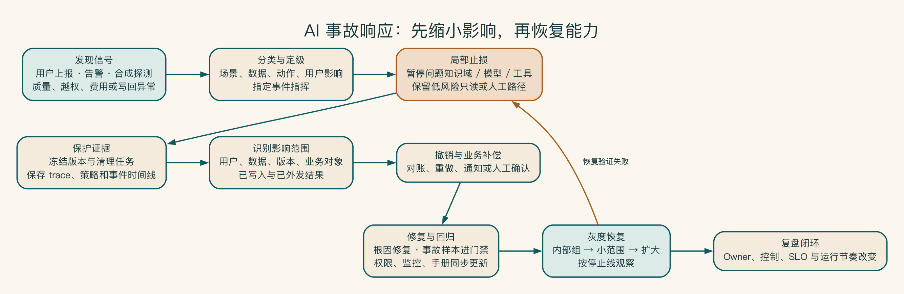

# 第 18 章 系统上线以后，怎样知道它还正常

系统上线第一周没有宕机，监控面板也是绿色。可销售发现引用越来越旧，运营发现单位任务成本翻倍，安全团队则收到一批异常工具调用。传统可用率没有报警，业务已经开始受影响。

接口还在回应，不等于系统仍在正确工作。模型、知识、流程和成本都可能悄悄发生变化，所以团队既要看业务结果，也要能追查一次任务经历了什么，并在异常时降级或退回旧版本。

## 上线以后，系统才开始面对真实世界

生产环境中的用户输入更加开放，知识持续更新，模型和供应商会变化，工具会超时，成本会累积。传统监控只看服务是否在线，无法说明回答质量、引用、路由、工具和业务结果是否正常。

业内常把模型、提示词、知识和评估的变更管理称为 LLMOps，把运行可靠性工作称为 AI SRE。名字可以先放在一边，读者只要记住：负责改系统的人和负责守系统的人，必须看到同一批结果。

生产运行不是一次发布，而是持续循环：变更先通过离线评估和风险放行条件，再以灰度方式进入真实流量。质量、风险、性能、可靠性和成本信号共同决定扩大、回滚或停止，生产反馈随后回到评估集和下一轮变更。

## 一次请求要能被完整追踪

一次 AI 任务很像一件经过多个中转站的快递。用户只看到最终是否送达，运营团队却要知道它在哪个站点停留、谁改过地址、哪里发生重试，以及签收以后是否真的交给了正确的人。

启明科技为每个业务任务生成 trace_id，并串联：

1. 用户、部门、应用和商机。
2. 输入检查和数据级别。
3. 检索查询、文档 ID 和权限结果。
4. 模型、渠道、版本、用量和延迟。
5. 工作流节点和状态。
6. 工具调用、参数摘要和结果。
7. 人审、修改和批准。
8. 文档与 CRM 写回。
9. 用户反馈和业务终点。

追踪内容必须最小化。原始输入和输出是否采集，应根据数据级别、用途、访问和留存单独决定。

一条任务轨迹由许多子步骤组成。一个业务任务可能包含多次检索、两个模型调用、一次人工等待和一次写回。它们要共享同一个业务任务 ID，同时保留各自的尝试次数和版本，不能各自生成互不关联的编号。

还要记录事件发生的业务时间，而不只是系统时间。异步任务排队两小时后完成，服务端推理只用了十秒，但用户等待了两小时。审批等待不属于模型延迟，却属于流程周期。只有端到端时间线才能解释真实体验。

记录格式本身也会变化。新增字段、工具或模型渠道时要保留版本，避免旧看板和事故查询突然失效。OpenTelemetry 可以提供通用的追踪结构，但生成式 AI 相关字段仍在演进。

项目应固定版本，并为业务任务、知识、审批和后置条件维护组织字段映射。[^ch18-otel] 对日志采样也要谨慎：普通成功请求可以抽样，高风险阻断、错误写回和事故任务应完整保留必要证据。

[^ch18-otel]: OpenTelemetry, *Semantic Conventions 1.43.0*：https://opentelemetry.io/docs/specs/semconv/ ；GenAI 语义仓库：https://github.com/open-telemetry/semantic-conventions-genai 。核查日 2026-07-17。

一条可用于排查问题的任务轨迹，要以业务任务为中心，而不是只记录模型请求。身份、检索、模型、工作流、工具、人审和写回都用同一个 `trace_id` 关联。这样既能看见技术耗时，也能看见排队和人工等待。是否保存原文，则由独立的数据规则决定。

## 什么叫“系统运行正常”

先别急着记缩写。运行指标描述系统现在发生了什么，服务目标规定“多好才算可以接受”。对 AI 系统来说，二者都不能只看接口有没有返回成功。

至少覆盖五类指标：

| 类别 | 运行指标示例 |
|---|---|
| 质量 | 引用忠实、结构通过、人工修改率 |
| 风险 | 越权阻断、违规路由、高风险动作审批覆盖 |
| 性能 | 首字响应时间、P95 端到端延迟、队列时间 |
| 可靠性 | 完成率、工具错误、恢复率、任务轨迹覆盖 |
| 成本 | 单次成功任务成本、异常消耗、预算使用 |

服务目标需要窗口和负责人。例如“试点两周内，95% 核心请求拥有完整任务轨迹。任何越权请求都必须被拦截。方案工作流 P95 在业务可接受时间内完成”。具体数字应基于基线和风险确定。

服务目标不宜过多。选择少量能代表用户结果和控制底线的指标，再用诊断指标解释原因。例如端到端完成率是运行指标，模型错误、检索无结果和工具超时是诊断维度。用户等待时间是运行指标，首字响应时间和队列长度是拆解指标。若所有技术指标都成为服务目标，团队会忙于维护数字而看不到业务。

定义分母同样重要。完成率是否排除用户主动取消，质量率是否只统计有评分的请求，权限阻断率的正常值是越低越好还是说明攻击增加？指标口径、数据缺失和延迟要写入目录，避免不同团队使用同名不同义的看板。

对长周期业务结果，可以使用领先和滞后指标组合。方案最终赢单需要数月且受多因素影响，早期可观察准备时间、主管首次通过和引用修改。但不能永久把领先指标当最终价值，必须定期回到业务结果验证。

## 出问题时，先知道最近改了什么

一次发布应生成可检索清单：代码提交、模型与供应商版本、提示词、知识索引、检索参数、工具模式、路由策略、配置和数据库变更。用户报告问题时，团队可以查看该时间窗到底变化了什么，而不是在多个系统中猜测。

变更按影响分级。修正文案可以走快速流程。扩大工具权限、更换高敏路由或重建知识索引需要更严格评估与批准。供应商未经企业控制的模型更新则需要监测和紧急回退准备。不是只有主动发布才会改变系统，外部依赖也会漂移。

当无法完全固定供应商版本时，建立定期探针和基准回放，检测行为、延迟和内容策略变化。发现变化后先评估影响，再决定是否接受、切换或缩小任务。

## 灰度、降级和回滚

发布先从小范围灰度开始，对少量用户、低风险任务或内部团队开放，比较新旧版本的质量、性能、成本和用户行为。

故障时可以降级。当强模型、知识服务或工具不可用时，系统可以切换批准候选、返回只读结果、减少功能或转人工。降级路径必须仍满足安全底线。

必要时还要回滚。模型、提示词、索引、工作流和路由都要保留可恢复版本。回滚不仅是重新部署代码，还要考虑已经写入的业务记录和错误知识。

灰度单位要与风险一致。可以按内部用户、部门、场景、数据级别或业务对象分组。高风险动作不应仅按随机 1% 流量试验，因为少量错误也可能影响真实客户。对于写操作，先做影子运行和生成变更集，再逐步开放执行。

降级应明确能力差异和用户提示。模型不可用时返回旧缓存，可能违反时效。知识服务不可用时继续生成，可能产生无来源回答。审批不可用时直接跳过，绝不属于合理降级。每个依赖都需要业务认可的最低可用模式。

回滚完成后还要对账。错误版本已经生成的文档、写入的 CRM 字段、发送的通知和加入的知识不会随着代码回滚自动消失。恢复计划必须包含识别影响范围和业务补偿。

## 告警要连接动作

“成本上升”“错误率异常”只是信号。有效告警要说明：

- 阈值和时间窗口。
- 可能影响的场景和用户。
- 谁收到并在多久内处理。
- 首个诊断步骤。
- 是否自动限流、降级或暂停。
- 如何确认恢复。

高风险越权、未批准外部路由和错误写回应有独立高优先级响应，不应淹没在普通模型错误里。

告警设计要避免把正常概率波动当事故。单次模型拒答可能符合策略，持续无答案率上升才可能表示索引问题。成本随着成功任务增长而上升可能正常，单位成功成本突然上升才值得调查。使用基线、窗口和多信号关联，减少告警疲劳。

同时保留人工上报通道。用户发现事实错误、危险建议或越权内容时，应能从结果界面直接提交并携带任务 ID，而不是截屏后在群里描述。高风险反馈自动升级，普通体验问题进入产品队列。

## 出事时要有人能把影响停住

监控发现异常以后，第一步通常不是立刻重试，而是先缩小影响。暂停受影响的工具或知识域，保留必要记录，再判断哪些任务已经写入、哪些仍停在队列里。

恢复也不能只把开关打开。修复后的版本要先在隔离环境验证，再给少量真实流量，确认质量和权限都正常以后逐步扩大。事故手册、补偿步骤和桌面演练放在附录 I。

## 看板满屏绿色，为什么没人能关掉系统

某企业为 AI 平台建设了精美看板：GPU、用量、HTTP 成功率和平均延迟几乎全部绿色。业务连续三天投诉回答引用旧制度，支持人员将截图转给模型团队。模型团队认为服务可用，知识团队没有值班安排，产品负责人也不知道如何停止某个知识域。

第四天，运维关闭整个应用，连不依赖问题知识的低风险功能也中断。事后发现，一次索引发布失败后系统继续使用旧版本，但没有“知识新鲜度”服务目标，没有发布失败告警，也没有局部暂停开关。技术指标没有说谎，只是没有代表用户结果。

整改将知识版本、引用时效、业务完成和人工退回纳入运行指标。每个告警绑定负责人、第一动作与升级时间。产品拥有场景开关，知识团队承担发布与恢复。每月进行局部降级演练。可观测性只有连接责任和动作时，才成为运营能力。

系统正常运行，意味着用户结果、质量、成本和风险都还在可接受范围内。看板只是开始，真正重要的是异常出现时有人知道该做什么。
