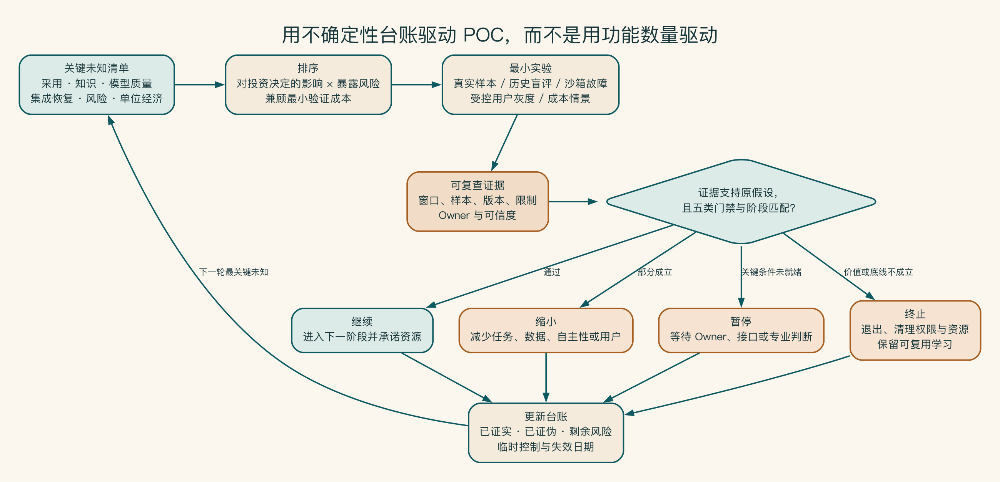
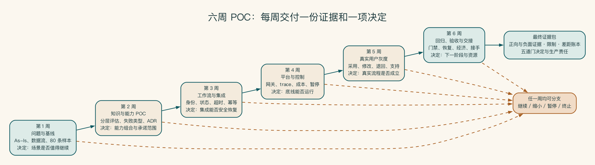

# 第 19 章 概念验证成功，离生产还有多远

概念验证最容易制造一种错觉：演示成功，项目就已经完成了最难的部分。真正接近生产时，身份、知识更新、失败处理、成本和长期责任才会一起出现。

概念验证的价值不在于证明团队能做出一个漂亮版本，而在于尽早弄清哪些假设成立、哪些不成立，以及是否值得继续投入。

## 概念验证要减少关键不确定性

一个有效的概念验证应该减少不确定性：业务是否采用、数据是否可用、模型是否达到质量、集成是否可行、风险是否可控、成本是否值得。若概念验证只展示顺利样本，它不能支持投资和上线决策。

项目应允许四种结论：继续、缩小、暂停和终止。默认继续会让概念验证变成投入的起点，而不是决策工具。

## 五个阶段

这五个阶段分别回答不同问题。原型验证交互是否成立，概念验证检查关键假设，试点观察真实使用；到了生产阶段，组织才正式承担维护、预算和事故响应责任。前一阶段留下的证据不够，项目就应停下或退回，而不是靠换一个名称继续向前。

第一阶段是发现问题。团队要确认痛点是否真实、结果能否测量，并找到愿意承担结果的业务负责人。如果拿不到样本，或者无论结果怎样都不会改变决定，项目就不该进入原型。这个阶段留下的是业务结果、边界、基线、初步风险和试点负责人。

第二阶段用原型验证关键交互。它只需回答用户是否愿意这样工作，以及规则、检索、模型和流程怎样组合，不追求生产架构。原型可以包含人工步骤和临时数据，但不能违规使用真实敏感数据，也不能在不知不觉中变成生产依赖。

第三阶段才是概念验证。团队在固定范围内使用真实任务和可重复评估，验证模型质量、知识、集成、性能、风险与成本假设。结果是一组可以复查的证据，而不是一次顺利演示。

第四阶段把系统交给少量真实用户。试点要观察采用、修改、退回、成本、故障和支持负担，同时补上灰度、监控、知识运营与责任交接。

最后才是生产。进入生产不只是增加用户数量，而是组织正式承诺服务目标、支持、安全、预算、变更和退出机制。

阶段不是只能向前移动。试点中发现知识无法稳定维护，可以退回概念验证阶段，缩小知识域。生产指标持续不达标，可以降低自主性或暂停部分功能。允许回退，项目才能诚实暴露问题，而不是为了保持“进度正常”把风险带入下一阶段。

原型工作台和生产服务之间隔着多道证据门。业务、质量、工程、风险和经济性必须分别成立。任何关键门失败，都应触发缩小、回退、暂停或终止，而不是依靠更多演示样本掩盖未知。

## 用未知清单驱动概念验证

概念验证开始前，先列出最可能改变决定的未知。用户是否愿意从 CRM 入口使用？历史资料有没有有效负责人？本地模型能否在五并发下达到质量要求？写回接口是否支持幂等？人工审核会不会成为瓶颈？为每个未知指定实验、证据、负责人和最晚决策时间。

未知可以分为四类：

- 可通过样本和实验验证的事实。
- 需要业务或专业角色作出的决定。
- 依赖外部供应商或系统的条件。
- 当前阶段无法消除、只能限制暴露的剩余风险。

概念验证的进度要看关闭了多少关键未知，完成多少页面只能说明开发量。若团队忙于开发界面，却没有验证最危险的数据和集成假设，概念验证看似推进，决策价值却没有增加。

未知清单还要记录结论对范围的影响。例如本地模型质量不足，不一定终止全部项目，可以把敏感摘要保留人工、公开研究走批准云端。用户不愿打开独立聊天入口，可以改成 CRM 侧边栏，而不是继续增加模型能力。

概念验证的进度应表现为关键未知被证实、证伪或转化为受控剩余风险。每个未知先按决策影响排序，再用成本最低的真实实验取得可复查证据。结论可以是继续、缩小、暂停或终止，并连同临时控制和失效日期写回台账，驱动下一轮最重要的验证。

## 五类阶段门

| 门 | 要回答的问题 |
|---|---|
| 业务门 | 是否改善预定结果，真实用户是否持续采用 |
| 质量门 | 常规、边界和高风险任务是否达到门槛 |
| 工程门 | 延迟、容量、可用性、集成、追踪和恢复是否达标 |
| 风险门 | 数据、权限、工具、安全、合规和事故能力是否通过 |
| 经济门 | 单次成功任务和总体成本是否可接受，扩大后是否仍成立 |

任何关键门失败，都可以得出缩小范围、保留人审、切换部署或终止结论。

每道门需要最低证据成熟度。原型门可以接受十几条代表样本和手工操作，试点门需要真实身份、真实流程、可重复评估和有限运行数据，生产门需要服务目标、值班、恢复、预算和责任承诺。不要让同一张漂亮的演示图跨越所有阶段反复充当证据。

放行条件应包含正向条件和阻断条件。正向条件说明达到什么才继续，阻断条件说明出现什么立即停止。例如跨用户数据泄露、未批准外部路由、无法恢复的重复写入。后者不能被平均质量或节省时间抵消。

条件通过必须有失效日期。若允许试点阶段人工每天同步知识，应明确在生产门前实现什么正式机制。若暂时增加 100% 人审，应说明何时根据错误率和容量决定保留、抽检或取消。没有期限的临时控制会成为永久债务。

每一道放行条件都要有明确的决定者。

阶段门不是项目经理勾选的清单。业务负责人批准价值和采用，产品与项目团队解释质量与流程，技术负责人确认工程能力，安全或法务确认专业风险，财务参与经济判断。最终责任人要明确接受剩余风险和资源承诺。

评审材料应在会议前分发，现场只讨论分歧、条件和决定。会议结束后记录通过、条件通过、缩小、暂停或终止，以及下一阶段预算、范围和负责人。没有正式决定，概念验证很容易以“再优化一下”无限延长。

关键证据还应注明采集方式和可信度。人工抽样、系统日志和用户自报不能被视为同等证据。样本过小或追踪覆盖不足时，结论要降低置信度并缩小承诺范围。

决策者还要承诺下一阶段资源。批准生产意味着业务负责人承担知识与采用，平台承担服务目标与值班，安全承担响应接口，财务接受预算。只有“同意上线”而没有人力和预算，不是真正通过。

评审会议之外，用户代表也需要实际参与。选择只对 AI 热情的五名员工会高估采用；应覆盖熟练者、新人、不同地区和对流程有保留的用户。反对意见常常能发现责任、数据或入口问题，不应简单归为“抗拒变化”。

## 启明科技的六周试点节奏

六周可以这样安排：

1. 第一周确认问题、范围、现状流程、用户、指标、风险和样本。没有业务基线，就不承诺效果。
2. 第二周清洗一小块知识，比较能力组合和模型，建立评估集，并验证权限与无答案行为。
3. 第三周连接沙箱系统，补上身份、任务状态、写回确认、异常处理和幂等。
4. 第四周接入模型网关、路由、日志、成本、监控、人工审核和安全放行条件。
5. 第五周交给少量销售使用，记录流程时间、质量、修改、退回、采用和支持问题。
6. 第六周运行完整回归，复盘故障与成本，并在继续、缩小、暂停或终止之间作出决定。下一阶段由谁负责，也要在这时写清。

六周只是示例，不是固定方法。若接口审批需要四周，项目可以先验证知识与流程，但不能假装写回已经通过。若场景涉及高风险外部决定，应延长观察窗口。压缩时间不能通过跳过身份、安全和基线换取。

每周都应产生一个可复查证据和一个明确决定。第一周决定问题是否值得做，第二周决定能力组合，第三周决定集成是否可恢复，第四周决定控制是否可运行，第五周决定真实采用是否成立，第六周决定下一阶段。这样，失败可以尽早结束，而不是在最后一天才发现根本假设不成立。

六周节奏不是六次功能汇报：每一周都必须形成能够改变项目方向的证据和决定。图中的虚线说明任何一周都允许继续、缩小、暂停或终止。只有问题、能力、集成、控制、真实采用和接手责任依次获得支持，最终验收材料才有资格推动下一阶段投资。

## 试点结束时，只需要回答一个决定

试点结束时，材料再多，最终仍要回答：是否继续投入。答案要同时看业务变化、严重错误、真实采用、运行成本和剩余未知，不能只看演示。

临时账号、手工上传和工程师每天救火，都要在决定中写出来。它们不一定让试点失败，却会说明扩大使用前还欠哪些工作。

验收材料、差距账本和投资判断模板放在附录 I。失败样本和没有达到的目标也要保留，因为它们往往比最佳案例更能决定下一步。

## 成功试点直接开放给全公司以后

某公司在 25 人试点中获得较高满意度，第二个月便向三千名员工开放。试点用户来自同一部门，资料权限简单，项目工程师每天手工修复索引和失败任务。扩大后出现新的语言、知识域、峰值并发与权限组合。共享检索索引很快返回不适用内容，支持请求超过项目团队容量。

由于没有正式生产门，企业没有值班、服务目标、知识负责人和预算分配。管理层认为“试点已经证明成功”，业务部门认为平台应负责内容，平台认为模型回答由业务判断。最终系统被整体关闭，连原试点中真正有价值的场景也失去服务。

真正的问题在于团队把受控试点的证据，直接外推到了不同任务、用户、数据和容量。扩大太快只是表面动作。正确路径是定义扩大单元，每次只改变一两个维度，重新检查放行条件和责任。保留原有健康场景，在新域失败时局部停止。生产化是一组组织承诺，不是用户数量开关。

概念验证的终点不是庆祝演示成功，而是作出一项诚实决定：继续、缩小、暂停，或者停止。四种结果都可能节省企业的时间和预算。
