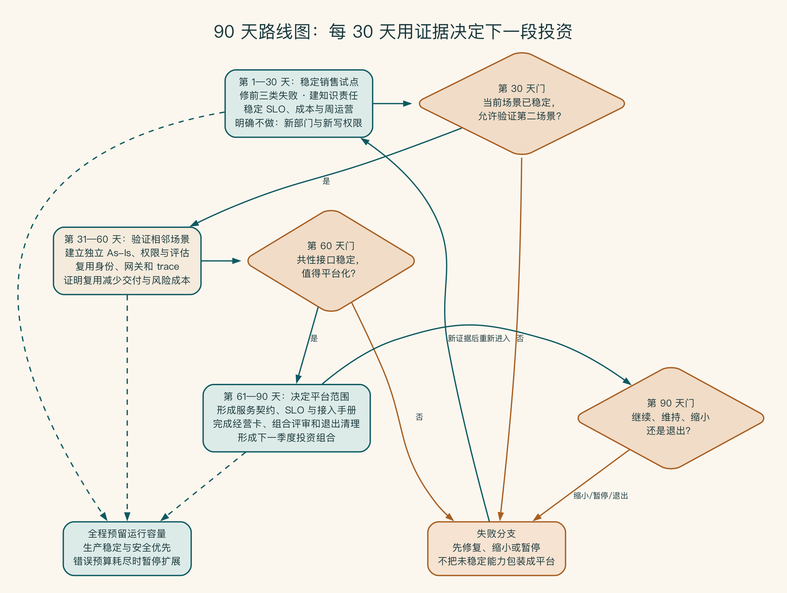
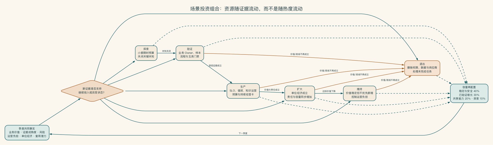

# 第 20 章 项目上线以后，谁来继续负责

书写到这里，系统已经通过了试点，也具备了进入生产的条件。接下来最容易被忽略的问题反而很朴素：项目组离开以后，星期一早上谁还会查看失败任务，知识过期时谁来更新，费用上涨时谁能决定暂停？

生产系统要长期经营。业务结果和技术运行各有负责人，双方还要在变化发生时共同作出决定。否则，责任会比代码更早离开现场。

## 上线后交给 IT，是最常见的责任真空

销售方案助手改善的是销售工作，知识来自产品和交付团队。模型与平台由 IT 运行，权限和事故由安全控制，预算由财务评估。任何一个团队都无法单独拥有整个系统。

如果项目上线后简单“交给 IT”，业务指标、知识质量和用户采用会失去负责人。如果完全留给业务，平台、安全和变更又难以控制。

企业 AI 需要产品责任和平台责任并存。

## 产品负责人与平台负责人

一家餐厅开门以后，不能只让物业负责。菜单和顾客体验需要经营者，水电、设备和安全需要运行团队。企业 AI 也一样：业务结果和技术平台各有最终负责人，两个人还要对同一次变化共同作出决定。

业务产品负责人关注业务结果和用户工作。

负责：

- 场景价值、范围和优先级。
- 用户流程、采用和业务指标。
- 评估标准和可用性判断。
- 人审、规则和业务反馈。
- 决定继续、缩小或停止场景。

平台技术负责人关注系统怎样稳定运行。

负责：

- 模型、网关、知识、集成和运行能力。
- 身份、容量、可用性和技术成本。
- 部署、变更、追踪、回滚和事故支持。
- 共享能力的标准化和复用。

两类负责人共同批准影响业务行为和生产风险的重大变更。

双负责人模型首先要分清最终决定权，开几次会议并不重要。业务负责人决定“这项结果是否值得、什么质量可用、哪些例外可以接受”。平台负责人决定“哪些技术路径可以进入生产、怎样满足服务目标、何时因风险暂停”。

当二者冲突时，不能让项目经理私下折中，而应按预先定义的风险升级机制由相应管理层决定。

安全、法务、财务和知识负责人也不是会签附件。安全可以阻断不满足底线的路径，法务对需要专业判断的用途给出边界，财务决定预算容忍，知识负责人对内容权威负责。每类角色应知道自己批准的对象和持续责任。

双负责人是运营中枢，而不是组织图上的两个头衔。业务结果、平台能力、知识、安全、财务、运行数据和用户反馈在同一节奏中汇合，再把场景放入探索、验证、生产、扩大、维持或退出等组合状态，持续调整资源。

## 从项目制走向产品制

生产 AI 系统不是一次性交付。知识、模型、用户、流程和风险持续变化，需要稳定的产品待办和运营预算。产品路线中同时存在四类工作：业务能力、质量改进、可靠性与安全、技术债与退出。若资源只用于新增功能，系统会在看板漂亮时逐渐失去可信度。

预算也应从“建设费用”转为“结果组合”。企业为某个场景分配模型、平台、知识、支持和改进预算，按季度判断单位成功任务、业务价值和风险是否值得继续。共享平台成本可以按使用或能力分摊，但不能因此掩盖某个场景自身不产生价值。

每个生产场景最好有一页持续经营卡：目标用户、业务结果、当前版本、关键服务目标、月成功任务、单位成本、主要风险、负责人、下一项投资和停止条件。管理层由此比较场景，而不是比较谁展示的智能体更炫。

## 责任要能在日常工作里找到

组织图上写了负责人，并不代表事情真的有人管。更实际的检验是：知识过期时谁会收到消息，模型费用突然翻倍时谁能调整，某个工具越权时谁可以局部暂停。

这些决定不必都进入同一场会议。日常失败及时处理，较大的模型和流程变化按固定节奏讨论，跨场景投资再进入季度判断。启明科技的责任表、会议节奏和 90 天路线图放在附录 I。

正文只保留经营逻辑：业务团队对结果和知识负责，平台团队对运行和恢复负责，重大变化由双方在清楚的安全与预算边界内共同决定。

## 建立场景投资组合

当企业拥有多个 AI 项目时，需要比较的不只是预计收益，还包括证据成熟度、复用程度、风险和运营负担。可以把场景分为探索、验证、生产、扩大、维持和退出六种状态。

探索场景获得小额、限时预算，用于关闭关键未知。验证场景需要业务负责人和评估。生产场景必须承担服务目标与运营。扩大场景证明单位经济性与共享能力。维持场景继续产生价值但不优先新增。退出场景执行数据、权限和供应商清理。

组合评审要防止沉没成本。已经投入很多不构成继续理由；新模型更强也不构成重启理由。只有新证据改变了价值、可行性或风险判断，才重新分配资源。

组合状态不是单向晋级路线。场景可以从验证进入生产，也可以因价值、底线或运营能力变化而缩小、维持或退出。季度评审用共同事实重新配置稳定、增长、平台和探索容量。这样，一个投入较多但证据不足的项目不会因为沉没成本自动获得下一轮预算。

## 用户采用是系统设计的一部分

用户不使用可能来自：

- 入口不在真实工作流。
- 需要额外复制和录入。
- 输出缺少引用，用户不信任。
- 人审太重或确认界面难用。
- 质量在常见任务上不稳定。
- 用户担心责任和监控。
- 新流程没有管理支持和培训。

培训不能修复一个流程设计差的产品。先观察真实使用和绕行，再决定是改体验、知识、规则还是组织要求。

采用还要区分“试用”“重复使用”和“完成真实任务”。登录人数和提问次数很容易增长，却可能没有替代任何工作。更有意义的是符合范围的用户中，有多少人在真实入口完成任务，多久再次使用，输出是否被采纳，是否减少返工。

用户担心责任时，必须解释系统角色：哪些内容只是草稿，谁做最终决定，错误如何反馈，使用数据会怎样被监控。若管理制度一方面要求员工使用，另一方面把所有 AI 错误责任留给个人，用户自然会保守或建立影子流程。

激励也可能扭曲指标。把“每人每天使用次数”设为 KPI，会制造无意义调用和成本；只奖励速度，可能让员工跳过核对。采用目标应连接业务质量和安全行为。

那么，什么时候才值得沉淀共享平台能力？

当多个已验证场景反复需要相同能力时，可以平台化：

- 统一身份和权限传递。
- 模型网关和成本归属。
- 知识准入、检索和引用服务。
- 工具注册、授权和审计。
- 评估、追踪和发布放行条件。
- 人审、告警和事故框架。

如果只有一个场景、价值尚未验证，不应先建设完整“企业 AI 操作系统”。平台能力应由重复需求拉动，而不是由概念推动。

平台化前可以使用四个门槛：至少两个生产或近生产场景有相同需求。接口和责任边界相对稳定。共享后能显著降低交付或风险成本。有团队愿意把它作为产品持续运营。只满足“技术看起来可以复用”还不够。

共享能力上线后也需要产品指标，例如接入一个新场景所需时间、重复代码减少、策略覆盖、平台服务目标、单位调用成本和内部用户满意度。平台团队不以组件数量衡量成功，而以让场景更快、更安全地交付衡量成功。

平台标准要允许例外，但例外必须显式。特殊行业数据不能使用统一云模型时，可以走本地批准路径；某场景需要专用知识检索时，可以保留领域服务。平台负责提供默认限制条件和例外审批，不把所有业务强行压成同一种架构。

并不是所有内容都适合放到平台。

平台化不意味着所有东西集中管理。以下内容通常需要领域负责人：

- 业务目标和优先级。
- 流程、规则和例外。
- 知识内容和版本。
- 业务质量和人审标准。
- 用户采用与反馈。
- 是否继续投入的价值判断。

平台提供限制条件和复用，业务拥有场景和结果。

业务负责人不能把知识维护理解为“上传文件”。他需要确定权威来源、批准版本、处理冲突、安排复核和响应缺口；不能把这些责任交给向量数据库管理员。平台保证知识服务可用，领域团队保证内容值得被相信。

同样，业务质量标准不能由通用模型团队统一决定。客服建议、合同审查和销售方案对错误、语气、引用和人审的容忍不同。平台提供评估框架与工具，领域负责人提供样本、量表和最终接受标准。

## 设计停止与退出机制

每个场景在立项时就写停止条件：长期采用低于门槛、单位成功成本超过上限、关键知识无法获得负责人、风险控制无法维持、供应商条件变化或业务流程已消失。停止属于投资组合管理的一部分，不必被解释成失败。

退出计划要覆盖完整收尾。团队要关闭入口和任务，撤销用户与服务权限，删除或归档数据和日志，停止供应商资源，并处理未完成的工作流。最后还要通知用户、保留必要审计证据，更新系统与知识目录。不能让一个“已停止”应用继续持有生产密钥和客户数据。

还可以选择降级而非完全退出：从自动执行退回建议，从全量用户退回少数专家，从实时服务改为批处理，从生成式方案退回受控搜索。组织保留已经验证的价值，同时降低不再值得承担的复杂性。

90 天路线图既包括建设，也包括删除和停止。

企业能力通常从个人辅助工具开始。

企业可能经历个人工具、团队工作流和共享平台三个阶段，但不是线性认证：

- 个人工具发现高频用法和用户需求。
- 团队工作流把 AI 连接到流程、知识、系统和指标。
- 多个团队出现重复需求后，平台沉淀身份、知识、工具、模型和管理能力。

平台的价值不在于拥有多少智能体，而在于让新场景更快、更安全、更低成本地进入生产。

## 那个没有产品责任的 AI 卓越中心

某企业成立 AI 卓越中心，第一年建设了模型目录、向量平台、智能体编排、提示库和统一门户。平台技术完整，却没有任何业务团队承担场景结果、知识和长期预算。项目接入以“调用次数”和“注册智能体数量”为指标，部门为了展示参与而创建大量低频助手。

半年后，平台调用增长，但真实流程完成、人工修改和业务价值无人测量。知识过期由平台工程师被动处理，安全策略遇到业务例外也找不到最终决策者。平台团队不断增加功能，希望吸引场景；业务团队则把失败归为“平台效果不够好”。

整改从三个真实场景重新开始：每个场景有产品负责人、基线、经营卡、停止条件和领域知识责任。平台只保留被至少两个场景反复需要的身份、网关、评估与任务轨迹。其余实验能力进入限时探索。平台指标改为接入时间、策略覆盖、复用带来的成本下降和生产场景结果。

卓越中心可以存在，但它的职责应是加速学习、建立限制条件和培养能力，不能替业务拥有价值，也不能用公共基础设施掩盖没有产品。平台应从稳定需求中生长，再反过来降低新场景门槛。

如果读者要把这些安排带回项目，附录 I 提供了责任表和 90 天实践，附录 H 保留运营、容量与组合讨论的技术细节。这里先回到全书最初的问题。

## 全书收口

从第一章开始，我们就没有把模型放在中心。全书从业务结果出发，依次走过边界、流程、人机分工、知识、集成、部署、安全、评估和运营。走到这里，读者得到的是一套企业能够承担的工作系统。

企业 AI 的先进性，不取决于图上画了多少智能体，也不取决于是否购买最强模型。真正重要的是，它能否在真实业务中持续产生结果。组织还要知道什么时候可以相信，什么时候必须确认，什么时候应该停止，以及怎样从错误中继续改进。

企业 AI 落地没有一个永远结束的时刻。系统会继续变化，知识会过期，模型会更新，业务也会改变。真正成熟的能力，是组织始终知道为什么继续、何时停下，以及出了问题由谁接住。
